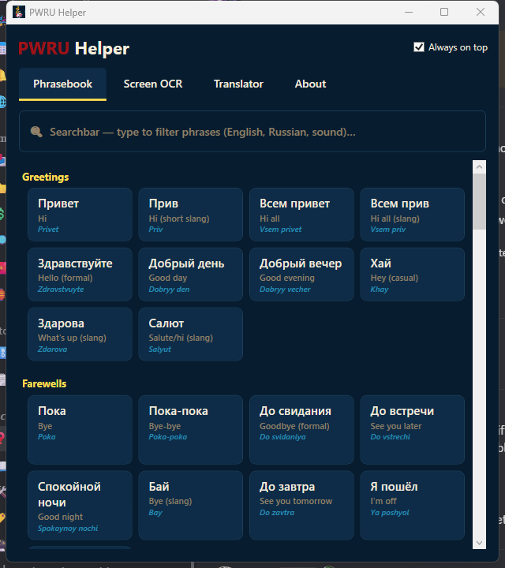

<div align="center">

# PWRU Helper

**A free little app to chat, read and translate Russian faster while playing on the
Perfect World RU server ([pwonline.ru](https://pwonline.ru/)).**

Made for English/French (and now Spanish/German) speakers who play on the Russian server.

[](../../releases/latest)

</div>

---

<div align="center">

## 🎥 See it in action

[](https://www.youtube.com/watch?v=6WpfOJiD4XU)

*(click to watch on YouTube)*

</div>

---

## ✨ What it does



**1. Phrasebook** — a big list of ready-made Russian phrases and gamer slang
(hello, gg, изи, imba, "need heal", trading, yes/no…). **Click one and it's copied** —
just paste it in the game chat with `Ctrl+V`. Every phrase shows the English meaning and
how to pronounce it. There's a search bar to find anything fast.

**2. Screen OCR** — click **"Select area & read once"**, draw a box over any Russian text
on your screen, and the app reads it and translates it (English, French, Spanish or
German), **message by message** (it understands the game's `[Channel] Nick:` chat
structure, so wrapped lines are grouped back into whole messages and nicknames are never
mangled by the translator). Or hit **"Start live translation"** and it keeps re-reading
that area and re-translating automatically whenever new text appears — until you press
Stop. Either way, the results appear on the **Translator** tab. Russian **gaming slang**
(LFM squad-forming, instance/role/class abbreviations, event names) is **decoded
underneath** each translation — e.g. `В ПП хил` shows *🔑 В = LFM · ПП = Full Moon
Pavilion · хил = heal* — and known slang is also **expanded before translating** so the
English reads properly ("need a healer", not "need a hil"). Repeated messages are served
from a local cache, so LFM spam translates instantly without re-asking Google.

**3. Translator** — one page for **reading + writing**: type in your language and get
Russian instantly (or the other way around) at the top, and see the live screen
translations underneath.

**4. Squad builder** — tick the **dungeon(s)**, **class(es)** and **role(s)** you're looking
for and it builds the Russian group-forming (LFM) message for you — e.g. tick *Terrace
legendary* + *DD* + *Healer* + *invite on me* and copy `в лега дд хил стук` straight into chat
(that last one, *стук*, asks people to whisper you for an invite). Tick **UPPERCASE** to shout it.
The lists live in their own editable `squad.json` (next to the app, or in `%AppData%\PWRUHelper\`),
so you can add dungeons, classes, roles and columns without touching the code.

---

## ⬇️ Download & use

<div align="center">

[](../../releases/latest)

</div>

Both builds are on the **[Releases](../../releases)** page — pick whichever you prefer:

- **`PWRUHelper.exe`** — *no installation.* Download and double-click; everything is inside
  the one file. Great for putting it on a USB stick or running it anywhere.
- **`PWRUHelper-x.y.z-setup.msi`** — *classic installer.* Installs the app into
  Program Files with **Start-menu and desktop shortcuts**, and shows up in
  *Add or remove programs* for a clean uninstall. Updating just means running the newer MSI.

> Works on Windows 10 & 11. The first time you run it, Windows might warn about an
> "unknown publisher" — click **More info → Run anyway** (this is normal for small free
> apps that aren't code-signed).

### Reading Russian from the screen (one-time setup)

For the **Screen OCR** feature to read Cyrillic well, Windows needs its Russian text pack.
The app makes this easy: open the **Screen OCR** tab and click
**"Install Russian OCR (1 click)"**, then accept the Windows permission popup. Done.

*(The Phrasebook and Translator work without this — it's only for reading text off the screen.)*

---

## 🔒 Privacy & fair play

- **Screen reading is 100% on your PC.** The Russian OCR runs on Windows' built-in engine
  locally — no screenshot ever leaves your computer.
- **Translations go through Google Translate.** The text you translate (typed, or read from
  the screen) is sent to Google's free public translate endpoint to be translated, exactly
  like using translate.google.com. No account, no API key, and nothing else is sent. If a
  line is private, don't translate it.
- **No game memory, no injection, no automation.** The app only takes a picture of a screen
  area you choose and puts text on your clipboard for *you* to paste. It never reads or
  writes the game's memory and never types or clicks for you — so it doesn't touch anything
  an anti-cheat cares about. It's the same as taking a screenshot and pasting a phrase yourself.

---

## 💡 Tips

- Keep **"Always on top"** ticked so the window stays over your game.
- **Compact overlay:** click **"⤡ Compact"** (or **Ctrl+Alt+M**) to shrink to a small
  always-on-top window — just the live feed plus a one-line reply box (type → Enter →
  Russian, copied). If your reply is too long for one chat message, it's **split into
  numbered blocks** you copy and send one after another. Drag the **title bar** to move it and
  **any edge or corner** to resize it, like a normal window. Click **⤢** to go back to the full window.
- **Global shortcuts** (work while you're in the game):
  **Ctrl+Alt+P** brings the app to the front · **Ctrl+Alt+T** jumps to the translator ·
  **Ctrl+Alt+L** starts/stops live translation · **Ctrl+Alt+M** toggles the compact overlay ·
  **Ctrl+Alt+R** re-reads your last area once (no live loop).
- Your settings, window position and **last live area are remembered** — use
  **"↻ Resume last area"** to restart live without re-drawing the box.
- Translating **auto-copies** the result (Ctrl+V in game). Pasting Russian flips the
  direction automatically. On a screen-read message, use **↩** to reply in Russian.
- For the sharpest reading, **select just the last 3–4 lines** of the chat rather than the
  whole window — a tighter box is read far more precisely.
- **Fine-tuning** (Screen OCR tab): **OCR sensitivity** (lower ignores the moving game world
  behind the chat; raise to catch every small change), **Live speed** (how often it re-reads),
  **Smallest text fragment** (skip stray single-letter specks) and **Stability** (how sure it
  must be a line is real before translating). Sensible defaults are set on first launch.
- **Busy background?** Try the **Background filter** (Screen OCR tab): *Boost contrast* makes
  bright chat text of any colour stand out from the 3D world behind it, and *Keep one colour*
  isolates a single chat channel by its colour (hex + tolerance).
- **Black captures in full-screen?** Switch **Capture method** to *Windows Graphics
  (experimental)* — it can read true full-screen games; if it can't run on your machine the
  app quietly falls back to the normal method.
- **Better translations (optional):** paste a free [DeepL API key](https://www.deepl.com/pro-api)
  in the About tab — DeepL (higher quality) is then used for **what you write**: the Translator
  tab and the compact overlay's quick reply, falling back to Google if DeepL is unavailable.
  Reading the screen keeps using the free Google engine, so a busy live feed can't burn through
  your DeepL quota. No key needed for normal use.
- **Updating is one click:** when a new version is out, the app offers to download and run the
  installer for you (About tab → *Check for updates*).
- **Something broke?** About tab → **📋 Copy error report** copies the recent error log so you
  can paste it to me on Discord.
- Your game should run in **windowed** or **borderless** mode for the screen-reading box
  to appear on top. In full-screen, alt-tab out first (or use a second monitor).
- Want to add your own phrases, slang or squad options? Edit `phrases.json` (phrasebook),
  `slang.json` (the chat-slang decoder — an optional `full` field also sets the Russian
  long-form used to improve translations) or `squad.json` (the squad builder's lists) —
  all kept next to the app (portable) or in `%AppData%\PWRUHelper\` (when installed via
  the MSI). Add lines and they'll show up next time you open it.

---

## 💬 Made by Kizotis

This is a **free** project I made to help the community. If you'd like me to add or change
something, send me a message! Just remember it's free and made on my own time, so please
don't expect changes the same day. 🙂

- 🌐 GitHub — https://github.com/Kizotis
- 🟣 Twitch — https://www.twitch.tv/kizotis
- ▶️ YouTube — https://www.youtube.com/@kizotis
- 💬 Discord — **kizotis**

**PWRU English community Discord:** https://discord.gg/RXTZhYTJz6

---

## 🛠️ For the curious (what it's built with)

- **C# / WPF on .NET 8** — a small, native Windows app (very light on CPU/RAM, so no game lag).
- **Windows built-in OCR** (`Windows.Media.Ocr`) for reading text off the screen — free and
  on-device, no cloud, no GPU.
- **Google's free translate endpoint** for translations — no API key, no cost.
- Colors taken from the pwonline.ru theme; icon mixes my avatar with the Perfect World logo.

### Building it yourself

```powershell
# run the dev version
dotnet run

# build the single portable exe (bundles .NET + all DLLs)
./"Build Portable EXE.bat"

# build the MSI installer (installs WiX v5 the first time)
./"Build MSI Installer.bat"
```

The portable build ends up in `bin/Release/.../win-x64/publish/PWRUHelper.exe`.

Reducing the SmartScreen "unknown publisher" warning (free code-signing via SignPath OSS,
winget submission, publishing SHA-256 hashes) is documented in
[`packaging/DISTRIBUTION.md`](packaging/DISTRIBUTION.md).

### Running the tests

```powershell
dotnet test tests/PWRUHelper.Tests
```

Unit tests cover the pure logic (OCR sentence-stitching, chat splitting, fuzzy line-matching,
the slang decoder and version parsing). They run headless — no window, no network.

---

## 📄 License

Released under the [MIT License](LICENSE) — free to use, modify and share.

---

<div align="center">
<sub>Free & fan-made. Not affiliated with Perfect World or pwonline.ru.</sub>
</div>
