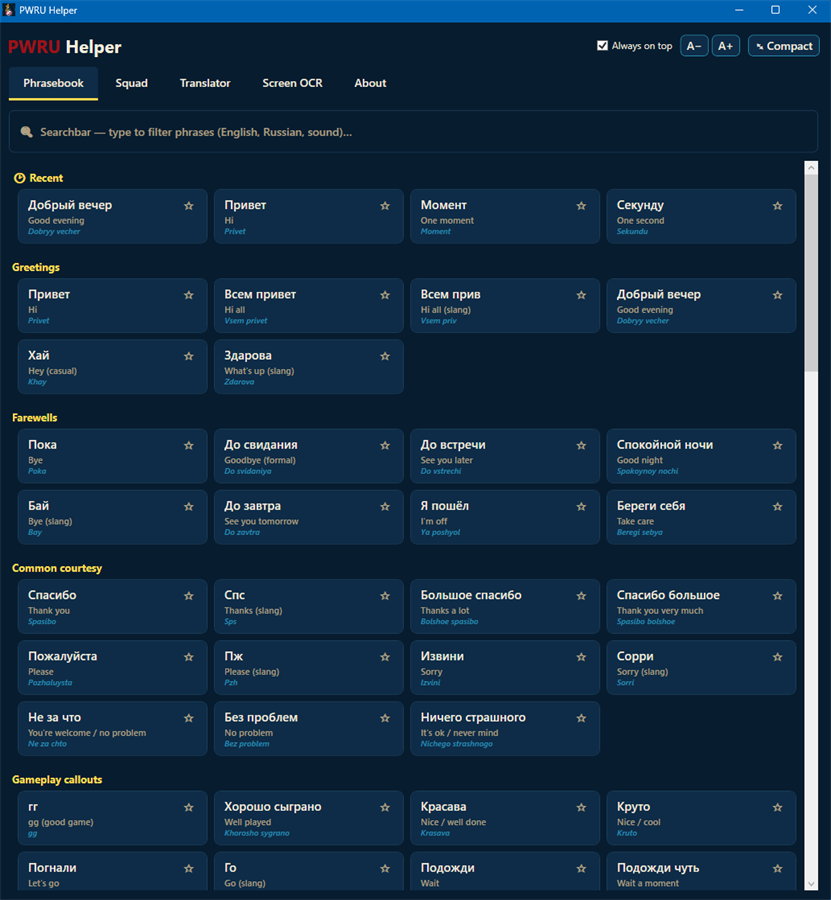
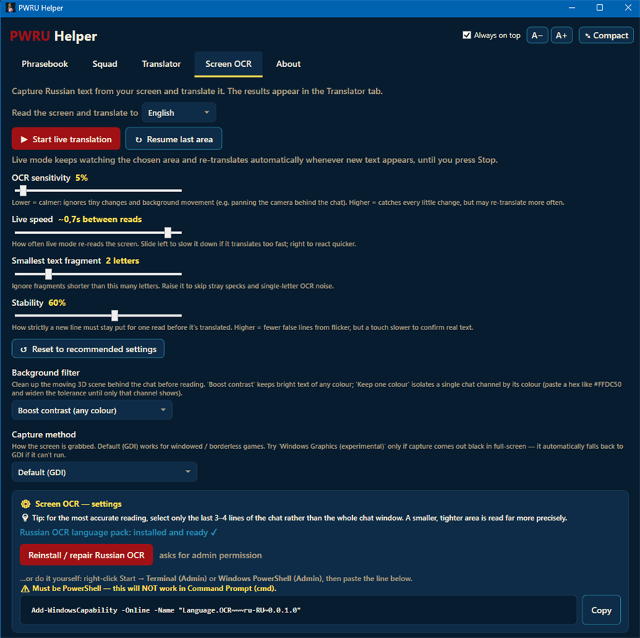
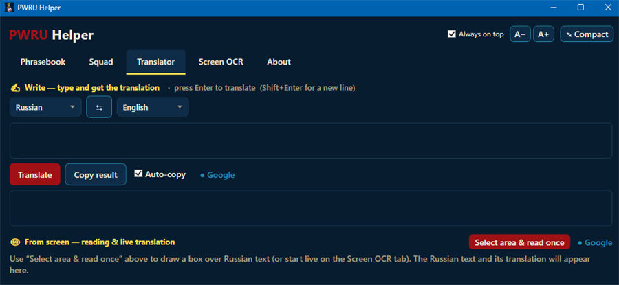

<div align="center">

# PWRU Helper

**Chat, read and translate Russian while you play on Perfect World RU ([pwonline.ru](https://pwonline.ru/)).**

Free · no account · no setup · Windows 10 & 11

[](../../releases/latest)

[](https://www.youtube.com/watch?v=6WpfOJiD4XU)

*Click to watch the demo*

</div>

---

## What it does

<table>
<tr>
<td width="50%" valign="top">

### 📖 Phrasebook
Ready-made Russian phrases and gamer slang. **Click one, it's copied** — paste it in the game chat with `Ctrl+V`. Every phrase shows its meaning and how to say it.

</td>
<td width="50%" valign="top">

### ✍️ Translator
Type in your language, get Russian instantly — already copied, ready to paste. Paste Russian and it flips the other way.

</td>
</tr>
<tr>
<td width="50%" valign="top">

### 👁 Screen OCR
Draw a box over the game chat. The app reads the Russian text and translates it, message by message. Turn on **live** mode and it keeps translating as new lines arrive. Chat slang is decoded under each line (`ПП = Full Moon Pavilion`).

</td>
<td width="50%" valign="top">

### 👥 Squad builder
Tick the dungeon, class and role you want and it writes the Russian "looking for group" message for you: `в лега дд хил стук`.

</td>
</tr>
</table>

<table>
<tr>
<td width="50%" align="center" valign="top">

<br/><sub>Click a phrase, it's copied</sub>
</td>
<td width="50%" align="center" valign="top">

<br/><sub>Read the game chat off the screen</sub>
</td>
</tr>
<tr>
<td width="50%" align="center" valign="top">

<br/><sub>Type, get Russian</sub>
</td>
<td width="50%" align="center" valign="top">

<br/><sub>The compact overlay, translating live</sub>
</td>
</tr>
</table>

---

## Download

| | |
|---|---|
| **`PWRUHelper-x.y.z-setup.msi`** ✅ | Classic installer. Small download, Start-menu shortcut, clean uninstall. Starts fast from the first launch. |
| **`PWRUHelper.exe`** | No installation — one file you can run from anywhere. Big download (≈180 MB) because everything is inside. |

> Windows may say *"unknown publisher"* — click **More info → Run anyway**. Normal for small free apps.

**To read Russian off the screen** (one-time): open the *Screen OCR* tab → **Install Russian OCR (1 click)** → accept the Windows popup. The Phrasebook and Translator work without it.

---

## Translation

- **Free by default.** Nothing to sign up for, nothing to configure.
- **Never stops.** If a translation engine asks us to slow down, it's paused for a few minutes and the next one takes over on its own. A small coloured dot next to the Translate button tells you which engine is answering.
- **Optional keys** (About tab) if you want better wording for what *you* write: **DeepL** or **Azure Translator**. Free stays underneath — if a key runs out, the app falls back on its own.
- **Optional offline engine.** About tab → **Download the offline engine** (about 50 MB, one time). It translates on your PC with no internet at all, and it only answers when nothing else can. It uses memory only while it is translating, and **Remove** deletes it again.

---

## Privacy

- **Screen reading happens on your PC.** No screenshot ever leaves your computer.
- **Only the text you translate is sent** to a translation service, exactly like using translate.google.com. If a line is private, don't translate it. With the offline engine installed, nothing is sent at all when it is the one answering.
- **Saved translations stay on your PC** (`%AppData%\PWRUHelper`). About tab → **Clear cache** empties them.
- **No game memory, no injection, no automation.** It takes a picture of the area you chose and puts text on your clipboard for *you* to paste. Nothing an anti-cheat cares about.

---

## Shortcuts

Work while you're in the game.

| Keys | Does |
|---|---|
| `Ctrl+Alt+P` | Bring the app to the front |
| `Ctrl+Alt+T` | Jump to the translator |
| `Ctrl+Alt+L` | Start / stop live translation |
| `Ctrl+Alt+R` | Read the last area once (or cancel a running read) |
| `Ctrl+Alt+M` | Compact overlay on / off |
| `Enter` | Translate (`Shift+Enter` for a new line) |

---

## Tips

- **Compact overlay** — a small always-on-top window with just the live feed and a reply box. Type → Enter → Russian, copied.
- **Draw a tight box** around the last 3–4 chat lines. Smaller box, better reading.
- **Game chat takes 78 characters.** Longer translations are marked where to cut; the overlay splits them into numbered blocks.
- **Black capture in full-screen?** Play windowed / borderless, or switch *Capture method* to *Windows Graphics*.
- **Something looks off after an update?** Screen OCR tab → **↺ Reset to recommended settings**.
- **Add your own phrases or slang:** edit `phrases.json`, `slang.json` or `squad.json` next to the app (or in `%AppData%\PWRUHelper`). An update that ships a newer list replaces your copy and keeps yours next to it as `.bak`, so nothing you wrote is lost.
- **Problem?** About tab → **📋 Copy error report** and paste it to me on Discord.

---

## Made by Kizotis

Free, made on my own time for the community. Ideas and bugs are welcome. 🙂

🟣 [Twitch](https://www.twitch.tv/kizotis) · ▶️ [YouTube](https://www.youtube.com/@kizotis) · 💬 Discord **kizotis** · 🌐 [GitHub](https://github.com/Kizotis)

**PWRU English community Discord:** https://discord.gg/RXTZhYTJz6

---

<details>
<summary><b>For developers</b></summary>

C# / WPF on .NET 8, Windows built-in OCR, free public translation services (DeepL / Azure optional).

```powershell
dotnet run                          # dev version
./"Build Portable EXE.bat"          # single portable exe
./"Build MSI Installer.bat"         # MSI (installs WiX v5 the first time)
dotnet test tests/PWRUHelper.Tests  # unit tests (headless, no network)
```

Code signing, winget and hashes: [`packaging/DISTRIBUTION.md`](packaging/DISTRIBUTION.md). The diagnostic of slow first launches and translation limits: [`docs/investigations/`](docs/investigations/).

</details>

## License

[MIT](LICENSE) — free to use, modify and share. Optional offline engine files are MPL-2.0 (Mozilla) — see [`packaging/`](packaging/NOTICE-offline-engine.md).

<div align="center">
<sub>Fan-made. Not affiliated with Perfect World or pwonline.ru.</sub>
</div>
