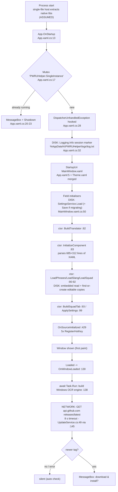

# 00 — Stack inventory (Phase 0, Discovery)

| | |
|---|---|
| **Document** | `docs/investigations/00-inventaire-stack.md` |
| **Date** | 2026-09-06 |
| **Baseline commit** | `4759712` (`main`, tag-equivalent v0.14.0, clean worktree) |
| **App version** | **0.14.0** — `PWRUHelper.csproj:14` `<Version>0.14.0</Version>` |
| **Author** | Mary (BMAD Business Analyst), DP — Document Project workflow, adapted to a single-file diagnostic inventory |
| **Purpose** | Give the Phase-1 investigators (P1 startup latency, P2 Google translation blocking) a complete, citable map of the stack: what exists, where it lives, what it touches at runtime, and what is *not* configured. |

**How to read.** Every claim carries an evidence tag, matching the convention in
[`README.md`](README.md):

- **[CONFIRMED]** — read directly in code/config at the cited `file:line`.
- **[CONFIRMED-ABSENT]** — verified by exhaustive grep that the thing is *not* present anywhere in the repo. Absence is load-bearing for this mission (unset publish flags, unset proxy config).
- **[ASSUMED]** — derived from documented .NET/Windows behaviour, not from this repo. Reasoning stated. Must be measured or confirmed by Amelia before it is used as a premise.
- **[REPORTED]** — prior measurement from the owner's earlier sessions, restated here for completeness. **Not verified by this document.** Section 10.2 collects them all.

This document contains **no recommendations** — that is Phase 1 and 2 work.

---

## 1. Scope of the inventory

The worktree at `4759712` holds 66 tracked files. Everything below was read at that commit.
Read-only commands used: `dotnet --list-sdks`, `dotnet --list-runtimes`, `dotnet restore`,
`dotnet list package --include-transitive`, `git log`, `grep`, `wc`. The app was **not run**
and the test suite was **not executed** (it historically wrote to the developer's real
`%AppData%`; see `Services/Logging.cs:25-30`).

---

## 2. Identity & stack

### 2.1 Core identity

| Property | Value | Evidence |
|---|---|---|
| Language / UI framework | C# / WPF | `PWRUHelper.csproj:10` `<UseWPF>true</UseWPF>` **[CONFIRMED]** |
| Output type | `WinExe` (no console window) | `PWRUHelper.csproj:4` **[CONFIRMED]** |
| TFM | `net8.0-windows10.0.19041.0` | `PWRUHelper.csproj:6` **[CONFIRMED]** |
| Why 19041 | "Windows 10.0.19041 target gives us the built-in Windows.Media.Ocr engine (free, on-device)" | `PWRUHelper.csproj:5` (comment) **[CONFIRMED]** |
| `SupportedOSPlatformVersion` | `10.0.19041.0` | `PWRUHelper.csproj:7` **[CONFIRMED]** |
| `Nullable` | `enable` | `PWRUHelper.csproj:8` **[CONFIRMED]** |
| `ImplicitUsings` | `enable` | `PWRUHelper.csproj:9` **[CONFIRMED]** |
| Assembly / root namespace | `PWRUHelper` | `PWRUHelper.csproj:12-13` **[CONFIRMED]** |
| App icon | `assets\icon.ico` (67 452 B) | `PWRUHelper.csproj:15` **[CONFIRMED]** |
| Application manifest | `app.manifest` | `PWRUHelper.csproj:11` **[CONFIRMED]** |
| Test-source exclusion | `DefaultItemExcludes` += `tests\**` | `PWRUHelper.csproj:18` **[CONFIRMED]** |
| Friend assembly | `InternalsVisibleTo PWRUHelper.Tests` | `PWRUHelper.csproj:28` **[CONFIRMED]** |
| Architecture style | code-behind, no MVVM (deliberate) | `project-context.md` **[CONFIRMED]** |
| Licence | MIT, © 2026 Kizotis | `LICENSE:1-3` **[CONFIRMED]** |

### 2.2 SDK / runtimes present on the dev box (2026-09-06)

| Component | Version(s) | Evidence |
|---|---|---|
| .NET SDK | **8.0.424** (only one installed) | `dotnet --list-sdks` **[CONFIRMED]** |
| `Microsoft.NETCore.App` | 8.0.30, 6.0.36 | `dotnet --list-runtimes` **[CONFIRMED]** |
| `Microsoft.WindowsDesktop.App` | 8.0.30, 6.0.36 | `dotnet --list-runtimes` **[CONFIRMED]** |
| `Microsoft.AspNetCore.App` | 8.0.30, 6.0.36 | `dotnet --list-runtimes` **[CONFIRMED]** |

Shipped builds are `--self-contained true`, so the *end-user's* machine runs the runtime
bundled inside the exe, not any of the above (§3.1). The dev box's runtime only matters for
`dotnet run` / `Launch PWRU Helper.bat`.

### 2.3 Publish/runtime properties — what is set and what is NOT

Only **three** `-p:` flags exist anywhere, and they live on the command line of the three
build paths, never in the csproj.

| Property | Set? | Where / evidence |
|---|---|---|
| `PublishSingleFile=true` | **YES** (CLI only) | `Build Portable EXE.bat:21`, `Build MSI Installer.bat:30`, `.github/workflows/release.yml:45` **[CONFIRMED]** |
| `IncludeNativeLibrariesForSelfExtract=true` | **YES** (CLI only) | `Build Portable EXE.bat:22`, `Build MSI Installer.bat:31`, `release.yml:46` **[CONFIRMED]** |
| `DebugType=none` | **YES** (CLI only) | `Build Portable EXE.bat:23`, `Build MSI Installer.bat:32`, `release.yml:47` **[CONFIRMED]** |
| `--self-contained true` / `-r win-x64` | **YES** (CLI arg, not `-p:`) | same three files **[CONFIRMED]** |
| `EnableCompressionInSingleFile` | **NO — deliberately removed** | `Build Portable EXE.bat:11-19` (comment), `release.yml:35-41`, guarded by `tests/PWRUHelper.Tests/PublishFlagsTests.cs:44-60` **[CONFIRMED]** |
| `PublishReadyToRun` | **NOT SET** | grep over `*.csproj *.bat *.yml *.props`: no occurrence **[CONFIRMED-ABSENT]** |
| `PublishTrimmed` / `TrimMode` | **NOT SET** | **[CONFIRMED-ABSENT]** (WPF forbids it, NETSDK1168 — **[REPORTED]**) |
| `PublishAot` | **NOT SET** | **[CONFIRMED-ABSENT]** |
| `InvariantGlobalization` | **NOT SET** → full ICU shipped | **[CONFIRMED-ABSENT]** |
| `SatelliteResourceLanguages` | **NOT SET** → all WPF satellite resources shipped | **[CONFIRMED-ABSENT]** |
| `UseWindowsForms` | **NOT SET** (WPF only) | **[CONFIRMED-ABSENT]** |
| `TieredCompilation*`, `TieredPGO`, `ReadyToRunUseCrossgen2` | **NOT SET** | **[CONFIRMED-ABSENT]** |
| `ServerGarbageCollection` / `ConcurrentGarbageCollection` | **NOT SET** (workstation concurrent GC default) | **[CONFIRMED-ABSENT]** |
| `runtimeconfig.template.json` | **DOES NOT EXIST** | file listing **[CONFIRMED-ABSENT]** |
| `DOTNET_*` env vars (incl. `DOTNET_BUNDLE_EXTRACT_BASE_DIR`) | **never set by the app or the scripts** | grep: no occurrence **[CONFIRMED-ABSENT]** |

> **P1 relevance.** `PublishSingleFile` + `IncludeNativeLibrariesForSelfExtract=true` means the
> native libraries are extracted to a per-user temp directory on launch (default
> `%TEMP%\.net\<app>\<hash>\`) rather than loaded from the bundle. The managed assemblies stay
> memory-mapped (that is the point of not compressing). The extraction directory is not
> overridden. **[ASSUMED — documented .NET host behaviour, not asserted in this repo; must be
> measured on a slow machine.]**

### 2.4 `app.manifest`

| Setting | Value | Evidence |
|---|---|---|
| `assemblyIdentity` | `PWRUHelper.app`, version `1.0.0.0` | `app.manifest:3` **[CONFIRMED]** |
| Execution level | `asInvoker`, `uiAccess="false"` — never elevates | `app.manifest:10` **[CONFIRMED]** |
| DPI awareness | `PerMonitorV2` (+ legacy `dpiAware=true`) | `app.manifest:18-19` **[CONFIRMED]** |
| Why PerMonitorV2 | "so screen-capture coordinates are real physical pixels" | `app.manifest:15` (comment) **[CONFIRMED]** |
| `supportedOS` | `{8e0f7a12-…}` (Win10/11) and `{1f676c76-…}` (Win8.1) | `app.manifest:26-27` **[CONFIRMED]** |
| `longPathAware` | **not declared** | **[CONFIRMED-ABSENT]** |
| `activeCodePage` (UTF-8) | **not declared** | **[CONFIRMED-ABSENT]** |
| `heapType` / segment heap | **not declared** | **[CONFIRMED-ABSENT]** |
| `disableWindowFiltering`, GDI scaling | **not declared** | **[CONFIRMED-ABSENT]** |

Elevation is only ever obtained out-of-process, via `Verb = "runas"` on a PowerShell child
process for the OCR language pack (`MainWindow.Ocr.cs:79-88`) **[CONFIRMED]**.

### 2.5 `AssemblyInfo.cs`

10 lines, one attribute only: `[assembly:ThemeInfo(ResourceDictionaryLocation.None,
ResourceDictionaryLocation.SourceAssembly)]` — `AssemblyInfo.cs:3-10` **[CONFIRMED]**.
No `AssemblyVersion`/`FileVersion` override; the version comes from `<Version>` in the csproj,
which is what `UpdateService.CurrentVersion` reads back at runtime
(`Services/UpdateService.cs:38-39`) **[CONFIRMED]**.

---

## 3. Packaging & distribution

### 3.1 The three build paths, side by side

| | `Build Portable EXE.bat` | `Build MSI Installer.bat` | `.github/workflows/release.yml` |
|---|---|---|---|
| Trigger | manual, dev box | manual, dev box | push of tag `v*`, or `workflow_dispatch` (`release.yml:9-11`) |
| Runner | local, `C:\Program Files\dotnet\dotnet.exe` hardcoded (`:4`) | idem (`:4`) | `windows-latest`, `actions/setup-dotnet@v4` `8.0.x` (`:18-25`) |
| Project arg | implicit (cwd) | implicit (cwd) | explicit `PWRUHelper.csproj` (`:44`) |
| Config / RID | `-c Release -r win-x64` (`:20`) | idem (`:29`) | idem (`:44`) |
| Self-contained | `--self-contained true` | `--self-contained true` | `--self-contained true` |
| `-p:` flags | `PublishSingleFile=true`, `IncludeNativeLibrariesForSelfExtract=true`, `DebugType=none` (`:21-23`) | identical (`:30-32`) | identical (`:45-47`) |
| Compression | absent, with a 9-line comment saying why (`:11-19`) | absent, comment (`:25-27`) | absent, comment (`:35-41`) |
| Tests run first | no | no | **yes** — `dotnet test tests/PWRUHelper.Tests -c Release` (`:27-28`) |
| MSI | no | `wix build installer\Product.wxs` (`:41-46`) | `wix build installer/Product.wxs` (`:60-65`) |
| Version source | hardcoded `set "VERSION=0.14.0"` (`:8`) | — | `github.ref_name` minus the leading `v` (`:52`) |
| Signing | none | none | **none** — no SignPath step exists in the live workflow **[CONFIRMED-ABSENT]** |
| Publish output | `bin\Release\net8.0-windows10.0.19041.0\win-x64\publish\PWRUHelper.exe` (`:25`) | same (`:35`) | same (`:53`) |

Flag parity across the three files is enforced by
`tests/PWRUHelper.Tests/PublishFlagsTests.cs:62-70` **[CONFIRMED]**, and the *drafted* signing
workflow is held to the same flags by `PublishFlagsTests.cs:72-79` **[CONFIRMED]**.

### 3.2 `.github/workflows/ci.yml`

Runs on push to `main`, on every PR, and on demand (`ci.yml:3-7`). `windows-latest`,
.NET `8.0.x`, then `dotnet build PWRUHelper.csproj -c Release` and
`dotnet test tests/PWRUHelper.Tests -c Release` (`ci.yml:20-24`) **[CONFIRMED]**.
No publish, no artifacts, no lint step.

### 3.3 MSI (`installer/Product.wxs`, WiX v5.0.2)

| Aspect | Value | Evidence |
|---|---|---|
| Toolset | WiX **v5.0.2 exactly**, `+ WixToolset.UI.wixext/5.0.2` | `Build MSI Installer.bat:18-19`, `release.yml:32-33` **[CONFIRMED]** |
| Package name / manufacturer | "PWRU Helper" / "Kizotis" | `Product.wxs:18-19` **[CONFIRMED]** |
| Scope | **perMachine** | `Product.wxs:23` **[CONFIRMED]** |
| Version | `$(var.Version)` = `X.Y.Z.0` (4th part appended by the caller) | `Product.wxs:20`; `Build MSI Installer.bat:43`, `release.yml:61` **[CONFIRMED]** |
| UpgradeCode (never changes) | `B7D1F3A2-6E54-4C9B-8A1D-2F0C7E5A9B34` | `Product.wxs:21` **[CONFIRMED]** |
| Upgrade policy | `MajorUpgrade` with a downgrade error message | `Product.wxs:26` **[CONFIRMED]** |
| Media | `MediaTemplate EmbedCab="yes"` → the ~178 MB exe is re-compressed into the CAB | `Product.wxs:27` **[CONFIRMED]** |
| Install dir | `ProgramFiles64Folder\PWRU Helper\` | `Product.wxs:36-37` **[CONFIRMED]** |
| Payload | a single file, `PWRUHelper.exe`, `KeyPath="yes"` | `Product.wxs:42` **[CONFIRMED]** |
| Shortcuts | Start menu + Desktop, both `Advertise="yes"` | `Product.wxs:44-57` **[CONFIRMED]** |
| ARP | icon, `ARPHELPLINK`, `ARPURLINFOABOUT` → the GitHub repo | `Product.wxs:30-33` **[CONFIRMED]** |
| Wizard | `WixUI_InstallDir` (user may choose ANY folder) | `Product.wxs:67` **[CONFIRMED]** |
| Data files | **none installed** — only the exe; `phrases/slang/squad.json` are created at first run (§6.3) | `Product.wxs:40-60` **[CONFIRMED]** |

Consequence for P1/P2 triage: an MSI install puts the exe under `Program Files`, which is
**not writable by a standard user**, so every editable data file and every log/settings write
lands in `%AppData%\PWRUHelper\` instead (§6.3) **[CONFIRMED]**.

### 3.4 Artifact sizes

| Artifact | Size | Evidence |
|---|---|---|
| `PWRUHelper.exe` (portable, uncompressed single file) | **~178–180 MB** | `README.md:79-81` ("~180 MB"), `Build Portable EXE.bat:15-16` ("179 MB") **[REPORTED]** |
| Same exe, if compression were re-enabled | 74 MB | `Build Portable EXE.bat:15` **[REPORTED]** |
| `PWRUHelper-<v>-setup.msi` | "much smaller download" — not quantified anywhere in the repo | `README.md:83-84` **[CONFIRMED]** the claim exists; the number is **[UNKNOWN]** |
| Repo assets | icon.ico 67 KB, icon.png 67 KB, avatar.png 114 KB, screenshots 43 + 81 KB, pw_ogimage 87 KB | `ls assets` **[CONFIRMED]** |
| Embedded data | `phrases.json` 13 066 B / `slang.json` 4 797 B / `squad.json` 4 327 B | `wc -c Data/*.json` **[CONFIRMED]** |

### 3.5 `Launch PWRU Helper.bat` (dev convenience only, not shipped to users)

19 lines. `cd /d "%~dp0"`, hardcodes `C:\Program Files\dotnet\dotnet.exe` (`:5`), targets
`bin\Debug\net8.0-windows10.0.19041.0\PWRUHelper.exe` (`:6`), builds Debug **only if the exe is
missing** (`:9-12`), then `start "" "%EXE%"` (`:15`) **[CONFIRMED]**. A Debug, framework-dependent
launch — it exercises a completely different startup path from the shipped single-file exe, so
timings taken through it are not comparable to P1.

### 3.6 winget & code signing status

| Item | Status | Evidence |
|---|---|---|
| winget manifests | **draft templates**, unfilled placeholders (`InstallerSha256: <SHA256 OF THE RELEASED .msi>`, `ProductCode: '<{PRODUCT-CODE-GUID}…>'`), and pinned to the stale version **0.7.0** | `packaging/winget/Kizotis.PWRUHelper.installer.yaml:4,14-16` **[CONFIRMED]** |
| winget CI submission | present but **opt-in**, no-ops without `secrets.WINGET_TOKEN`, `continue-on-error: true` | `release.yml:87-103` **[CONFIRMED]** |
| First winget submission | never done — `update` requires an existing package | `release.yml:82-83`, `packaging/DISTRIBUTION.md:49-51` **[CONFIRMED]** |
| Code signing | **NOT wired.** The live `release.yml` has zero SignPath steps | grep of `release.yml` **[CONFIRMED-ABSENT]** |
| Signing draft | full replacement workflow, every step gated on `secrets.SIGNPATH_API_TOKEN != ''` | `packaging/signpath-signing.md:82,103-156` **[CONFIRMED]** |
| SignPath eligibility premise | "OSI license (**MIT**), public repo" | `packaging/signpath-signing.md:23,33` **[CONFIRMED]** |
| SmartScreen consequence | unsigned exe/msi → "unknown publisher" warning, "some antivirus engines may flag the fresh binary" | `packaging/DISTRIBUTION.md:3-5`, `README.md:86-88` **[CONFIRMED]** |

> **P1 relevance.** The shipped binary is unsigned and changes hash on every release. Both the
> SmartScreen reputation path and AV heuristic scanning behave differently for an unsigned,
> low-reputation, 178 MB binary than for a signed one. **[ASSUMED — Windows behaviour, to be
> measured.]**

---

## 4. Dependencies

### 4.1 NuGet

| Package | Version | Kind | Purpose | Evidence |
|---|---|---|---|---|
| `System.Drawing.Common` | 8.0.10 | direct (app) | GDI screen capture, bitmap scaling, image filter | `PWRUHelper.csproj:33` **[CONFIRMED]** |
| `Microsoft.Win32.SystemEvents` | 8.0.0 | transitive (of the above) | — | `dotnet list package --include-transitive` **[CONFIRMED]** |
| `Microsoft.NET.Test.Sdk` | 17.11.1 | direct (tests) | test host | `tests/…/PWRUHelper.Tests.csproj:13` **[CONFIRMED]** |
| `xunit` | 2.9.2 | direct (tests) | framework | `…csproj:14` **[CONFIRMED]** |
| `xunit.runner.visualstudio` | 2.8.2 | direct (tests) | VSTest adapter | `…csproj:15` **[CONFIRMED]** |

**That is the entire third-party surface: one runtime package.** No HTTP library, no JSON
library (uses `System.Text.Json`), no logging framework, no DI container, no Polly/retry
library **[CONFIRMED-ABSENT]**.

### 4.2 Windows / WinRT API families

| API family | Used for | Where | Evidence |
|---|---|---|---|
| `Windows.Media.Ocr` | on-device OCR engine | `Services/OcrService.cs:6,65-88,134` | **[CONFIRMED]** |
| `Windows.Globalization` | `Language` tag for the OCR engine | `Services/OcrService.cs:4,70` | **[CONFIRMED]** |
| `Windows.Graphics.Imaging` | `BitmapDecoder` → `SoftwareBitmap` for OCR | `Services/OcrService.cs:5,150-158` | **[CONFIRMED]** |
| `Windows.Graphics.Capture` (+ `.DirectX`, `.DirectX.Direct3D11`) | experimental WGC capture backend | `Services/WgcCapture.cs:4-6` | **[CONFIRMED]** |
| `WinRT` interop (`MarshalInterface<T>.FromAbi`, `CastExtensions.As<T>`) | WGC activation-factory plumbing | `Services/WgcCapture.cs:7` | **[CONFIRMED]** |
| `Microsoft.Win32.Registry` | read Add/Remove-Programs to detect an MSI install | `MainWindow.Update.cs:152-157` | **[CONFIRMED]** |
| `System.Drawing` GDI | `CopyFromScreen` capture, bicubic scaling | `Services/GdiCapture.cs`, `Services/OcrService.cs:121-127` | **[CONFIRMED]** |

### 4.3 Complete P/Invoke inventory (`DllImport`), production code only

| DLL | Entry point | Purpose | `file:line` |
|---|---|---|---|
| `user32` | `GetSystemMetrics` | virtual-screen bounds in physical px | `MainWindow.xaml.cs:212` |
| `user32` | `RegisterHotKey` | 5 global hotkeys | `MainWindow.xaml.cs:426` |
| `user32` | `UnregisterHotKey` | release them on close | `MainWindow.xaml.cs:427` |
| `user32` | `GetCursorPos` | region drag corners in physical px | `SelectionOverlay.xaml.cs:26` |
| `user32` | `OpenClipboard` | clipboard write | `Services/ClipboardService.cs:25` |
| `user32` | `CloseClipboard` | clipboard write | `Services/ClipboardService.cs:26` |
| `user32` | `EmptyClipboard` | clipboard write | `Services/ClipboardService.cs:27` |
| `user32` | `SetClipboardData` | clipboard write | `Services/ClipboardService.cs:28` |
| `kernel32` | `GlobalAlloc` | clipboard HGLOBAL | `Services/ClipboardService.cs:29` |
| `kernel32` | `GlobalLock` | clipboard HGLOBAL | `Services/ClipboardService.cs:30` |
| `kernel32` | `GlobalUnlock` | clipboard HGLOBAL | `Services/ClipboardService.cs:31` |
| `kernel32` | `GlobalFree` | clipboard HGLOBAL | `Services/ClipboardService.cs:32` |
| `user32` | `MonitorFromPoint` | pick the monitor to capture | `Services/WgcCapture.cs:381` |
| `user32` | `GetMonitorInfo` | monitor rect | `Services/WgcCapture.cs:384` |
| `d3d11` | `D3D11CreateDevice` | WGC device (hardware, WARP fallback) | `Services/WgcCapture.cs:388` |
| `d3d11` | `CreateDirect3D11DeviceFromDXGIDevice` | DXGI → WinRT device | `Services/WgcCapture.cs:394` |
| `combase` | `RoGetActivationFactory` | WGC activation factory | `Services/WgcCapture.cs:400` |
| `combase` | `WindowsCreateString` | manual HSTRING (marshalling removed in .NET 5+) | `Services/WgcCapture.cs:404` |
| `combase` | `WindowsDeleteString` | manual HSTRING | `Services/WgcCapture.cs:407` |

19 imports across 5 files. `WM_NCHITTEST` overlay resizing uses a WPF `HwndSource` hook, not a
`DllImport` **[CONFIRMED]**.

---

## 5. Entry point & startup sequence (map, not forensics)

> Amelia's `00-annexe-demarrage-et-reseau.md` owns the deep trace. This section is the map:
> what runs, in what order, and which step touches disk or network.

### 5.1 `App.xaml` / `App.xaml.cs`

| Step | Detail | Evidence |
|---|---|---|
| `StartupUri` | `MainWindow.xaml` — WPF constructs and shows the window itself | `App.xaml:5` **[CONFIRMED]** |
| Merged resources | `Theme.xaml` (312 lines) merged into `Application.Resources` | `App.xaml:9` **[CONFIRMED]** |
| `OnStartup` #1 | single-instance `Mutex("PWRUHelper.SingleInstance", initiallyOwned:true)`; a second copy shows a MessageBox and `Shutdown()`s | `App.xaml.cs:17-24` **[CONFIRMED]** |
| `OnStartup` #2 | `DispatcherUnhandledException += OnUnhandledException` — the app survives UI exceptions with a MessageBox, `e.Handled = true` | `App.xaml.cs:28,37-44` **[CONFIRMED]** |
| `OnStartup` #3 | **`Logging.Info("--- PWRU Helper v… starting ---")`** — the first disk write of the process, synchronous, on the UI thread | `App.xaml.cs:32` **[CONFIRMED]** |
| Global exception handlers | only `DispatcherUnhandledException`. No `AppDomain.UnhandledException`, no `TaskScheduler.UnobservedTaskException` | **[CONFIRMED-ABSENT]** |
| `OnExit` | releases + disposes the mutex | `App.xaml.cs:46-51` **[CONFIRMED]** |

### 5.2 `MainWindow` field initialisers (run **before** the constructor body)

| Field | What it does at startup | Evidence |
|---|---|---|
| `_readTranslator = new CachingTranslator(new TranslationService())` | constructs the OCR-feed translator; touching the `TranslationService` type runs its static initialiser → builds the shared `HttpClient` (no network) | `MainWindow.xaml.cs:43`; `Services/TranslationService.cs:32,37-44` **[CONFIRMED]** |
| `_updates = new UpdateService()` | no work in the ctor; the static `HttpClient`s are built on first type use | `MainWindow.xaml.cs:49`; `Services/UpdateService.cs:26-35,131-138` **[CONFIRMED]** |
| **`_settings = SettingsService.Load()`** | **reads `%AppData%\PWRUHelper\settings.json`**, sanitises, and — if `SettingsVersion < 3` — **migrates and writes it straight back** | `MainWindow.xaml.cs:50`; `Services/SettingsService.cs:108-129` **[CONFIRMED]** |
| `_ocr = new OcrService("ru")` | only wires a `Lazy<OcrEngine?>` — **no engine built here** | `MainWindow.xaml.cs:51`; `Services/OcrService.cs:36-40` **[CONFIRMED]** |
| `_slang` / `_squad` | placeholder empty instances, replaced later in the ctor | `MainWindow.xaml.cs:52-53` **[CONFIRMED]** |
| `_restoringSettings = true` | starts TRUE because XAML load itself fires change handlers | `MainWindow.xaml.cs:35` **[CONFIRMED]** |

### 5.3 `MainWindow` constructor (`MainWindow.xaml.cs:80-104`)

| Order | Call | Notes | Line |
|---|---|---|---|
| 1 | `BuildTranslator()` | pure object graph, reads `_settings.DeepLApiKey` | `:82` → `MainWindow.Translate.cs:226-233` |
| 2 | `InitializeComponent()` | parses `MainWindow.xaml` (685 lines) + the merged `Theme.xaml` (312); **fires slider/combo change handlers**, guarded by `_restoringSettings` | `:83` |
| 3 | `_toastTimer.Tick += …` | `DispatcherTimer`, 1.6 s | `:84`, field at `:56` |
| 4 | `OcrResults.ItemsSource = _ocrItems` | | `:86` |
| 5 | `OcrCommandBox.Text = "Add-WindowsCapability …"` | | `:87` |
| 6 | `ShowAppVersion()` | reads `Assembly.GetName().Version` | `:88` → `MainWindow.Update.cs:22-23` |
| 7 | `PopulateLanguageCombos()` | 3 combos filled from static arrays | `:89`, `:341-356` |
| 8 | **`LoadPhrases()`** | embedded resource read **+ disk: find-or-create + possible version refresh of `phrases.json`** | `:90` → `MainWindow.Phrasebook.cs:24-69` |
| 9 | **`LoadSlang()`** | idem for `slang.json` | `:91` → `MainWindow.Ocr.cs:132-145` |
| 10 | **`LoadSquad()`** | idem for `squad.json` | `:92` → `MainWindow.Squad.cs:130` |
| 11 | `BuildSquadTab()` | builds the tick-box columns | `:93` → `MainWindow.Squad.cs:31` |
| 12 | `ApplySettings()` | restores every control, window placement, capture backend, font scale | `:99`, `:151-202` |
| 13 | `FromCombo.SelectionChanged += …` | attached only now, so init changes don't persist | `:102` |
| 14 | `Loaded += OnWindowLoaded` | | `:103` |

Explicitly **not** in the constructor: `CheckOcrAvailability()` — moved out because reading
`OcrService.IsAvailable` is what builds the Windows OCR engine (26–38 ms **[REPORTED]**) and it
used to sit in front of the first paint (`MainWindow.xaml.cs:94-98`, `Services/OcrService.cs:17-23`)
**[CONFIRMED]**.

### 5.4 `OnSourceInitialized` (`MainWindow.xaml.cs:429-458`)

Caches the HWND, adds the `HotkeyHook`, then registers **five** global hotkeys with
`MOD_CONTROL|MOD_ALT|MOD_NOREPEAT`: `P` show, `T` translator, `L` live, `M` compact, `R` read
once (`:444-448`). Failures are collected and surfaced as a persistent warning in the About tab
(`:450-457`) **[CONFIRMED]**.

### 5.5 `OnWindowLoaded` (`MainWindow.xaml.cs:130-146`) — `async void`

1. `await Task.Run(() => _ocr.IsAvailable)` — **builds the Windows OCR engine on a worker thread** (`:138`).
2. `CheckOcrAvailability()` — writes the Screen-OCR tab labels (`:139`).
3. Toast for any refreshed data file (`:141`).
4. **`await CheckForUpdatesAsync()`** — the **only outbound network call in the startup path** (`:145` → `MainWindow.Update.cs:36-66` → `Services/UpdateService.cs:49`).

Whether the window has actually painted before step 4 issues its request is **[ASSUMED]** — the
code comment at `:143-144` states the intent ("once the window is up, so the dialog has an
owner"), and the two `await`s do yield to the dispatcher, but `Loaded` precedes
`ContentRendered`. **Amelia must confirm** (P1).

### 5.6 Shutdown

`OnClosing` (`:229-256`) snapshots all slider/combo/window state and calls
`SettingsService.Save` inside a blanket `catch` (`:255`). `OnClosed` (`:491-504`) unregisters the
five hotkeys, removes the hook, closes the overlay **[CONFIRMED]**.

### 5.7 Startup flow

---

## 6. Configuration

### 6.1 Settings file

| Aspect | Value | Evidence |
|---|---|---|
| Path | `%AppData%\PWRUHelper\settings.json` (`SpecialFolder.ApplicationData`) | `Services/SettingsService.cs:87-89` **[CONFIRMED]** |
| Test override | `internal static string? PathOverride` — tests point it at a temp file so the suite never corrupts the dev's own file | `Services/SettingsService.cs:91-97` **[CONFIRMED]** |
| Format | `System.Text.Json`, `WriteIndented = true` | `Services/SettingsService.cs:99` **[CONFIRMED]** |
| Atomic save | write `<path>.tmp` → `File.Replace` if the target exists, else `File.Move` | `Services/SettingsService.cs:191-194` **[CONFIRMED]** |
| Failure policy | `Load` and `Save` each wrap everything in `catch { }` — never throws, worst case defaults / no persistence | `Services/SettingsService.cs:126,196` **[CONFIRMED]** |
| Sanitisation | nulls coalesced, ranges clamped, `OcrFilterMode`/`CaptureBackend` whitelisted, `LastLiveRegion` must be length 4 | `Services/SettingsService.cs:165-182` **[CONFIRMED]** |

### 6.2 Versioning & migration

`CurrentSettingsVersion = 3` (`Services/SettingsService.cs:102`). `Migrate` runs inside `Load`
and, when it changes anything, the file is **persisted immediately** (`:121`) **[CONFIRMED]**.

| Step | Condition | Change | Line |
|---|---|---|---|
| v1 (0.12.2) | `SettingsVersion < 1 && OcrFilterMode == "off"` | → `"contrast"` | `:140-141` |
| v2 (0.13.0) | same guard, re-applied because the v1 migration was clobbered by the XAML-load bug | → `"contrast"` | `:148-149` |
| v3 (0.13.0) | `LiveSpeedPercent == 80` (the exact old default) | → `92` (~0.7 s between reads) | `:155-156` |

A fresh install is stamped with `SettingsVersion = CurrentSettingsVersion` so migrations never
touch it (`:128`) **[CONFIRMED]**.

Settings are also written at these non-shutdown points: language pick
(`MainWindow.xaml.cs:114`), font scale (`:281`), DeepL key save
(`MainWindow.Translate.cs:238`), live region save/invalidate (`MainWindow.Live.cs:50,78,93`)
**[CONFIRMED]**.

### 6.3 First-run data files (`phrases.json`, `slang.json`, `squad.json`)

Each file is **both** an `EmbeddedResource` and copied to the output directory
(`PWRUHelper.csproj:39-50`) **[CONFIRMED]**. At runtime, `FindOrCreateEditable`
(`MainWindow.Phrasebook.cs:222-247`):

1. Candidate order — `AppContext.BaseDirectory\Data\<file>`, then
   `%AppData%\PWRUHelper\<file>` (`:227-229`).
2. If either exists → use it, and check it for a version refresh (`:231-236`).
3. Otherwise, try to **create** it from the embedded text in the same order,
   `catch { }`-ing per candidate and falling through to the next (`:237-245`).
4. If nothing is writable → returns `null`; the caller falls back to the embedded copy, so the
   feature still works (`MainWindow.Phrasebook.cs:26-29,41-44`) **[CONFIRMED]**.

**Program Files case (MSI install):** step 3's first candidate throws (no write access for a
standard user) and the file is created in `%AppData%\PWRUHelper\` instead — silently, by design
**[CONFIRMED]**. For a single-file publish, `AppContext.BaseDirectory` is the extraction/host
directory, so the "next to the exe" candidate may not be where the user thinks it is
**[ASSUMED]**.

`UpgradeEditableIfStale` (`MainWindow.Phrasebook.cs:265-286`) compares the `"version"` key of
the shipped JSON to the user's copy, backs the user's copy up to a **free** `.bak`/`.bakN` name
(`:290-295`) and overwrites. Note: **`Data/slang.json` carries no `"version"` key**
(`grep '"version"' Data/*.json` → only `phrases.json:3` = 1 and `squad.json:3` = 2), so
`shipped <= 0` and the early return at `:270` means **an existing `slang.json` editable copy is
never refreshed** **[CONFIRMED]**.

---

## 7. Logging

| Aspect | Value | Evidence |
|---|---|---|
| Path | `%AppData%\PWRUHelper\logs\log.txt` (+ `log.1.txt`) | `Services/Logging.cs:18-20`, `:72-73` **[CONFIRMED]** |
| Test override | `Logging.DirectoryOverride` (module initialiser in the test assembly) | `Services/Logging.cs:31-39`; `tests/…/TestLogRedirect.cs` **[CONFIRMED]** |
| File handle | **none kept open.** Every write does `Directory.CreateDirectory` + `File.AppendAllText` | `Services/Logging.cs:83-86` **[CONFIRMED]** |
| Sync/async | **fully synchronous**, on the calling thread, inside `lock (_gate)` | `Services/Logging.cs:81-87` **[CONFIRMED]** |
| Flush policy | implicit — `File.AppendAllText` opens, writes, closes each call | `Services/Logging.cs:86` **[CONFIRMED]** |
| Encoding | UTF-8 **without BOM** | `Services/Logging.cs:61` **[CONFIRMED]** |
| Rotation | at **1 MB** (`maxBytes = 1024*1024`): delete `log.1.txt`, move `log.txt` → `log.1.txt`. Exactly two files, bounded at ~2 MB | `Services/Logging.cs:69,95-105` **[CONFIRMED]** |
| Can it throw? | **No** — `Write`, `RollIfTooBig` and `ReadRecent` each swallow everything | `Services/Logging.cs:89,104,126` **[CONFIRMED]** |
| Can it block? | **Yes** — it is a synchronous file open+append under a lock; a slow/contended `%AppData%` blocks the caller | derived from `:81-87` **[CONFIRMED]** as a code property; the *impact* is **[ASSUMED]** |
| Read-back | `ReadRecent(30 000 chars)`, oldest file first, trimmed to a whole line — feeds the About tab's "Copy error report" | `Services/Logging.cs:50,107-127`; `MainWindow.xaml.cs:312-322` **[CONFIRMED]** |

**Logged at startup:** exactly one line —
`INFO --- PWRU Helper v0.14.0 starting ---` (`App.xaml.cs:32`) **[CONFIRMED]**.
No per-step timing, no environment dump, no network diagnostics.

**Other log sites** (all post-startup): data-file refresh / refresh failure
(`MainWindow.Phrasebook.cs:276,283`), primary-translator fallback
(`Services/FallbackTranslator.cs:29,41`), WGC failure + latch
(`Services/ScreenCapture.cs:62,66`), live auto-stop after 5 errors
(`MainWindow.Live.cs:233`), update download failure (`MainWindow.Update.cs:110`), unhandled UI
exception (`App.xaml.cs:39`) **[CONFIRMED]**.

> **P2 relevance.** A Google 429 that surfaces as a `TranslationException` is **never logged**
> on the Google-only path — `FallbackTranslator` is the only thing that logs a translator
> failure, and it is only in the pipeline when a DeepL key is set
> (`MainWindow.Translate.cs:229-231`). For a default (no-key) user, a P2 incident leaves **no
> trace in `log.txt`** **[CONFIRMED]**.

---

## 8. Network surface

### 8.1 Every outbound call in the codebase

| # | Method + endpoint | Client & lifetime | Timeout | Headers | Fires when | In the startup path? |
|---|---|---|---|---|---|---|
| 1 | `GET https://translate.googleapis.com/translate_a/single?client=gtx&sl={src}&tl={tgt}&dt=t&q={urlencoded}` — `Services/TranslationService.cs:122-123` | `private static readonly HttpClient` — one per process, never disposed (`:32,37-44`) | **12 s** (`:39`) | `User-Agent: Mozilla/5.0 (Windows NT 10.0; Win64; x64) … Chrome/120.0 Safari/537.36` (`:41-42`) — a spoofed browser UA | Translator tab (`MainWindow.Translate.cs:94`), quick reply (`:37`), read-once (`MainWindow.Ocr.cs`), **and the LIVE loop, up to 2 requests per tick** (`MainWindow.Live.cs:315,320`) | **NO** **[CONFIRMED-ABSENT]** |
| 2 | `POST https://api-free.deepl.com/v2/translate` (key ends `:fx`) or `https://api.deepl.com/v2/translate` — `Services/DeepLTranslator.cs:24-26` | `private static readonly HttpClient` (`:16`) | **12 s** (`:16`) | `Authorization: DeepL-Auth-Key …` (`:73`); **no User-Agent** | only when a DeepL key is saved, and only on the *write* path (Translator tab, quick reply) | **NO** **[CONFIRMED-ABSENT]** |
| 3 | `GET https://api.github.com/repos/Kizotis/PWRU-Helper/releases/latest` — `Services/UpdateService.cs:20-21,49` | `private static readonly HttpClient` (`:26-35`) | **8 s** (`:30`) | `User-Agent: PWRUHelper-UpdateCheck`, `Accept: application/vnd.github+json` (`:32-33`); **unauthenticated** | **automatically at `Loaded`** (`MainWindow.xaml.cs:145`) and on the About-tab button (`MainWindow.Update.cs:31`) | **YES** — `await`ed inside `OnWindowLoaded` **[CONFIRMED]** |
| 4 | `GET <release asset>` on `github.com` / `*.githubusercontent.com` — `Services/UpdateService.cs:105-127` | separate `private static readonly HttpClient Downloads` (`:131-138`) | **`Timeout.InfiniteTimeSpan`** (`:135`) — bounded only by the caller's token | `User-Agent: PWRUHelper-Update` (`:136`) | only after the user answers "Yes" to the update dialog (`MainWindow.Update.cs:62,90`) | **NO** |
| 5 | `Process.Start(… UseShellExecute = true)` on `https://…` hyperlinks (DeepL, GitHub, Twitch, YouTube, Discord, releases page) — `MainWindow.xaml.cs:302`, `MainWindow.Update.cs:172`, `MainWindow.xaml:615,643,648,653,670` | out-of-process (default browser) | — | — | user click | **NO** |
| 6 | `powershell.exe … Add-WindowsCapability -Online -Name "Language.OCR~~~ru-RU~0.0.1.0"` — `MainWindow.Ocr.cs:79-92` | elevated child process (`Verb = "runas"`) | — | — | user clicks "Install Russian OCR"; downloads from Windows Update | **NO** |

No `WebRequest`, no `WebClient`, no raw `Socket`, no `Dns.*`, no WebSocket, no telemetry
endpoint anywhere in the repo **[CONFIRMED-ABSENT]**.

### 8.2 `HttpClient` configuration — what is NOT set

| Knob | State | Evidence |
|---|---|---|
| `IHttpClientFactory` / handler pooling | not used; three long-lived static clients | `TranslationService.cs:32`, `DeepLTranslator.cs:16`, `UpdateService.cs:26,131` **[CONFIRMED]** |
| Proxy (`WebProxy`, `UseProxy`, `DefaultProxy`) | **never configured** → the default `HttpClientHandler` picks up the system/WinINET proxy, with no credentials supplied | grep **[CONFIRMED-ABSENT]** |
| `DefaultRequestVersion` / `VersionPolicy` | **not set** → .NET default (HTTP/1.1 for `HttpClient`) | grep **[CONFIRMED-ABSENT]**; the default itself is **[ASSUMED]** |
| `SocketsHttpHandler` (`PooledConnectionLifetime`, `ConnectTimeout`, `MaxConnectionsPerServer`) | **not configured** | grep **[CONFIRMED-ABSENT]** |
| Cookies / redirect policy / decompression | **not configured** (framework defaults) | **[CONFIRMED-ABSENT]** |
| Client certificate / TLS callback | **not configured** | **[CONFIRMED-ABSENT]** |
| Per-call `CancellationToken` | Google & DeepL take the caller's `ct`; the startup update check passes **`default`** (`MainWindow.Update.cs:47` calls `CheckForUpdateAsync()` with no token) | **[CONFIRMED]** |

### 8.3 Retry / failure behaviour (P2-critical)

| Behaviour | Detail | Evidence |
|---|---|---|
| Google retry loop | **3 attempts**, `Task.Delay(300 * (attempt+1))` between them (300 ms, 600 ms). One user action can therefore become 3 requests | `Services/TranslationService.cs:126,153` **[CONFIRMED]** |
| Retried statuses | `429` and any `5xx` only; other non-success statuses throw immediately | `Services/TranslationService.cs:138-143` **[CONFIRMED]** |
| Terminal 429 message | **"Google is limiting translations right now — wait a minute and try again."** | `Services/TranslationService.cs:145-146` **[CONFIRMED]** |
| Non-JSON body (HTML captcha / block page) | "The translation service returned an unexpected response (it may be temporarily blocked). Try again shortly." | `Services/TranslationService.cs:172-176` **[CONFIRMED]** |
| Other terminal messages | HTTP-code error `:143`; "unavailable (HTTP n)" `:148`; "Couldn't reach the translation service. Check your Internet connection." `:157` | **[CONFIRMED]** |
| Per-line placeholders | `"(rate-limited — try again shortly)"`, `"(skipped — rate-limited, try again shortly)"`, `"(translation failed: …)"` | `Services/TranslationService.cs:102,105,106,114` **[CONFIRMED]** |
| Batch → per-line fallback | a failed/misaligned batch retries **one request per line**, and stops issuing new ones after the first `TranslationException` (`rateLimited` latch) | `Services/TranslationService.cs:95-108` **[CONFIRMED]** |
| Backoff / jitter / circuit breaker across calls | **none** — no cool-down state survives a call | **[CONFIRMED-ABSENT]** |
| Live-loop protection | 5 consecutive tick errors → `StopLive()` + "Live stopped after repeated errors (…)" | `MainWindow.Live.cs:231-236` **[CONFIRMED]** |
| Live-loop request rate | 1 tick every `3000 − 25×speed%` ms = **0.5 s … 3.0 s** (default 92 % → ~0.7 s); each tick with new text issues **up to 2** requests (a "ru" batch and an "auto" batch) | `MainWindow.Live.cs:354-355`, `:313-321`; default `Services/SettingsService.cs:16` **[CONFIRMED]** |
| Caching | LRU, capacity 500, **process-lifetime, no TTL**; only successes cached (values starting `(` are refused) | `Services/CachingTranslator.cs:24,82-85` **[CONFIRMED]** |
| Two independent caches | the read path (`_readTranslator`, `MainWindow.xaml.cs:43`) and the write path (`BuildTranslator()`, `MainWindow.Translate.cs:232`) each own a separate `CachingTranslator`, so the same string can be fetched twice | **[CONFIRMED]** |
| Where the message reaches the user | Translator tab `"Failed: {Friendly(ex)}"` (`MainWindow.Translate.cs:106`); live feed placeholder `"({Friendly(ex)})"` (`MainWindow.Live.cs:281`) and status line (`:235,238`); read-once (`MainWindow.Ocr.cs:248,298`); overlay quick reply (`MainWindow.Translate.cs:41`) | **[CONFIRMED]** |
| `Friendly()` mapping | `TranslationException` → its own message; `HttpRequestException` → "no Internet connection"; `TaskCanceledException` → "the request timed out" | `MainWindow.xaml.cs:404-410` **[CONFIRMED]** |

> **P2 anchor fact.** The user-reported "Google translation limited… retry in some minutes" maps
> to `Services/TranslationService.cs:145-146` (a **429 on the third attempt**) or, if the wording
> differs, to `:175-176` (**non-JSON response**). Getting the *exact* string from the user
> discriminates between "rate-limited by Google" and "something returned a non-JSON page"
> (which is also what a captive portal or a TLS-inspecting corporate proxy would produce).

---

## 9. External services & their terms (facts recorded, no research)

| Service | Exact usage | Notes recorded in-repo |
|---|---|---|
| **Google Translate (free/unofficial endpoint)** | `GET https://translate.googleapis.com/translate_a/single` with `client=gtx`, `sl`, `tl`, `dt=t`, `q` (URL-encoded). Response shape `[[["translated","original",…], …], …]` parsed at `Services/TranslationService.cs:159-171` | "the same one translate.google.com uses. No API key, no cost." (`:26-28`). Request body travels **in the query string**; capped at `MaxQueryBytes = 1500` UTF-8 bytes, longer text is chunked on sentence boundaries (`:35,57-64,181-202`) **[CONFIRMED]** |
| **DeepL API** | `POST /v2/translate`, form-encoded, one `text` field per line, `target_lang`, optional `source_lang`; `Authorization: DeepL-Auth-Key` header. Free keys (`:fx` suffix) → `api-free.deepl.com`, else `api.deepl.com` | Mapped error codes: `401/403` bad key, `456` free quota exhausted, `429` rate-limited, else "DeepL service error (HTTP n)" (`Services/DeepLTranslator.cs:99-105`). Never used for the OCR feed, to protect the quota (`MainWindow.xaml.cs:38-44`) **[CONFIRMED]** |
| **GitHub Releases API** | `GET /repos/Kizotis/PWRU-Helper/releases/latest`, unauthenticated, `Accept: application/vnd.github+json` | Download URLs are allow-listed to `github.com` and `*.githubusercontent.com` (`Services/UpdateService.cs:97-101`), and `html_url` must be https on `github.com` or it falls back to the hardcoded releases page (`:63-66`) **[CONFIRMED]**. The unauthenticated 60-req/h/IP limit is **[ASSUMED]**, not asserted in code |
| **Windows OCR language pack** | `Add-WindowsCapability -Online -Name "Language.OCR~~~ru-RU~0.0.1.0"`, run elevated via `powershell.exe -NoProfile -ExecutionPolicy Bypass -Command` | Capability id is a single constant, `MainWindow.xaml.cs:63`; shown to the user verbatim at `:87`; executed at `MainWindow.Ocr.cs:82-83`. UAC cancel (Win32 1223) is handled specially (`:106-111`) **[CONFIRMED]** |
| **Windows OCR engine** | `OcrEngine.TryCreateFromLanguage(new Language("ru"))`; the user-profile engine is accepted **only** if its tag already starts with `ru` | Deliberate: a Latin engine reads Cyrillic as confident gibberish (`Services/OcrService.cs:51-63`) **[CONFIRMED]** |

---

## 10. Runtime footprint

### 10.1 What the repository itself asserts

| Claim | Source |
|---|---|
| Portable exe ~180 MB, uncompressed **on purpose**, so Windows can share the pages instead of unpacking them into RAM — "saves about **120 MB** of memory while you play" | `README.md:79-81` **[CONFIRMED as a repo claim]** |
| Measured, same machine/build: compressed 74 MB exe → **267 MB working set / 153 MB private**; uncompressed 179 MB exe → **155 MB working set / 95 MB private**; "~110 MB of RAM handed back"; "starts ~130 ms faster warm" | `Build Portable EXE.bat:13-17`, echoed in `Build MSI Installer.bat:25-27` and `.github/workflows/release.yml:36-41` **[CONFIRMED as a repo claim]** |
| The same numbers are frozen into a regression test, with "If you are re-adding this flag, measure first" | `tests/PWRUHelper.Tests/PublishFlagsTests.cs:47-52` **[CONFIRMED]** |
| Windows OCR engine construction costs **26–38 ms** in-app (~100 ms in a bare WinRT benchmark, mostly projection loading the app pays anyway) — "~30 ms out of a ~1200 ms warm start" | `Services/OcrService.cs:17-23` **[CONFIRMED as a repo claim]** |
| Building the OCR engine was moved out of the constructor precisely because it sat in front of the first paint | `MainWindow.xaml.cs:94-98` **[CONFIRMED]** |
| WPF `Clipboard` is banned; `ClipboardService` retries **40 × 50 ms ≈ 2 s** on a worker thread | `Services/ClipboardService.cs:34-47`; rationale `:5-15` **[CONFIRMED]** |
| WGC capture failures latch after 3 consecutive misses because "a failing WGC attempt is expensive (D3D device setup + up to ~500 ms synchronous wait)" | `Services/ScreenCapture.cs:12-16,25-29` **[CONFIRMED]** |
| Tiny footprint is a product requirement ("nothing may lag the game") | `project-context.md` **[CONFIRMED]** |

### 10.2 Known prior facts — **reported 2026-08-04, to re-verify**

Restated verbatim from the owner's earlier sessions. **Not measured or confirmed by this
document.** Every item below is **[REPORTED]**.

- Benchmarked 2026-08-04 on the owner's machine, Defender real-time **ON**: **cold start (fresh file) 3.9–8.9 s**, **warm 1.08–1.25 s**, measured `Start-Process` → `MainWindowHandle`.
- The cold−warm delta was attributed to Defender scanning an **unsigned single-file exe** plus the first disk read; **~900 ms** was called the .NET + WPF runtime floor.
- In-constructor warm costs measured then: process-start → ctor **640–675 ms**; `InitializeComponent` **206–233 ms**; `LoadSlang` **16 ms**; `BuildSquadTab` **17 ms**; `LoadPhrases` **9 ms**; `LoadSquad` **5 ms**; `ApplySettings` **4 ms**; `BuildTranslator` **2 ms**.
- `PublishReadyToRun` measured **worse** (cold 6.4–10.7 s) and is banned.
- `EnableCompressionInSingleFile` was removed in PR #52 (v0.14.0) because compression cost **~118 MB** of working set; the exe is now **~178 MB uncompressed**; `tests/PWRUHelper.Tests/PublishFlagsTests.cs` guards the flags.
- Trimming / NativeAOT are impossible with WPF (**NETSDK1168**).
- Code signing (SignPath) is **not** wired in `.github/workflows/release.yml`; the guide alone lives in `packaging/signpath-signing.md`. (Independently **[CONFIRMED]** by this document, §3.6.)
- Open **PR #49** proposes relicensing MIT → CC BY-NC 4.0, which would disqualify SignPath Foundation free signing (OSI licence required).
- Accepted by the owner, **not findings**: `TranslationService`'s per-line fallback catches `OperationCanceledException` without a `when (ct.IsCancellationRequested)` filter (`Services/TranslationService.cs:104` — independently **[CONFIRMED]** to still be the case at `4759712`); `ClipboardService.TrySetOnce` can leave the clipboard empty on a rare failure (`Services/ClipboardService.cs:68-72`).

---

## 11. Tests & CI

| Aspect | Value | Evidence |
|---|---|---|
| Project | `tests/PWRUHelper.Tests/PWRUHelper.Tests.csproj`, TFM matches the app, `UseWPF=true`, `IsPackable=false` | `…csproj:5-9` **[CONFIRMED]** |
| Files | 26 `.cs` — 24 test classes + `StaTestHost.cs` (STA runner) + `TestLogRedirect.cs` (module initialiser redirecting the log dir) | file listing **[CONFIRMED]** |
| Attribute counts | **178 `[Fact]`**, **17 `[Theory]`**, **78 `[InlineData]`** → roughly **256 executable cases** | `grep -c` over `tests/**/*.cs` **[CONFIRMED]** |
| Documented count | `project-context.md` says "142 tests" — **stale** relative to the counts above | **[CONFIRMED discrepancy]** |
| Biggest suites | `TextMatchingTests` 45, `SlangGlossaryExpandTests` 16, `DefaultsAndResizeTests` 11, `ChannelTagTests` 11, `TranslationBackendTests` 10 | per-file counts **[CONFIRMED]** |
| Headless constraint | must stay headless-safe (CI runs it on every PR); `TemplateRenderTests` renders real `ItemTemplate`s via `ContentControl` on an STA thread because an `ItemsControl` defers container generation headless | `project-context.md`, `tests/…/TemplateRenderTests.cs` **[CONFIRMED]** |
| Real-`%AppData%` guard | `SettingsService.PathOverride` + `Logging.DirectoryOverride` exist specifically because the suite constructs a real `MainWindow` and would otherwise write to the developer's own profile | `Services/SettingsService.cs:91-95`, `Services/Logging.cs:25-30` **[CONFIRMED]** |
| CI | `ci.yml` → build + test on every push to `main`, every PR, and on demand | `ci.yml:3-24` **[CONFIRMED]** |
| Release CI | `release.yml` → tests, WiX install, publish, MSI, GitHub release, optional winget | `release.yml:27-103` **[CONFIRMED]** |
| Startup-relevant tests | `StartupSettingsTests` (2 cases), `LiveDefaultsTests` (7), `ResetTuningTests` (1), `PublishFlagsTests` (3) | file listing **[CONFIRMED]** |
| Network-relevant tests | `TranslationBackendTests` (10, incl. the OCE-vs-timeout case at `:101`), `CachingTranslatorTests` (7), `UpdateAssetsTests` (4) | **[CONFIRMED]** |

**No** performance test, **no** startup-timing test, **no** integration test that touches the
network **[CONFIRMED-ABSENT]**.

---

## 12. Repo map

### 12.1 Root — code-behind & windows

| File | Lines | Purpose |
|---|---:|---|
| `App.xaml` | 13 | `StartupUri=MainWindow.xaml`; merges `Theme.xaml` |
| `App.xaml.cs` | 52 | Single-instance mutex, dispatcher exception handler, startup log line |
| `AssemblyInfo.cs` | 10 | `ThemeInfo` attribute only |
| `MainWindow.xaml` | 685 | The whole 5-tab UI (Phrasebook 0 · Squad 1 · Translator 2 · Screen OCR 3 · About 4) |
| `MainWindow.xaml.cs` | 505 | **Core**: fields, ctor, `ApplySettings`, `OnClosing/OnClosed`, `OnSourceInitialized` + hotkeys, clipboard helper, toast, `Friendly()` |
| `MainWindow.Phrasebook.cs` | 315 | Phrasebook list/search/favourites + the shared editable-data-file locator and versioned refresh |
| `MainWindow.Squad.cs` | 144 | Squad-builder tab construction and LFM phrase assembly |
| `MainWindow.Translate.cs` | 253 | Translator tab, quick reply, chat-block highlighting, `BuildTranslator()` |
| `MainWindow.Ocr.cs` | 488 | Region selection, read-once, OCR pack detection + one-click install, `LoadSlang` |
| `MainWindow.Live.cs` | 359 | LIVE loop, dedup wiring, batch translation, slider→threshold maths |
| `MainWindow.Compact.cs` | 66 | Enter/exit compact-overlay mode |
| `MainWindow.Update.cs` | 175 | Version display, update check/download/apply, MSI-vs-portable detection (ARP registry read) |
| `CompactOverlay.xaml` / `.xaml.cs` | 153 / 277 | Small always-on-top feed + one-line reply box; `WM_NCHITTEST` native resize |
| `SelectionOverlay.xaml` / `.xaml.cs` | 19 / 126 | Full-screen drag-a-rectangle overlay, physical px via `GetCursorPos` |
| `Theme.xaml` | 312 | pwonline.ru dark-navy palette + control styles (the dark ToolTip style is load-bearing) |
| `OcrResultItem.cs` | 53 | One feed row (`INotifyPropertyChanged`); **namespace `PWRUHelper`, at repo root by design** |
| `Converters.cs` | 26 | `WidthToColumnsConverter` for the phrase grid |
| `app.manifest` | 30 | DPI awareness, `asInvoker`, supportedOS |
| `PWRUHelper.csproj` | 53 | See §2 |

### 12.2 `Services/` (UI-free, unit-testable)

| File | Lines | Purpose |
|---|---:|---|
| `TranslationService.cs` | 219 | Google free-endpoint translator, chunking, 3-attempt retry, error mapping **(P2 epicentre)** |
| `DeepLTranslator.cs` | 146 | Optional DeepL backend, free/pro host selection, error-code mapping |
| `FallbackTranslator.cs` | 45 | DeepL → Google fallback; refuses to swallow a real cancellation |
| `CachingTranslator.cs` | 127 | Bounded LRU (500), successes only |
| `UpdateService.cs` | 161 | GitHub releases check, asset URL allow-list, resumable-free download **(startup network call)** |
| `SettingsService.cs` | 198 | `AppSettings` + load/migrate/sanitise/atomic-save |
| `Logging.cs` | 128 | `Logging` facade + `LogWriter` rolling file (1 MB × 2) |
| `OcrService.cs` | 159 | Lazy Windows OCR engine, up/down-scaling, bitmap → `SoftwareBitmap` |
| `ScreenCapture.cs` | 73 | Backend router GDI/WGC + 3-strike WGC failure latch |
| `ICaptureBackend.cs` | 15 | One-method capture interface |
| `GdiCapture.cs` | 31 | Default backend, `Graphics.CopyFromScreen` |
| `WgcCapture.cs` | 408 | Experimental `Windows.Graphics.Capture` backend, manual HSTRING interop, D3D11 staging copy |
| `OcrImageFilter.cs` | 98 | Pre-OCR `BoostContrast` / `KeepColor` filters |
| `LiveDedup.cs` | 152 | Which OCR lines are genuinely new (signature-based, with a confirmation frame) |
| `TextMatching.cs` | 667 | Pure text helpers: chat splitting, signatures, fuzzy match, `GameChatBlockSpans`, `IsProbablyRussian` |
| `SlangGlossary.cs` | 285 | Slang `Decode` (🔑 line) and `Expand` (pre-translation rewrite), one shared matcher |
| `SquadCatalog.cs` | 94 | Squad columns/options + LFM phrase assembly |
| `ClipboardService.cs` | 77 | Raw Win32 clipboard write on a worker thread (WPF `Clipboard` is banned) |

### 12.3 `Models/`, `Data/`, `installer/`, `packaging/`, `assets/`, `.github/`

| Path | Size | Purpose |
|---|---|---|
| `Models/Phrase.cs` | 13 lines | One phrasebook entry (`En`, `Ru`, `Translit`, `Category`, runtime `IsFavourite`) |
| `Data/phrases.json` | 139 lines / 13 066 B, `"version": 1` | Phrasebook source — EmbeddedResource **and** copied next to the exe |
| `Data/slang.json` | 55 lines / 4 797 B, **no `"version"` key** | Slang glossary (`keys`/`meaning`/`context`/`category`/`full`) |
| `Data/squad.json` | 56 lines / 4 327 B, `"version": 2` | Squad-builder columns |
| `installer/Product.wxs` | 69 lines | WiX v5 package (§3.3) |
| `installer/license.rtf` | 724 B | Licence shown in the MSI wizard |
| `packaging/DISTRIBUTION.md` | 79 lines | SmartScreen-friction playbook: SignPath, SHA-256 publication, winget |
| `packaging/signpath-signing.md` | ~190 lines | Full SignPath application + a drafted, token-gated `release.yml` replacement |
| `packaging/winget/*.yaml` | 3 files | Draft winget manifests, still on version 0.7.0 with placeholders |
| `assets/` | 7 files, ~470 KB | icon.ico/png, avatar, PW logo art, 2 README screenshots |
| `.github/workflows/ci.yml` | 24 lines | Build + test |
| `.github/workflows/release.yml` | 103 lines | Tag → exe + MSI + GitHub release (+ optional winget) |
| `CLAUDE.md` / `project-context.md` | 9 / ~200 lines | Agent rules; `project-context.md` is the durable AI contract |
| `.gitignore` | 20 lines | `bin/ obj/ .claude/ _bmad/ installer/*.msi` … |

`design-artifacts/` **does not exist** in this repo **[CONFIRMED-ABSENT]**.

---

## 13. Open questions & gaps for Phase 1

Everything below could **not** be settled by static reading at `4759712`.

### P1 — startup latency

1. **Single-file extraction cost.** `IncludeNativeLibrariesForSelfExtract=true` extracts native libraries to a per-user temp folder on launch; `DOTNET_BUNDLE_EXTRACT_BASE_DIR` is never set. How many files, how large, where exactly, and is the extraction repeated when the folder is cleaned or the hash changes (i.e. on every new release)? **Needs measurement.**
2. **Does the first frame paint before the GitHub call?** `OnWindowLoaded` `await`s `Task.Run(OCR engine)` then `await`s `CheckForUpdatesAsync()` (`MainWindow.xaml.cs:138,145`). If the window has not rendered, an 8-second GitHub timeout on a filtered/proxied network lands inside the *perceived* startup. Amelia to confirm the exact ordering vs `ContentRendered`.
3. **`%AppData%` latency.** `SettingsService.Load` (field initialiser), the startup log write (`App.xaml.cs:32`), and up to three data-file create/refresh operations all hit `%AppData%\PWRUHelper\` synchronously before the window exists. On a roaming profile, a OneDrive Known-Folder-Move target, or a folder under real-time AV scanning, what does that cost? **Needs per-machine measurement.**
4. **AV / EDR behaviour on an unsigned 178 MB binary.** Not measurable from the repo. Does the slow set of machines share a product (Defender vs a corporate EDR), a policy, or an exclusion list? The dev box itself is Azure-AD-joined (per `README.md:44`), so a GPO-managed configuration is plausible there too.
5. **SmartScreen / Authenticode reputation round trip.** An unsigned, low-reputation exe may trigger a network check at process start. Whether this is happening (and whether it is on the critical path) is **[ASSUMED]** and must be observed, not argued.
6. **Which machines are slow, and what do they share?** No per-machine data exists in the repo. A machine sheet (OS build, AV, profile type, proxy, `%TEMP%` location, install kind portable-vs-MSI, disk) is a prerequisite for any hypothesis matrix.
7. **Portable vs MSI startup.** The MSI installs to `Program Files` (write-protected), so the first run writes three data files into `%AppData%` instead; the portable exe may write them next to itself. Do the two install kinds show different startup profiles?
8. **XAML parse cost.** `InitializeComponent` was measured at 206–233 ms **[REPORTED]** over `MainWindow.xaml` (685 lines) + `Theme.xaml` (312). Is that stable across machines, or does it scale with something environmental (font enumeration, theme, DPI)?
9. **The single-instance mutex.** `new Mutex(true, "PWRUHelper.SingleInstance")` is a session-local (unnamed-prefix) mutex. Behaviour under fast-user-switching, RDP sessions, or a stale-handle case has not been examined.

### P2 — Google translation blocking

10. **Which exact message do users see?** `Services/TranslationService.cs:145-146` (429 on the third attempt) and `:175-176` (non-JSON body) produce very different diagnoses. The literal wording the user reports must be matched to a `file:line`.
11. **"Sometimes at launch" is unexplained.** There is **no Google request in the startup path** (§8.1, **[CONFIRMED-ABSENT]**). Either the user translated immediately after launch, or an IP-level block from a previous session is still in force, or the message came from a resumed LIVE loop. To be resolved with the user.
12. **Request volume.** A LIVE session issues up to 2 requests per tick at 0.5–3.0 s (default ~0.7 s) — a plausible sustained ~3 req/s, ×3 on the retry path. What volume actually triggers the block, and is it per-IP, per-UA, or per-session? **Requires measurement + external research.**
13. **Shared-IP exposure.** CGNAT, a corporate NAT, a VPN or a mobile hotspot puts the user behind an address other people also hit `translate.googleapis.com` from. Untestable from code; must be captured in the per-machine sheet.
14. **Corporate TLS inspection / captive portals.** No proxy configuration and no certificate handling exist (§8.2). An intercepting proxy returning an HTML error page would land exactly on the `JsonException` path (`:172-176`). Needs a capture of the actual response body on a failing machine.
15. **Block duration.** "1 minute, 10 minutes, or never clears" is not explainable by anything in the code — there is no client-side cool-down or circuit breaker (**[CONFIRMED-ABSENT]**). The persistence therefore lives server-side or in the network path. **Needs empirical timing.**
16. **The spoofed Chrome User-Agent** (`:41-42`) is a fixed, now-dated string (`Chrome/120.0`). Whether the endpoint treats it as a signal is unknown and needs external research (dated sources per the mission's ground rule 5).
17. **Silent failures.** On the default no-key path a P2 incident writes **nothing** to `log.txt` (§7), so the About tab's "Copy error report" cannot evidence it. Any Phase-1 instrumentation must add that trace (behind the no-production-change rule).
18. **Cache interaction.** Failure placeholders are never cached (`Services/CachingTranslator.cs:82-85`), so every failing line is re-requested on the next tick — potentially deepening a rate-limit. Whether this materially amplifies the block needs measurement.
19. **Two independent caches** (read path vs write path) mean a phrase the user types can miss a translation the live feed already fetched, doubling requests for the same text. Impact unquantified.
20. **DeepL is not a mitigation for the OCR feed by design** (`MainWindow.xaml.cs:38-44`): even a user with a DeepL key stays entirely on Google for screen reading. This constrains any Phase-2 target architecture.

---

_End of `00-inventaire-stack.md` — Phase 0, Discovery. Next: `00-annexe-demarrage-et-reseau.md` (Amelia)._
