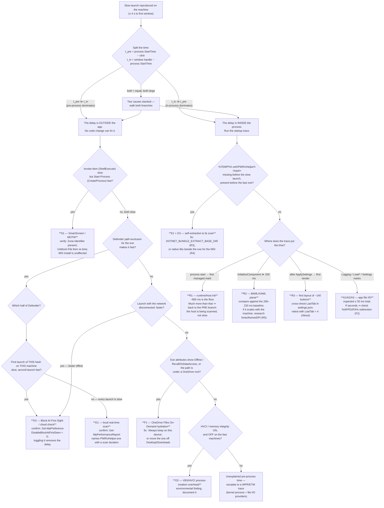

# 01 — P1 startup: hypothesis matrix

_Phase 1 · author: Amelia (BMAD Senior Software Engineer), forensic method `gds-investigate` · baseline commit `4759712` (main, v0.14.0) · written 2026-09-06 · **no production code was changed and no build was run** to produce this document._

## 0. What this document is, and what it is built on

This is the core P1 artefact: every candidate cause of the "6–10 s from double-click to window" symptom, graded, ranked, and paired with a concrete way to kill or confirm it.

**Evidence grades** (mission convention, `docs/investigations/README.md`):
**[CONFIRMED]** read in code/config with `file:line` · **[INFERRED]** derived, reasoning stated · **[UNKNOWN]** needs measurement or research · **[REPORTED]** prior measurement from an earlier session, not re-verified here.
Where a row depends on Windows/.NET platform behaviour rather than on this repository, it is tagged **[INFERRED — general Windows/.NET knowledge, Mary to source]**: it is engineering knowledge stated as a mechanism, not a citation, and Phase 1 research must attach a dated source before it is treated as fact.

### 0.1 The evidence that constrains every row

| Ref | Fact | Source |
|---|---|---|
| **A** | On the affected machines the 6–10 s pass **before any window appears**; the window then appears normally. | Owner, 2026-09-06 (gating answer (a)) |
| **B** | Affected machines are **personal** — no corporate account, no GPO, no EDR, **Windows Defender only**. Fast CPU/RAM/SSD everywhere. | Owner, 2026-09-06 (gating answer (c)) |
| **C** | The exe is **unsigned**, **~178 MB**, **uncompressed single-file**, and gets a **new file hash at every release**. Downloaded from GitHub releases (so it carries Mark-of-the-Web) or installed by MSI. | `00-inventaire-stack.md` §3.4, §3.6 **[CONFIRMED]**; MOTW **[INFERRED]** |
| **D** | **Zero network, zero registry, zero WinRT, zero WMI, zero font enumeration in application code before the window is visible.** Only synchronous file I/O on the UI thread, 5 `RegisterHotKey`, and the first layout pass. | `00-annexe-demarrage-et-reseau.md` §1.7 **[CONFIRMED]** |
| **E** | The three `HttpClient`s constructed on the pre-window path open no socket and resolve no proxy. The only startup network call (`api.github.com`) fires **after** first paint. | Annex §1.7, F2 **[CONFIRMED]** call sites / **[INFERRED]** HttpClient semantics |
| **F** | Publish flags: `PublishSingleFile=true`, `IncludeNativeLibrariesForSelfExtract=true`, `--self-contained`, `DebugType=none`, **no** compression, **no** R2R/trim/AOT, `DOTNET_BUNDLE_EXTRACT_BASE_DIR` never set. | `00-inventaire-stack.md` §2.3 **[CONFIRMED]** |
| **G** | Prior benchmark, owner's machine, Defender ON, 2026-08-04: **cold 3.9–8.9 s / warm 1.08–1.22 s** for the uncompressed 178 MB build; in-process warm budget ≈ 1150 ms of which process-start→ctor 640–675 ms, `InitializeComponent` 206–233 ms, everything else < 20 ms each. Run-to-run noise on that machine ±400 ms. | `00-inventaire-stack.md` §10.2 **[REPORTED]** |

**The single most important consequence of A + G.** The warm in-process budget is ~1.2 s and the *entire* code-side portion after the constructor entry is ~500 ms, of which `InitializeComponent` is half. Even if every line of application code before first paint were deleted, the app could not start faster than ~0.7 s. **A 6–10 s startup therefore cannot be explained by application code.** 5–9 seconds of it are spent outside the app's control — before `Main`, or inside the OS/AV machinery that surrounds process creation. Every hypothesis below is scored against that arithmetic.

**Second consequence of A.** Everything the Phase 0 index listed as a post-first-paint suspect — the `api.github.com` update check, WPAD/PAC proxy resolution, the 8 s `HttpClient` timeout — is **out of scope for P1** (it remains a real "window freezes after it appears" risk, tracked separately, but it is not what users are reporting).

### 0.2 The pre-window timeline, as the hypotheses index it

```
 [T0] user double-clicks the exe in Explorer
  |    S-group : Explorer/ShellExecute -> MOTW check -> SmartScreen app-reputation (cloud)
  |              Smart App Control (Win11 clean installs)
  |    F-group : file has to be readable at all -- OneDrive hydration, network/USB path
  v
 [T1] CreateProcess
  |    D-group : Defender scan-on-execute of the 178 MB image (local engine)
  |              + cloud-delivered protection / Block At First Sight (blocking, 10 s default)
  |    O-group : VBS/HVCI, cold file cache, power plan
  v
 [T2] .NET single-file host (apphost) starts
  |    E-group : native-library self-extraction to %TEMP%\.net\PWRUHelper\<hash>
  |              + Defender scanning each extracted file
  v
 [T3] CoreCLR init -> WPF init -> generated Main -> App.InitializeComponent (Theme.xaml BAML)
  |    R-group : runtime floor (~900 ms [REPORTED]), JIT of the startup path, tiered compilation
  v
 [T4] App.OnStartup            (App.xaml.cs:13-35)  -- mutex, first log write to Roaming %APPDATA%
  |    A-group : app code. Measured total ~500 ms warm.
 [T5] MainWindow field inits   (MainWindow.xaml.cs:21-70) -- SettingsService.Load (+migration write)
 [T6] MainWindow ctor body     (MainWindow.xaml.cs:80-104) -- InitializeComponent (52 KB BAML),
  |                               3 data files (File.Exists x2 each, create-if-missing), ApplySettings
 [T7] OnSourceInitialized      (MainWindow.xaml.cs:429-458) -- HWND, 5 x RegisterHotKey
 [T8] first measure/arrange/render of the restored tab (~140 non-virtualized buttons if LastTab=0)
  v
 [T9] FIRST PAINT -- what the user finally sees
```

`file:line` anchors for T4–T8 are all **[CONFIRMED]** in `00-annexe-demarrage-et-reseau.md` §1.0–1.8. T0–T3 are OS/runtime territory and carry no repository evidence at all — which is exactly why they dominate the ranking.

---

## 1. The matrix

Probability is the author's calibrated belief **given evidence A–G**, before any Phase 1 measurement. The percentages in each group sum to ~100 % across the whole table.

### Group D — Windows Defender (the process-creation choke point)

| ID | Hypothesis | Mechanism (where in the timeline) | Fits the evidence? | Probability | How to verify | Fix / mitigation | Cost & risk | Grade |
|---|---|---|---|---|---|---|---|---|
| **D1** | **Real-time scan-on-execute of the 178 MB unsigned image**, with the scan-result cache invalidated by every signature update. | Between T1 and T2: the Defender mini-filter intercepts the image section creation and scans the file before the loader is allowed to map it. Defender caches a verdict per file (file identity + last-write + engine/signature version); a signature update — which lands several times a day on a consumer box — invalidates that cache, so the *next* launch pays a full re-scan even though the file has not changed. | **(a)** yes — entirely pre-window, before `Main`. **(c)** yes — Defender is the only AV present. **Variance across machines:** yes (different exclusion sets, different scan schedules, different cloud reputation state). **Day-to-day variance on one machine:** yes — this is the cleanest explanation for "fast yesterday, slow today". **Magnitude:** a 178 MB PE containing ~240 embedded managed assemblies is not scanned at raw disk speed; realistic effective throughput with unpacking/emulation is tens of MB/s, i.e. **2–5 s**. Matches the owner's own cold−warm delta (G). | **HIGH — 30 %** | `New-MpPerformanceRecording -RecordTo x.etl` around a cold launch, then `Get-MpPerformanceReport -Path x.etl -TopFiles 20 -TopProcesses 10 -TopScansPerFile 10`; the report names `PWRUHelper.exe` with a scan duration if this is it. Cross-check `C:\ProgramData\Microsoft\Windows Defender\Support\MPLog-*.txt` for the scan entry. A/B: add a **path exclusion** for the exe, relaunch, compare. | Documented, optional Defender exclusion (folder **and** process) — see `recommandations.md` R1. Structurally: **code signing** (R2), which lets Defender's trust logic short-circuit. | Exclusion: zero engineering cost, **real security cost** (an excluded folder is unscanned; must be presented honestly, never as a silent default). Signing: external dependency + licence constraint. | **[INFERRED — general Windows/.NET knowledge, Mary to source]** for the caching/invalidation mechanism; **[REPORTED]** for the 2–5 s magnitude on the owner's box; **[CONFIRMED]** for size/unsigned (C). |
| **D2** | **Cloud-delivered protection / Block At First Sight (BAFS): the unknown hash is held while Defender asks the cloud, with a blocking timeout that defaults to 10 s.** | Same point in the timeline as D1, but the wait is *network*, not CPU. When MAPS (cloud protection) is on, sample submission is on, and BAFS is enabled — the consumer defaults — Defender **blocks execution of a first-seen file** while it queries the cloud back-end. The documented default cloud-check timeout is **10 s**, extensible by `CloudExtendedTimeout` by up to a further 50 s. An unsigned, low-prevalence, brand-new-hash 178 MB binary is precisely the "unknown file" this path exists for. | **(a)** yes — pre-window, and the user sees *nothing*, because BAFS holds the process before it exists. **(c)** yes — these are consumer defaults on a personal Defender-only machine. **Variance across machines:** yes, and it explains the shape better than anything else: the **first few people to launch a new release pay the cloud round-trip; once enough machines have run that hash, the cloud answers "known good" instantly and later users pay nothing.** The developer, who builds a fresh binary locally every time, always has an unknown hash and always pays. **Magnitude: the default 10 s timeout is the same order as the reported 6–10 s.** This is the single closest numerical fit in the whole matrix. | **HIGH — 35 %** | `Get-MpPreference` → `MAPSReporting` (2 = Advanced), `SubmitSamplesConsent`, `DisableBlockAtFirstSeen` (0 = BAFS on), `CloudBlockLevel`, `CloudExtendedTimeout`. Decisive A/B on **one** machine, with the owner's informed consent: temporarily `Set-MpPreference -DisableBlockAtFirstSeen $true`, launch, restore. Second signal: the **same** binary is slow on its first launch and fast on the second, and slow again on a machine that has never seen that hash. Third: launch with the network disconnected — if BAFS is the cause, the cloud query fails fast instead of waiting out the timeout, and startup gets *faster* offline (a strongly counter-intuitive, therefore strongly diagnostic, result). | Code signing (R2) is the only real structural fix: a reputable signature moves the file out of "unknown". Short term: exclusion (R1), and **expectation-setting** — "the first launch after each update is slow" is a true, explainable statement (R8). | Turning BAFS off is a **security regression** and must never be recommended as a fix — it is a *diagnostic* toggle only, restored immediately. | **[INFERRED — general Windows/.NET knowledge, Mary to source]** for BAFS semantics and the 10 s / +50 s timeouts (Mary must attach a dated Microsoft source). **[CONFIRMED]** for the unsigned/new-hash-per-release premise (C). |
| **D3** | **Defender scans each file extracted to `%TEMP%\.net\PWRUHelper\<hash>\`** on the launches where extraction actually happens. | Between T2 and T3: the single-file host writes N native DLLs to `%TEMP%`, and each freshly-written executable file is scanned on close/first-execute. This is a *second* scan bill on top of D1, paid only on the first launch of a given build (or after `%TEMP%` is cleaned). | **(a)** yes. **(c)** yes. **Variance:** yes — it is the mechanism behind "the launch right after an update is much worse", and it compounds with D2 (new hash → both new-file scans and an unknown-hash cloud query on the same launch). **Magnitude:** the extracted set is a handful of DLLs measured in tens of MB, so on its own this is **hundreds of ms, not seconds**. It is an aggravating factor, not the main term. | **MEDIUM — 8 %** (as an aggravating factor; near-certain to be *present*, unlikely to be *sufficient*) | Delete `%TEMP%\.net\PWRUHelper\`, time a launch, time the next one, diff. `Get-MpPerformanceReport` will list the extracted DLLs by name if they cost anything. Also record the folder's file count and total size — currently **[UNKNOWN]**; nothing in the repo states it. | See E1. A Defender exclusion for `%TEMP%\.net\` is narrower than excluding the exe, but still a security cost. | Low. | **[INFERRED]** — the flag is **[CONFIRMED]** (`Build Portable EXE.bat:22`, F); the extraction location and per-file scan are platform behaviour, **Mary to source**; the file count/size is **[UNKNOWN]** and settled by Amelia-QD's script. |
| **D4** | **Defender scans the 3 data files the app writes next to the exe on first run.** | T6: `FindOrCreateEditable` (`MainWindow.Phrasebook.cs:222-247`) creates `<exe dir>\Data\{phrases,slang,squad}.json` when they are missing — 22 KB total. | **(a)** yes, technically pre-window. **Magnitude: negligible** — three small JSON files. Included only so it is dismissed with a reason rather than left as a loose end. | **LOW — <1 %** | Visible as three file writes in Procmon; will not appear in a Defender performance report. | none needed | — | **[CONFIRMED]** for the writes (`MainWindow.Phrasebook.cs:237-245`, sizes in `00-inventaire-stack.md` §3.4); **[INFERRED]** that the cost is irrelevant. |
| **D5** | **Controlled Folder Access blocks/slows the app's writes** because the portable exe lives on Desktop/Documents and creates a `Data\` folder there. | T6, same call as D4: an unsigned, unknown binary writing into a CFA-protected folder is exactly the pattern CFA exists to stop. Each denied write costs an evaluation and an audit event, and the app then falls back to `%APPDATA%` — silently, by design (`MainWindow.Phrasebook.cs:245`). | **(a)** yes. **(c)** CFA is **off by default** on consumer Windows, so this needs the user to have turned it on. **Magnitude:** small — an evaluation per write, three writes, once. It cannot produce 6–10 s. Its real value is as a *secondary* explanation for machine-to-machine variance. | **LOW — 2 %** | `Get-MpPreference | Select EnableControlledFolderAccess` (0 = disabled). If enabled, Defender Operational event log records CFA blocks (events in the 1123/1124 family). | Tell users to put the portable exe in a plain folder such as `C:\Tools\PWRU Helper\` — already the recommendation in `checklist-nouvelle-machine.md` for other reasons. | none | **[CONFIRMED]** the app writes next to the exe; **[INFERRED — general Windows knowledge, Mary to source]** for CFA defaults and event IDs. |
| **D6** | **MsMpEng CPU/IO contention** — a scheduled scan or a signature update is running concurrently with the launch. | T1–T3. Not a property of the app at all; pure environmental noise. | **(a)** yes. **Variance:** explains *random* slow launches with no other pattern, but not "this machine is always slow". **Magnitude:** can be seconds. | **LOW — 3 %** | The machine sheet should record `Get-MpComputerStatus` (`QuickScanStartTime`, `FullScanStartTime`, `AntivirusSignatureLastUpdated`) and whether MsMpEng was busy at launch time (a `Get-Counter` sample or the ETL). | none (environmental) | — | **[INFERRED]** |

### Group S — Reputation gates in the shell (before the process exists)

| ID | Hypothesis | Mechanism | Fits the evidence? | Probability | How to verify | Fix / mitigation | Cost & risk | Grade |
|---|---|---|---|---|---|---|---|---|
| **S1** | **SmartScreen application-reputation round-trip on a Mark-of-the-Web file**, performed by Explorer during `ShellExecute`, before `CreateProcess`. | T0→T1. A file downloaded by a browser carries a `Zone.Identifier` alternate data stream. Double-clicking it makes the shell submit the file's hash/signature to the SmartScreen service and wait for a verdict; unsigned + low-prevalence is the worst case. On a slow DNS or a flaky link this round-trip is seconds of dead time **with no window and no dialog yet**. | **(a)** yes — this is the earliest possible pre-window cost and the user sees literally nothing. **(c)** yes — SmartScreen is on by default on personal Windows. **Variance:** yes (MOTW present or not; whether the user has already clicked "Run anyway"). **Magnitude:** normally sub-second; seconds only on a degraded network path. **Counter-evidence:** the reported symptom includes **no SmartScreen dialog** — and an unknown, unsigned, MOTW'd binary would normally produce the blue "Windows protected your PC" screen on the *first* launch. So either the users are past that first launch (verdict cached, MOTW still present) or MOTW was stripped. **An MSI-installed exe under `Program Files` has no MOTW at all** — the MSI carries it, the installed payload does not. So if MSI users are *also* slow, S1 is refuted for them. | **MEDIUM — 8 %** | `Get-Item 'PWRUHelper.exe' -Stream Zone.Identifier` (error = no MOTW). Then A/B: `Unblock-File`, relaunch, compare. Compare an **MSI-installed** machine against a **portable** one — the sharpest discriminator in the whole matrix. And compare `Invoke-Item` (ShellExecute — full shell path, MOTW + SmartScreen) against `Start-Process` (direct `CreateProcess` — skips the shell reputation gate) on the *same* file: **if ShellExecute is slow and CreateProcess is fast, the cost is in group S; if both are slow, it is in group D.** | `Unblock-File` in the user checklist; prefer the MSI; long term, code signing (R2) improves the SmartScreen verdict — gradually with an OV certificate, immediately only with EV. | Zero-cost, zero-risk instructions. | **[INFERRED — general Windows knowledge, Mary to source]** for the SmartScreen/MOTW mechanics; **[CONFIRMED]** unsigned (C); **[UNKNOWN]** whether MOTW is present on the affected machines. |
| **S2** | **Smart App Control** (Windows 11, clean installs only) in *evaluation* or *on* mode adds its own per-launch cloud trust check. | T0→T1, alongside S1. SAC only exists on Win11 installs that were clean-installed at 22H2 or later, cannot be switched on after the fact, and starts in an "evaluation" mode where it observes and consults the cloud. | **(a)** yes. **(c)** plausible on a recent personal Win11 laptop. **Magnitude:** small per launch. **Strong counter-evidence:** when SAC is genuinely **on**, an unsigned, unknown binary is **blocked outright**, not merely delayed. The app runs, so SAC is at most in evaluation mode. | **LOW — 2 %** | Registry: `HKLM\SYSTEM\CurrentControlSet\Control\CI\Policy\VerifiedAndReputablePolicyState` (0 = off, 1 = enforced, 2 = evaluation). Include it in the machine sheet. | Nothing actionable beyond code signing. | — | **[INFERRED — general Windows knowledge, Mary to source]** |
| **S3** | **WDAC / AppLocker / an enterprise application-control policy.** | T0→T1. | **Refuted by (c)**: the affected machines are personal, with no corporate account and no GPO. WDAC and AppLocker are not configured on a stock consumer install. Recorded here so the lead is closed with a reason rather than left dangling. | **DISMISSED — ~0 %** | `Get-CimInstance -Namespace root\Microsoft\Windows\DeviceGuard -ClassName Win32_DeviceGuard` in the machine sheet will show it if it ever appears. | — | — | **[INFERRED]** from owner evidence (c). |

### Group E — Single-file self-extraction

| ID | Hypothesis | Mechanism | Fits the evidence? | Probability | How to verify | Fix / mitigation | Cost & risk | Grade |
|---|---|---|---|---|---|---|---|---|
| **E1** | **Native-library self-extraction to `%TEMP%\.net\PWRUHelper\<hash>\` costs real time on the launches where it happens** — first launch of every new build, and any launch after `%TEMP%` has been cleaned. | T2→T3. `IncludeNativeLibrariesForSelfExtract=true` (`Build Portable EXE.bat:22`, `Build MSI Installer.bat:31`, `release.yml:46` — **[CONFIRMED]**) makes the host write the bundle's native DLLs to disk before the runtime can load them. `DOTNET_BUNDLE_EXTRACT_BASE_DIR` is never set (**[CONFIRMED-ABSENT]**), so the default `%TEMP%` location applies. The extraction is keyed by a content hash, so **every release re-extracts**. Storage Sense and Disk Cleanup both delete `%TEMP%` content, which makes an otherwise-warm machine pay again — a good match for "slow again for no visible reason". | **(a)** yes, entirely pre-`Main`. **(c)** neutral. **Variance:** yes, on both axes (per-build and per-`%TEMP%`-cleanup). **Magnitude:** the write itself is a few tens of MB to an SSD — **hundreds of ms**. Combined with D3 (scanning what was just written) it is plausibly ~1 s on a first launch. It cannot alone account for 6–10 s, and it **cannot explain a machine that is slow on every launch**. | **MEDIUM — 7 %** | Record the exact contents: `Get-ChildItem -Recurse "$env:TEMP\.net\PWRUHelper" | Measure-Object Length -Sum` plus the file count and names (currently **[UNKNOWN]** — nothing in the repo states them). Time: (1) launch with the folder present, (2) delete it and launch again. The delta is E1 + D3. | Two options, both in `recommandations.md`: **R3** — set `DOTNET_BUNDLE_EXTRACT_BASE_DIR` to a stable per-user location so cleanup tools do not wipe it; **R4** — drop `IncludeNativeLibrariesForSelfExtract` for the **MSI build only**, shipping the native DLLs beside the exe in `Program Files`, which removes extraction entirely for installed users. | R3: trivial, but moves files out of `%TEMP%` and needs a cleanup story. R4: **breaks the "one portable exe" promise** if applied to the portable build — so it must not be; for the MSI it means adding a WiX component per DLL and keeping that list in step with the SDK. | **[CONFIRMED]** flags; **[INFERRED — general .NET knowledge, Mary to source]** extraction location and hash-keying; **[UNKNOWN]** actual file count, size, and cost. |
| **E2** | **The 178 MB uncompressed bundle is slower to page in than a compressed one on a cold file cache.** | T1→T3. Uncompressed means the managed assemblies are memory-mapped rather than inflated into private RAM — deliberately, for the RAM budget. The trade is that a cold launch reads more bytes off disk. | **(a)** yes. **Magnitude:** on an SSD (given: all affected machines are SSD), reading 178 MB sequentially is well under a second, and the mapping is demand-paged so not all of it is even touched. **The owner's own A/B already settled the direction**: uncompressed measured *faster* cold (3.9–8.9 s) than compressed (4.3–6.9 s overlap, warm clearly better) and saved 118 MB of RAM. | **LOW — 2 %** | Already measured **[REPORTED]**; re-confirmed only incidentally by the cold/warm split in the measurement script. | **None. Re-enabling compression is NOT proposed** — it was removed on purpose in PR #52 and is guarded by `tests/PWRUHelper.Tests/PublishFlagsTests.cs:44-60`. | — | **[REPORTED]** (`00-inventaire-stack.md` §10.2) |

### Group F — Where the file lives

| ID | Hypothesis | Mechanism | Fits the evidence? | Probability | How to verify | Fix / mitigation | Cost & risk | Grade |
|---|---|---|---|---|---|---|---|---|
| **F1** | **The exe sits on a OneDrive-synced Desktop or Downloads folder with Files On-Demand, and the 178 MB file has to be hydrated (re-downloaded) before it can execute.** | T0→T1, before Defender even sees it. With Known Folder Move enabled — the default prompt on a personal Microsoft account — Desktop, Documents and Pictures are OneDrive folders. A "cloud-only" or "locally available (evictable)" 178 MB file must be pulled back from the service before the loader can map it; the shell blocks meanwhile, showing nothing. **Storage Sense free-up-space and OneDrive's own space reclamation dehydrate untouched files after a period of disuse — which produces exactly "it was fast last week, it is slow today".** | **(a)** yes, and it is completely invisible. **(c)** yes — personal machines with personal Microsoft accounts are the *most* likely to have KFM on. **Variance:** strong on both axes. **Magnitude: 178 MB over a domestic uplink is easily 6–30 s** — the only hypothesis besides D2 that reaches the top of the reported range naturally. **Caveat:** it only applies to users who keep the exe on Desktop/Downloads *and* have KFM on *and* have let the file dehydrate. | **MEDIUM — 7 %** | `(Get-Item PWRUHelper.exe).Attributes` — look for `Offline` (0x1000) / `RecallOnDataAccess` (0x400000) / `SparseFile`. Also `fsutil reparsepoint query` on the file and `echo %USERPROFILE%\Desktop` vs the OneDrive path. Right-click → "Always keep on this device", relaunch, compare. | User guidance: **do not keep the exe on a OneDrive-synced Desktop/Downloads**; use `C:\Tools\PWRU Helper\` or install the MSI (which lands in `Program Files`, never synced). Ships in `checklist-nouvelle-machine.md`. | Zero engineering cost. | **[INFERRED — general Windows/OneDrive knowledge, Mary to source]**; **[UNKNOWN]** whether any affected machine is in this state. |
| **F2** | **`%APPDATA%` (Roaming) is redirected or synced**, making the first log write and the settings read network- or sync-mediated on the UI thread. | T4/T5. `Logging.cs:18-20` and `SettingsService.cs:87-89` both use `SpecialFolder.ApplicationData` = **Roaming** (**[CONFIRMED]**). `App.xaml.cs:32` performs the process's first disk write there, synchronously, on the UI thread, before `MainWindow` exists (**[CONFIRMED]**). | **(a)** yes. **(c)** **weak** — this is a corporate pattern (Folder Redirection to a UNC share, roaming profiles), and **OneDrive Known Folder Move does not include `%APPDATA%`**: KFM covers Desktop, Documents and Pictures only. On a personal, non-domain machine `%APPDATA%` is a plain local folder. **Magnitude:** local → single-digit ms. | **LOW — 2 %** | Machine sheet: `echo %APPDATA%`, `fsutil reparsepoint query "%APPDATA%"`, and whether the path is under a OneDrive root. | If it ever proves true: move logs to `%LOCALAPPDATA%`. Listed in `recommandations.md` as **R7**, explicitly marked as low-value on personal machines. | Tiny change; would need a migration story for existing users' `settings.json`, so not free. | **[CONFIRMED]** for the code paths; **[INFERRED]** that KFM excludes `%APPDATA%`, Mary to source. |
| **F3** | **The exe is on a network share, a USB stick, or a very long path.** | T0→T2. A UNC or removable path makes both the read and the AV scan dramatically slower; `longPathAware` is **not** declared in `app.manifest` (**[CONFIRMED-ABSENT]**, `00-inventaire-stack.md` §2.4). | **(a)** yes. **(c)** possible but unreported. **Magnitude:** potentially very large. | **LOW — 2 %** | Machine sheet records the full exe path and `(Get-Item path).PSDrive.Provider` / drive type. | Guidance: run from a local fixed disk. | none | **[INFERRED]**; **[CONFIRMED-ABSENT]** for `longPathAware`. |
| **F4** | **MSI installs pay 3 denied `File.WriteAllText` attempts into `Program Files\PWRU Helper\Data\` on every launch, forever.** | T6. `Product.wxs:40-60` installs **only the exe** — no `Data\` folder (**[CONFIRMED]**). So candidate 1 of `FindOrCreateEditable` never exists for MSI users, the create attempt is denied by ACL, the exception is caught (`MainWindow.Phrasebook.cs:245`), and `%APPDATA%` is used instead. The failure is never cached, so it repeats every launch. | **(a)** yes. **(c)** yes for MSI users. **Magnitude: three caught exceptions and three ACL checks — low single-digit ms.** On the owner's box the *whole* of `LoadPhrases`+`LoadSlang`+`LoadSquad` measured 30 ms **[REPORTED]**, which bounds this from above. Without an EDR (given: none) there is no filter-driver amplification. | **LOW — 1 %** | Procmon on an MSI machine, or the in-process trace (`trace-instrumentation.md`) which times each `Load*` individually. | Ship the 3 JSON files in the MSI, or cache the "not writable" verdict. Both are cosmetic-value cleanups, tracked in `recommandations.md` as **R9** (low priority). | Trivial. | **[CONFIRMED]** code path and MSI payload; **[REPORTED]** the 30 ms bound. |

### Group R — .NET runtime, WPF, and the first frame

| ID | Hypothesis | Mechanism | Fits the evidence? | Probability | How to verify | Fix / mitigation | Cost & risk | Grade |
|---|---|---|---|---|---|---|---|---|
| **R1** | **The .NET + WPF runtime floor (~900 ms) plus JIT of the startup path.** | T3→T4. With no R2R, everything on the startup path is jitted at tier 0 on first execution. Tiered compilation is at its defaults (`TieredCompilation*` **[CONFIRMED-ABSENT]**, `00-inventaire-stack.md` §2.3), which is already the fast-to-start configuration. | **(a)** yes. **Magnitude: ~900 ms, and it is a floor, not a variable.** It is present on the fast machines too, so **it cannot explain the difference between a fast machine and a slow one** — which is the actual question. | **LOW as a cause of the symptom — 1 %** (certain to be present, incapable of producing the variance) | The in-process trace (`trace-instrumentation.md`) reports process-start → first managed code, isolating exactly this term. | **`PublishReadyToRun` is NOT proposed** — measured worse (cold 6.4–10.7 s) and banned. **Trimming/AOT are impossible with WPF** (NETSDK1168). **[REPORTED]** | — | **[REPORTED]** for the 900 ms and the R2R result; **[CONFIRMED-ABSENT]** for the flags. |
| **R2** | **`InitializeComponent` — 52 KB of `MainWindow` BAML plus `Theme.xaml`.** | T6. Measured **206–233 ms** warm **[REPORTED]** — the largest single code-side cost, and already investigated and judged not worth splitting. | **(a)** yes. **Magnitude:** ~200 ms, stable. Environmental scaling (fonts, theme, DPI) is **[UNKNOWN]** but there is no mechanism in the XAML for it to explode: `Theme.xaml` is 312 lines, uses only the system `Segoe UI` font, and contains no images and no external URIs (**[CONFIRMED]**, annex §1.0). | **LOW — 1 %** | The trace brackets `InitializeComponent` directly (`MainWindow.xaml.cs:83`) and will show whether it is 200 ms or 2 s on a slow machine. **This is the one measurement that turns R2 from a guess into a fact.** | none proposed | — | **[REPORTED]** cost; **[CONFIRMED]** XAML content. |
| **R3** | **First layout of the Phrasebook tab — ~140 non-virtualized templated buttons — sits in front of the first frame, and the cost depends on which tab `LastTab` restored.** | T6→T8. `ApplySettings` sets `MainTabs.SelectedIndex = s.LastTab` (`MainWindow.xaml.cs:173-174`) **before** the first layout pass; a `TabControl` realizes only the selected tab's content; `PhraseList` is an `ItemsControl` over a `UniformGrid` (`MainWindow.xaml:135-144`), i.e. **no virtualization**, so all 133 phrases + recents + favourites are realized (**[CONFIRMED]**). | **(a)** yes — it is genuinely pre-first-paint. **(c)** neutral. **Magnitude: [UNKNOWN], but bounded from above by G**: the owner's warm total was ~1150 ms process-start→`Loaded` with 640–675 ms of it before the ctor even started, which leaves no room for a multi-second layout on a fast machine. On a machine with a broken GPU path (see R4) it could be worse. | **LOW — 2 %** | Two cheap tests: (1) the trace timestamps `ContentRendered` and the first `CompositionTarget.Rendering` tick; (2) ask an affected user to close the app on the **About** tab (index 4, nearly empty) and relaunch — if startup improves materially, R3 is real. `LastTab` is readable directly from `%APPDATA%\PWRUHelper\settings.json`, so the script can record it without asking. | Virtualize the phrase grid, or defer non-visible tab content. **Only if measured** — the owner has already rejected deferral work on this path once on the basis of measurement. | Virtualizing a `UniformGrid` `ItemsPanel` is not free and would need `TemplateRenderTests` coverage (project rule). | **[CONFIRMED]** structure; **[UNKNOWN]** cost; **[REPORTED]** the surrounding budget. |
| **R4** | **Software rendering fallback / render-tier 0, or D3D device creation on the first frame.** | T8. WPF creates its rendering stack for the first window; on a machine where hardware acceleration is unavailable (remote session, stale/failed driver, a policy forcing software rendering) WPF drops to tier 0 and every frame is on the CPU. | **(a)** yes — it lands squarely before first paint. **(c)** possible; nothing rules it out. **Magnitude:** first-frame cost can be several hundred ms; a *sustained* software-render penalty would also make the running app feel sluggish, which is **not** part of the reported symptom (the window "appears normally"). That argues against it. | **LOW — 3 %** | `RenderCapability.Tier >> 16` — worth adding to the trace output (a single line: tier, DPI, monitor count). Registry check for `HKCU\Software\Microsoft\Avalon.Graphics\DisableHWAcceleration`. | Nothing to fix in the app; it is a driver/environment finding. | — | **[INFERRED — general WPF knowledge, Mary to source]**; **[UNKNOWN]** on the affected machines. |
| **R5** | **WPF font/glyph cache behaviour.** | T3/T6/T8. In .NET Framework, WPF font caching was owned by a separate `WPFFontCache` Windows **service**, and a stopped/broken service was a classic startup-hang cause. **Whether .NET Core / .NET 8 WPF still has any such out-of-process dependency, or caches purely in-process/per-user, I do not know with certainty.** The app uses only system fonts — `Segoe UI` and `Consolas` — and embeds none (**[CONFIRMED]**, annex §1.0), so there is no font *loading* work of the app's own making. | **(a)** would fit if a stalled cache existed. **(c)** neutral. **Magnitude:** unknown; historically this class of problem produced multi-second hangs, which is why it must not be dismissed on a hunch. | **[UNKNOWN] — deliberately not scored** | **Mary to research**: does .NET 8 WPF have an out-of-process font-cache dependency, and if so what is its failure mode and how is it observed? Amelia-QD's script should meanwhile record `Get-Service *FontCache*` (state and start type) on each machine — cheap, and settles the "is anything even there" half of it. | Depends entirely on the research outcome. | — | **[UNKNOWN]** — flagged explicitly as an open research item, not as a suspicion. |
| **R6** | **DPI / multi-monitor configuration.** | T7/T8. `app.manifest:18-19` declares `PerMonitorV2` (**[CONFIRMED]**), so WPF does per-monitor DPI negotiation at window creation. A mixed-DPI multi-monitor setup does more work here. | **(a)** yes. **Magnitude:** tens of ms at most; per-monitor-V2 is the *efficient* path, not the slow one. | **LOW — 1 %** | Machine sheet records monitor count and per-monitor scaling; the trace records DPI at `SourceInitialized`. | none | — | **[CONFIRMED]** manifest; **[INFERRED]** cost. |

### Group N — Network activity at process start that is *not* the app's

| ID | Hypothesis | Mechanism | Fits the evidence? | Probability | How to verify | Fix / mitigation | Cost & risk | Grade |
|---|---|---|---|---|---|---|---|---|
| **N0** | *(Premise, not a hypothesis)* **The application itself issues no network call before the window is visible.** | Three `HttpClient`s are constructed (T4, T5, T6) and none is used; the only `GetAsync`/`SendAsync` sites are `UpdateService.cs:49,111`, `TranslationService.cs:131`, `DeepLTranslator.cs:78`, none reachable before `Loaded`. | This is **[CONFIRMED]** (annex §1.7, F1/F2) and it is what makes the whole N group interesting: **any network wait observed before first paint belongs to Windows, not to PWRU Helper.** | — | Capture with `netsh trace` / Sysmon network events filtered to the launch window, and note the *process* making them (`MpCmdRun`/`MsMpEng`, `smartscreen.exe`, `svchost`). | — | — | **[CONFIRMED]** |
| **N1** | **SmartScreen and Defender-cloud calls are the network cost.** | See S1 and D2 — this row exists to state where the network time actually goes if the trace shows a pre-`Main` gap and a packet capture shows traffic. | Consistent with everything. | folded into S1 + D2 | Correlate the packet capture's process names with the pre-process gap. | — | — | **[INFERRED]** |
| **N2** | **Certificate revocation checking (CRL/OCSP).** | T0→T2. | **Largely inapplicable: the exe is unsigned** (**[CONFIRMED]**, C) — there is no certificate chain on it to validate, so no revocation lookup is triggered by the exe itself. The **native DLLs extracted from the bundle are Microsoft-signed**; Windows generally validates such images against local catalogs, and revocation checking for code integrity is cached and fails soft rather than blocking for seconds. I do not consider it a plausible multi-second term here, but I cannot rule it out from first principles. **Note the irony worth keeping**: **signing the app would introduce a certificate chain, and therefore a revocation-check surface that does not exist today** — a small counterweight to be aware of when evaluating R2 in `recommandations.md`, not a reason to avoid signing. | **LOW — 1 %** | If a packet capture shows OCSP/CRL traffic (`ocsp.digicert.com`, `crl.microsoft.com`, …) in the pre-process gap, it becomes real. `certutil -urlcache CRL list` on the machine. | none today | — | **[INFERRED — general Windows knowledge, Mary to source]**; **[UNKNOWN]** whether it occurs at all. |
| **N3** | **NCSI (network connectivity checks) or WinHTTP auto-proxy (WPAD) delaying something pre-process.** | T0→T2. WPAD resolution is per-process and lazy — for **this** app it happens on the first `HttpClient` request, which is **after** first paint (**[CONFIRMED]**, F2). So WPAD cannot be in the pre-window window for PWRU Helper's own traffic. It *could* affect SmartScreen's or Defender's own requests, which use their own stacks. | **(a)** only via S1/D2, never via the app. **(c)** personal machines, no proxy expected. | **LOW — 1 %** | `netsh winhttp show proxy`; `HKCU\...\Internet Settings\AutoDetect`. Keep in the machine sheet — it costs one line and it is the prime suspect for the *separate* post-paint freeze issue. | none for P1 | — | **[CONFIRMED]** that the app's own proxy resolution is post-paint; **[INFERRED]** for the rest. |

### Group A — The application's own pre-window work

| ID | Hypothesis | Mechanism | Fits the evidence? | Probability | How to verify | Fix / mitigation | Cost & risk | Grade |
|---|---|---|---|---|---|---|---|---|
| **A1** | **The first log write is synchronous, on the UI thread, and re-does `Directory.CreateDirectory` + open + append + close for every line.** | T4. `App.xaml.cs:32` → `Logging.cs:81-87`, with a `FileInfo` size probe for the 1 MB rotation check (`Logging.cs:95-105`). It is the **first disk write of the process** and it is on the critical path to the window (**[CONFIRMED]**). | **(a)** yes. **(c)** on a local personal SSD, **single-digit ms**. Only F2 (redirected `%APPDATA%`) could inflate it, and F2 is itself unlikely here. **Exactly one line is written at startup** (**[CONFIRMED]**, annex §1.1) — this is not a logging-volume problem. | **LOW — 1 %** | The trace brackets it directly (mark before/after `App.xaml.cs:32`). | Move the startup marker off the UI thread, or write it after the window is up. **Only worth doing if the trace shows it costs something** — see `recommandations.md` **R6**. | Trivial, but touches a class the whole app depends on; must not change the "never throws" contract (`Logging.cs:89`). | **[CONFIRMED]** |
| **A2** | **The one-shot `SettingsVersion` migration write.** | T5. `SettingsService.cs:121` → `Save` on the first launch after upgrading from ≤ v0.13.0: temp write + `File.Replace`, on the UI thread, before the window exists (**[CONFIRMED]**). | **(a)** yes. **Magnitude:** one small file, once per user, ever. It **cannot** explain a machine that is slow on every launch — but it *can* explain "the first launch after the update was really bad", where it stacks with D2 + D3 + E1 on exactly the same launch. | **LOW — 1 %** | Ask whether the second launch after an update is also slow (it is the same question that separates D2's first-hash-launch from a permanent condition). `settings.json`'s `SettingsVersion` field tells the script whether the migration has already run. | none | — | **[CONFIRMED]** |
| **A3** | **The three data-file probes (2 × `File.Exists` each, plus create-if-missing, plus read, plus JSON parse) before the window.** | T6, `MainWindow.Phrasebook.cs:222-247` and the three `Load*` calls (**[CONFIRMED]**). | **(a)** yes. **Magnitude: 30 ms total, measured** (`LoadSlang` 16 + `LoadPhrases` 9 + `LoadSquad` 5) **[REPORTED]**. Bounded and small. | **LOW — 1 %** | The trace times each `Load*` separately. | none | — | **[CONFIRMED]** / **[REPORTED]** |
| **A4** | **Five `RegisterHotKey` P/Invokes at `OnSourceInitialized`.** | T7, `MainWindow.xaml.cs:444-448` (**[CONFIRMED]**). A hotkey already owned by another app changes the *result* (a warning on the About tab) but not the duration. | **(a)** yes. **Magnitude:** five synchronous `user32` calls — microseconds. | **DISMISSED — <1 %** | Bracketed by the trace anyway, for free. | none | — | **[CONFIRMED]** |
| **A5** | **The single-instance mutex misbehaving (stale handle, fast user switching, RDP).** | T4, `App.xaml.cs:17`. A session-local named mutex; if it is already owned, the app shows a message box and exits — a *different* symptom entirely (no window ever appears, but a dialog does). | **(a)** partially, but the reported symptom is "the window appears after 6–10 s", not "a dialog appears". Creating an uncontended named mutex is microseconds. | **DISMISSED — <1 %** | The trace brackets it. | none | — | **[CONFIRMED]** |

### Group O — Operating system and machine state

| ID | Hypothesis | Mechanism | Fits the evidence? | Probability | How to verify | Fix / mitigation | Cost & risk | Grade |
|---|---|---|---|---|---|---|---|---|
| **O1** | **First launch after a reboot — cold file cache.** | T1→T3. Nothing of the 178 MB image, none of the runtime, and none of the WinRT/WPF machinery is in the standby list yet, so everything is a real disk read *and* everything is a Defender cache miss at the same time. | **(a)** yes. **(c)** yes. **Variance:** this is precisely the "cold vs warm" axis the owner already measured (3.9–8.9 s vs 1.08–1.22 s) **[REPORTED]** — **the reported 6–10 s is, numerically, the owner's own cold number.** That is a significant observation: the affected users may be describing *normal cold-start behaviour*, experienced more often than the owner because they launch the app once per gaming session rather than repeatedly. | **MEDIUM as a framing, folded into D1/D2 as a mechanism — 5 %** | The measurement script must always report **cold vs warm as a pair** on the same machine: reboot (or `Clear-FileSystemCache`-equivalent is not reliably available, so use a reboot) → launch → close → launch again. If cold ≈ 8 s and warm ≈ 1.2 s on a "slow" machine, that machine is **not anomalous** — it matches the owner's box, and the real finding is that *cold start itself* is the product problem. | Everything in group D, plus expectation-setting (R8). | — | **[REPORTED]** for the numbers; **[INFERRED]** for the framing. |
| **O2** | **VBS / HVCI / Core Isolation memory integrity.** | T1→T3. Memory integrity runs code-integrity checks in a hypervisor-protected context and is known to add overhead to process creation and to JIT-generated executable page mapping. It is **on by default on many recent OEM Windows 11 machines** and off on older upgraded installs — a clean split across a set of otherwise-identical personal machines. | **(a)** yes. **(c)** yes — nothing corporate needed. **Variance across machines:** yes, and it is one of the few *stable per-machine* explanations (unlike D2/E1/O1, which are per-launch). **Magnitude: [UNKNOWN]** — I would expect tens of percent on process creation and JIT, not a 5-second addition, but the interaction with a 178 MB self-contained image that jits its whole startup path is genuinely unmeasured. | **MEDIUM — 4 %** | `Get-CimInstance -Namespace root\Microsoft\Windows\DeviceGuard -ClassName Win32_DeviceGuard` → `VirtualizationBasedSecurityStatus`, `SecurityServicesRunning` (2 = HVCI). Put it in the machine sheet; if fast and slow machines split cleanly on this field, it is a finding. A/B (owner's machine only, with consent) by toggling Core Isolation and rebooting. | Nothing the app can do. It would be a *documented environmental fact*, and an argument for the Defender exclusion (R1). | — | **[INFERRED — general Windows knowledge, Mary to source]**; **[UNKNOWN]** magnitude. |
| **O3** | **Power plan / CPU parking / a laptop on battery in a power-saving mode.** | T1→T3. A 6–10 s startup on a "fast" machine that is thermally or power throttled is not the same machine as the same laptop plugged in. | **(a)** yes. **(c)** plausible — personal laptops. **Magnitude:** can easily double a CPU-bound startup. | **LOW — 2 %** | Machine sheet: `powercfg /getactivescheme`, on-battery vs plugged, `Get-CimInstance Win32_Processor | Select CurrentClockSpeed,MaxClockSpeed` at launch time. Ask affected users to retest plugged in. | User guidance only. | — | **[INFERRED]** |
| **O4** | **HDD instead of SSD.** | T1. | **Refuted by the owner**: all affected machines have fast CPU/RAM/SSD (`README.md` of the investigation folder, and gating answer (c)). Recorded so the lead is closed. | **DISMISSED — 0 %** | The script still records `Get-PhysicalDisk | Select MediaType` — one line, and it makes the dismissal evidence-backed rather than assumed. | — | — | **[INFERRED]** from owner evidence. |
| **O5** | **Windows 10 vs Windows 11, and build number.** | Not a cause on its own, but the *gate* for S2 (Smart App Control, Win11 only), for O2 defaults (HVCI on by default on newer OEM Win11), and for Defender engine differences. | **(a)/(c)** neutral. | **not scored — a covariate, not a cause** | `[Environment]::OSVersion` + `Get-ComputerInfo | Select OsName,OsBuildNumber,WindowsVersion`. Mandatory field in the machine sheet: without it, S2 and O2 cannot be interpreted. | — | — | **[INFERRED]** |

### Group P — Perception

| ID | Hypothesis | Mechanism | Fits the evidence? | Probability | How to verify | Fix / mitigation | Cost & risk | Grade |
|---|---|---|---|---|---|---|---|---|
| **P1** | **There is no splash screen and no feedback of any kind, so the entire pre-window period is dead, silent, unexplained time — and the user's estimate of "6–10 s" includes every millisecond of it.** | T0→T9. Nothing in the repo shows anything before the main window: `App.xaml:5` is a bare `StartupUri="MainWindow.xaml"` and there is no `SplashScreen` resource anywhere (**[CONFIRMED]** by the absence of any `SplashScreen` usage and by `App.xaml`'s 13 lines). Double-clicking produces the Explorer busy cursor and then nothing. | This is not a *cause* of the delay and must never be presented as one. It is a **severity multiplier**: an unexplained 8 s of nothing is reported as a bug, whereas 8 s behind a logo that says "starting…" is reported as slow-but-working. | **not a cause — but the highest-leverage cheap change** | Ask two affected users to launch and describe what they see. Their answer ("nothing at all, I clicked twice") is itself evidence about double-launch attempts (which the single-instance mutex then turns into a message box). | See `recommandations.md` **R5**. **Critical constraint, stated up front: a splash cannot cover anything that happens before the process starts.** WPF's `SplashScreen` (a PNG shown by the native host very early) covers T3→T9 and possibly a little of T2 — but **D1, D2, S1, F1 and O1, the entire top of the ranking, all occur before any code of ours can run.** If the delay is pre-process, a splash changes nothing whatsoever. **Measure the pre-process/in-process split before promising a splash will help.** | Small implementation cost; **high risk of being sold as a fix and delivering nothing.** | **[CONFIRMED]** absence of a splash; **[INFERRED]** the perception argument. |

---

## 2. Ranked top 5

| Rank | ID | Hypothesis | P | Why it ranks here |
|---|---|---|---|---|
| **1** | **D2** | Defender cloud-delivered protection / **Block At First Sight** holding the unknown hash | **35 %** | It is the only hypothesis whose **default timeout (10 s) is numerically the reported symptom**, and the only one that explains *both* variance axes with one mechanism: a new hash every release means early launchers of each build pay the cloud round-trip while later ones do not, and the developer — who always runs a freshly built binary — always pays. It requires nothing unusual on the machine: MAPS on, sample submission on, BAFS on are the **consumer defaults**. It is entirely pre-process, so the window appears "normally" the moment the block lifts, exactly as reported (a). |
| **2** | **D1** | Defender **local real-time scan** of the 178 MB unsigned image, cache invalidated by signature updates | **30 %** | The owner has already measured the effect on his own machine and attributed 2–5 s of the cold−warm delta to it **[REPORTED]**. The image is unusually large for a desktop app and contains ~240 embedded assemblies, which is scan-expensive. Signature updates land several times a day, so the per-file verdict cache goes stale constantly — which is the mechanism behind "sometimes it is fast, sometimes it is not, on the same machine, same file". D1 and D2 are two halves of one story, and **together they carry ~65 % of the probability mass**; separating them is precisely what the `DisableBlockAtFirstSeen` and offline A/B tests are for. |
| **3** | **E1 + D3** | **Native-library self-extraction** to `%TEMP%\.net\PWRUHelper\<hash>` and the scan of what it writes | **15 % combined** | Confirmed to happen by the publish flags (`IncludeNativeLibrariesForSelfExtract=true`, **[CONFIRMED]**), confirmed to repeat on every new build (hash-keyed) and after any `%TEMP%` cleanup. It is the best explanation for "the launch right after an update is much worse than the ones after it", and it is the one item on the list with a **fix that does not depend on anyone else** (R3/R4). Ranked third rather than higher because its plausible magnitude is hundreds of ms to ~1 s, not 6–10 s — it is an aggravator that lands on exactly the same launches as D2. |
| **4** | **S1** | **SmartScreen** application-reputation round-trip on a MOTW'd, unsigned, low-prevalence exe | **8 %** | The right shape (pre-process, invisible, network, reputation-driven, unsigned-sensitive) and a clean discriminator (`Invoke-Item` vs `Start-Process`; portable vs MSI). Ranked below the Defender group because the shell's reputation verdict is normally cached after the first run and because an unresolved SmartScreen verdict usually produces a **dialog**, which nobody has reported. |
| **5** | **F1** | The exe on a **OneDrive-synced Desktop/Downloads** with Files On-Demand, hydrating 178 MB | **7 %** | The only non-Defender hypothesis that reaches the top of the 6–10 s range on its own, and personal machines with personal Microsoft accounts are the population most likely to have Known Folder Move enabled. It is also the cheapest to test and the cheapest to fix (move the file; the checklist already says so). Ranked fifth because it needs three conditions to coincide (KFM on **and** exe on Desktop/Downloads **and** the file dehydrated). |

**Everything else — 5 % combined.** Group A (the app's own pre-window code) is, in total, worth **~4 %** of the probability mass and about **500 ms** of measured wall-clock. **The most important conclusion of this matrix is negative: P1 is almost certainly not a code problem, and no amount of application-code optimisation will fix it.** The corollary is that the two structural levers that *would* fix it — code signing and reducing the per-release hash/extraction churn — are both packaging decisions, not code decisions.

---

## 3. Decision tree

This is what Amelia-QD's measurement results should walk, top to bottom. Every leaf names the hypothesis it lands on.



---

## 4. Measurements required from Amelia-QD's script

These are the inputs this matrix needs to collapse. Anything not on this list is optional; everything on it is load-bearing for at least one row above. The script must be **read-only by default**, and every state-changing A/B (exclusions, BAFS toggle) must be a separate, clearly-labelled, explicitly-consented step that restores the previous state.

### 4.1 The timing split — the single most important output

| # | Measurement | Why |
|---|---|---|
| **M1** | **`t_pre`** = process `StartTime` − the timestamp taken immediately before the launch call, and **`t_in`** = the moment `MainWindowHandle != 0` − process `StartTime`. Report both, per launch, never just the total. | This one number decides the whole investigation: it splits the decision tree at its root. Every prior benchmark **[REPORTED]** measured only the total, which is why the question is still open. |
| **M2** | The same pair measured **two ways on the same file**: via `Invoke-Item` / `Start-Process -Verb Open` (ShellExecute — the real double-click path, including MOTW and SmartScreen) **and** via `Start-Process` (direct `CreateProcess`, which bypasses the shell reputation gate). | Separates group S from group D at zero cost. |
| **M3** | **Cold / warm pairs**: launch after a reboot, then close and relaunch immediately; report both. Repeat ≥ 3 times (the owner's box shows ±400 ms of noise, so a single sample proves nothing). | Distinguishes O1/D1-cache-miss from a permanent per-machine condition. |
| **M4** | **First-launch-of-a-new-hash vs second launch**, on a machine that has never run that build. | The decisive D2 signal, and the E1/D3 signal, on the same test. |
| **M5** | Optional, consented, one machine: launch **with networking disabled**. | If startup gets *faster* offline, D2 is confirmed and D1 is demoted. |

### 4.2 Defender state

`Get-MpPreference` — at minimum: `MAPSReporting`, `SubmitSamplesConsent`, `DisableBlockAtFirstSeen`, `CloudBlockLevel`, `CloudExtendedTimeout`, `DisableRealtimeMonitoring`, `DisableScanningNetworkFiles`, `EnableControlledFolderAccess`, `ExclusionPath`, `ExclusionProcess`, `ExclusionExtension`, `ScanAvgCPULoadFactor`.
`Get-MpComputerStatus` — `AMRunningMode`, `RealTimeProtectionEnabled`, `AntivirusSignatureLastUpdated`, `AntivirusSignatureVersion`, `QuickScanStartTime`, `FullScanStartTime`, `IsTamperProtected`.
**And, on at least one slow machine:** `New-MpPerformanceRecording` around a cold launch → `Get-MpPerformanceReport -TopFiles 20 -TopProcesses 10 -TopScansPerFile 10`. This is the only tool that directly attributes wall-clock to Defender scanning a named file; it is what turns D1/D2 from the leading theory into a confirmed finding.

### 4.3 File and location state

- Full path of the exe; `(Get-Item …).Length`, `.Attributes` (look for `Offline`, `RecallOnDataAccess`, `SparseFile`, `ReparsePoint`); drive letter, `MediaType` from `Get-PhysicalDisk`, and whether the path is under a OneDrive root.
- **MOTW:** `Get-Item <exe> -Stream Zone.Identifier` (present/absent, and its `ZoneId`).
- **Extraction state:** existence, file count, total size and newest timestamp of `%TEMP%\.net\PWRUHelper\*` — captured **before** the timed launch, so M4 can be interpreted.
- `%APPDATA%` and `%TEMP%` resolved values; whether either is a reparse point or under a OneDrive/UNC root.
- Install kind: **portable or MSI** (presence of `%ProgramFiles%\PWRU Helper\PWRUHelper.exe`), and whether `<exe dir>\Data\` exists.
- `%APPDATA%\PWRUHelper\settings.json` → `SettingsVersion` and **`LastTab`** (needed for R3 and A2; no user question required).

### 4.4 Reputation and integrity policy state

- `HKLM\SYSTEM\CurrentControlSet\Control\CI\Policy\VerifiedAndReputablePolicyState` (Smart App Control: 0 off / 1 enforced / 2 evaluation).
- SmartScreen: `HKLM\SOFTWARE\Policies\Microsoft\Windows\System\EnableSmartScreen` and `HKCU\Software\Microsoft\Windows\CurrentVersion\AppHost\EnableWebContentEvaluation` / the Explorer SmartScreen setting.
- `Get-CimInstance -Namespace root\Microsoft\Windows\DeviceGuard -ClassName Win32_DeviceGuard` → `VirtualizationBasedSecurityStatus`, `SecurityServicesConfigured/Running` (HVCI = 2).

### 4.5 Machine covariates (one line each, needed to interpret everything above)

OS name / build / edition · CPU model and current vs max clock at launch · RAM · `powercfg /getactivescheme` and on-battery vs plugged · monitor count and per-monitor scaling · `Get-Service *FontCache*` state and start type (for R5) · `netsh winhttp show proxy` · third-party AV present (`Get-CimInstance -Namespace root\SecurityCenter2 -ClassName AntiVirusProduct`) to *prove* Defender-only rather than assume it.

### 4.6 What the script must NOT do

Not change Defender settings without an explicit, per-run consent prompt that names what it changes and restores it afterwards. Not add a permanent exclusion. Not upload anything. Not require admin for the read-only path (several `Get-Mp*` cmdlets do need elevation — the script should degrade gracefully and say which fields it could not read rather than failing).

---

## 5. What would refute the leading theory

Stated up front, so the investigation cannot quietly confirm itself:

- **M1 shows `t_in` ≫ `t_pre` on the slow machines.** Then the entire Defender/SmartScreen story is wrong, the cause is inside the process, and the startup trace (`trace-instrumentation.md`) becomes the primary instrument rather than the secondary one.
- **A Defender path exclusion for the exe changes nothing.** That refutes D1 and D2 together and promotes F1, O2, and the in-process branch.
- **The second launch of a brand-new build is just as slow as the first.** That refutes D2, D3 and E1 as *the* cause and leaves D1 (permanent per-launch scan) or a stable per-machine condition (O2, F1, R4).
- **MSI-installed machines are as slow as portable ones.** That refutes S1 for those users (no MOTW on the installed payload) and weakens F1 (`Program Files` is never OneDrive-synced), pushing the weight onto D1/D2/E1.
- **The measured cold/warm pair on a "slow" machine is 8 s / 1.2 s — i.e. identical to the owner's own machine.** Then there is **no slow machine at all**: there is a cold-start cost the whole user base pays, noticed more by users who launch once per session. That would reframe P1 from "a bug on some machines" to "cold start is 6–10 s by design, and nobody has been told" — which changes the recommendation set completely (expectation-setting and signing rise; per-machine forensics stop).

---

_Next: `mesures-protocole.md` + the script (Amelia-QD) supply §4; `trace-instrumentation.md` (this folder) supplies the in-process half of M1; `recommandations.md` (draft, this folder) turns confirmed rows into actions. Final ranking is re-scored in Phase 2 against real measurements._
