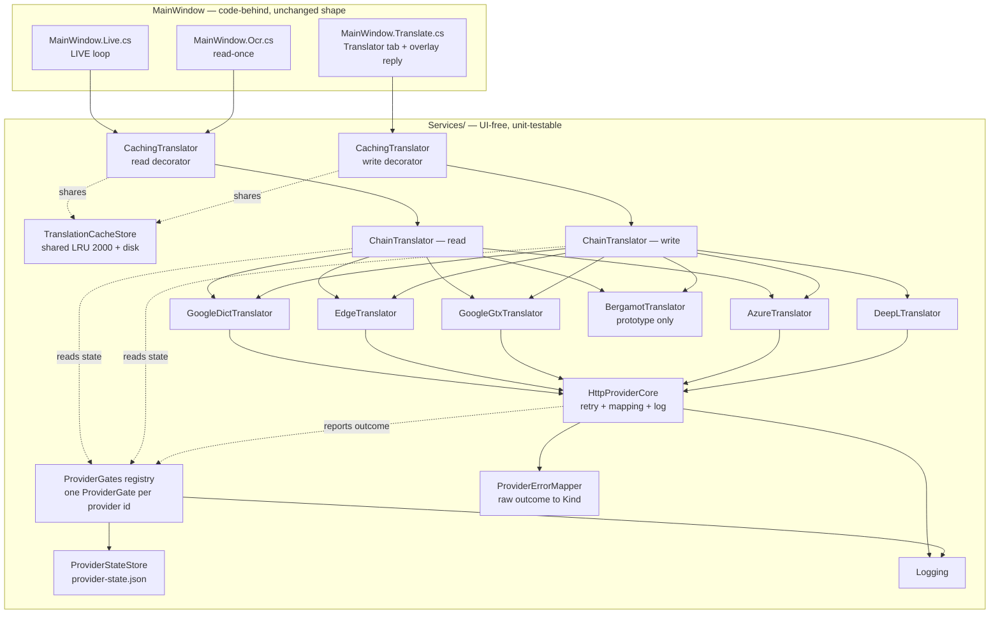
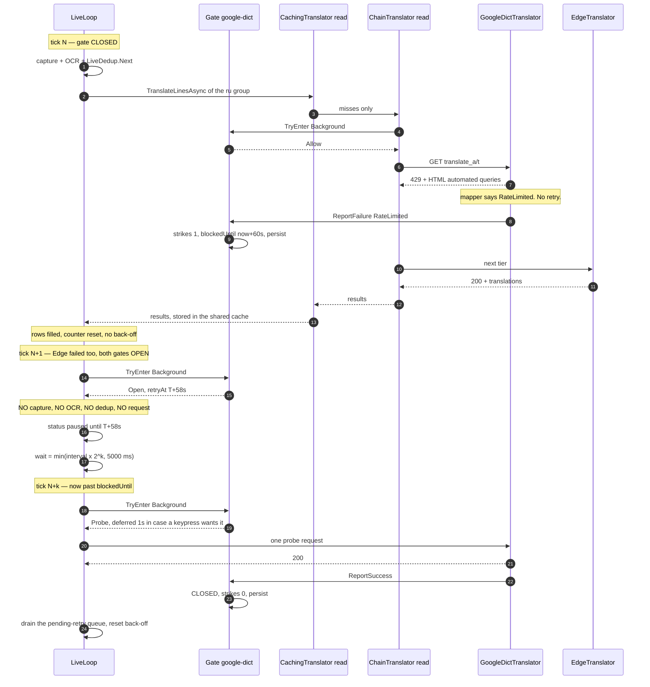

# 02 — P2 · Target architecture (translation path)

_Phase 2 · author: **Winston** (BMAD System Architect), workflow **CA — Create Architecture** ·
baseline commit `4759712` = `main` v0.14.0 · 2026-09-06 · status: **target — Phase 2 (design frozen, not implemented)**._

**Inputs.** `project-context.md` (hard rules) · `docs/investigations/README.md` (Phase 0/1 consolidations, the owner's
answers and his five Phase-2 decisions) · `02-traduction/analyse-implementation-actuelle.md` (§2 volume model,
§3 amplifiers, §4 what must be kept, §5.2 log line, §6.3 seams, §6.4 test surface) ·
`02-traduction/mecanismes-de-blocage-google.md` ("Implications for the target architecture") ·
`02-traduction/benchmark-fournisseurs.md` (§2, §3.1–3.2, §5.1, §5.4, §5.9, §6–7, §11, §11.4) ·
`00-annexe-demarrage-et-reseau.md` Case 2 · `01-demarrage/recommandations.md` (P1 levers) · the code at the baseline.

**No production code was changed to write this document.** Every `file:line` is at the baseline commit.
Evidence convention as elsewhere: **[CONFIRMED]** read in code · **[INFERRED]** derived · **[UNKNOWN]** needs
measurement · **[ASSUMED]** a chosen number, calibrated but not measured.

User-facing wording is **not** decided here. Every string the user reads appears as `«Sally: …»` — Sally owns the
copy (the `02-traduction/` UX deliverable, written in parallel).

---

## 1. Goals and non-goals

### 1.1 Goals

| # | Goal | Why it is here |
|---|---|---|
| G1 | **Stop the app from keeping its own block alive.** Google's block page states the release condition — *"the block will expire shortly after those requests stop"* — and today the app answers a 429 with two more requests in 900 ms plus a LIVE tick 700 ms later. | The single CONFIRMED mechanism behind "10 minutes, or never clears" (`mecanismes…` Q3; `analyse…` §1.5, A1–A4). |
| G2 | **Survive one provider going away.** `client=gtx` moved from "works" to "429 on request #1" during August 2026 for the whole ecosystem. The app must degrade to a second and third provider rather than to a dead end. | `benchmark…` §5.1; the read path has **no** second provider today (`analyse…` §6.2). |
| G3 | **Tell the truth on screen.** A read-once that failed must not report `Done — N line(s) translated`; a paused LIVE loop must not blink `● LIVE` as if it were working; a row that failed during a blip must not stay `(…)` for the rest of the session. | `analyse…` F-8, §3.1 (the burned row), `Ocr.cs:243-244`, `Ocr.cs:296-299`, `Live.cs:281`. |
| G4 | **Make the next incident a measurement.** `TranslationService` logs nothing, so the About tab's "Copy error report" is empty for exactly the failure users report. | `analyse…` §5.1 [CONFIRMED-ABSENT]; `MainWindow.xaml.cs:312-322`. |
| G5 | **Make all of the above testable headless.** The retry loop, the breaker and the response parsers are unreachable today because the `HttpClient` is `private static readonly` and not injectable. | `TranslationService.cs:32`; `analyse…` §6.4 gaps 1–3. |
| G6 | **Cost nothing at startup and nothing in RAM.** P1 is an open problem; this work must not make it worse. Nothing new runs before the window is visible; nothing new is always-resident. | `project-context.md` ("tiny footprint is a product requirement"); the P1 findings. |

### 1.2 Non-goals — deliberate, do not propose

| Non-goal | Reason |
|---|---|
| MVVM, view-models, a binding framework, a DI container | `project-context.md`: code-behind is a decision. A DI container would also add startup cost against G6. |
| i18n / `.resx` | English UI is a decision. |
| **Multi-`q=` Google batching** | Declined non-feature. It is *measured working* on the new endpoint (`benchmark…` §3.2) and it is *still not proposed here*; see OQ-A in §15.3. |
| WGC session caching | Declined; unrelated. |
| A generic "provider framework", a plugin model, a provider registry loaded from JSON | Rule of Three. Six concrete providers, one shared HTTP helper, one chain type. Nothing more. |
| User-Agent rotation, `client=` rotation as a *primary* strategy, JA3/TLS impersonation, forced HTTP/2, proxies, VPN advice | Folklore against an IP+client-id-keyed counter; `mecanismes…` Q6 and "Explicitly not worth building". |
| New NuGet packages | Only one, and only in a prototype: `BergamotTranslatorSharp` (§7.6). Azure uses a raw `HttpClient` POST — see §7.5 for why. |
| Splash screen, ReadyToRun, trimming, AOT, single-file compression, shipping fewer releases | Owner-banned or measured worse; see §13. |
| DPAPI-encrypted API keys | Noted as optional later hardening in §12, not now. |

---

## 2. Invariants — the spine

Everything below is what every story built from this document must keep true. A story that breaks one of these is
wrong even if it passes its own tests.

| # | Invariant | Enforced by / evidence |
|---|---|---|
| **I1** | `ITranslator` keeps its exact shape: two methods, `ct` last, `Task<string>` / `Task<List<string>>`. New behaviour arrives as **decorators or new implementations**, never as interface changes. | `TranslationService.cs:18-23`; every existing composition and test double depends on it. |
| **I2** | `Services/` stays free of UI types and unit-testable headless. The gate, the chain, the cache and every provider live in `Services/`. | `project-context.md`; `analyse…` §6.1. |
| **I3** | **Every `catch (OperationCanceledException)` in the pipeline and the LIVE loop filters `when (ct.IsCancellationRequested)`.** An `HttpClient` timeout is an OCE with the token *not* cancelled. A new decorator that catches broadly and forgets this turns every timeout into a phantom user-cancel. | The project's most expensive past bug: `FallbackTranslator.cs:26,38`, `DeepLTranslator.cs:80`, `Live.cs:227`; test `TranslationBackendTests.cs:98-109`. |
| **I4** | **Only successes are cached.** Any value starting with `(` is a failure placeholder and must never be stored — in memory or on disk. | `CachingTranslator.cs:82-85`; test `CachingTranslatorTests.cs:97-109`. |
| **I5** | **A batch count mismatch is never padded.** For a provider with a 1:1 batch contract (DeepL, Azure) it is a `BadResponse`. For a join/split provider (Google, Edge) it may fall through to per-line **only** under the bound in §6.3. | `DeepLTranslator.cs:49-53` (padding once bypassed the fallback and poisoned the cache); `analyse…` A11/S6. |
| **I6** | **Slang expansion stays upstream of every engine**, cloud or local. The displayed original and the 🔑 line stay raw; the cache key is the expanded text. | `Live.cs:298-302`, `Translate.cs:89-93`; `benchmark…` §10 measured `данж`→"dangling" without expansion. |
| **I7** | **The OCR path picks its source per message** (`IsProbablyRussian` → `ru`, else `auto`). No request-merging may lose that. | `Live.cs:306-310`; `analyse…` §6.1. |
| **I8** | **DeepL is never reachable from the read path.** A LIVE loop is 85–240 req/min against a one-time 1 M-character allowance. | `MainWindow.xaml.cs:40-41`, `Translate.cs:223-225`, `Live.cs:293-295`; `benchmark…` §5.3. |
| **I9** | **Gate state is process-global and persisted.** The two chains must never hold two independent breakers, and restarting the app must not clear a cool-down — the condition it mirrors is server-side and IP-scoped. | `MainWindow.xaml.cs:43` vs `Translate.cs:229-232` are separate instances today; the owner's report "restarting does not clear it" [CONFIRMED]. |
| **I10** | **Nothing new touches the disk or the network before the window is visible.** The gate file and the cache file load lazily, on first use, off the UI thread. | P1 fact F1 (`README.md`): zero network before first paint; G6. |
| **I11** | **No user text, no `q=`, no full URL, no API key ever reaches the log.** The log is pasted to Discord by design. | `MainWindow.xaml.cs:312-322`; `analyse…` §5.2. |
| **I12** | **Settings restore stays re-entrancy-safe.** Every new persisted control bails on `_restoringSettings` and its UI side effects are applied explicitly. | `MainWindow.xaml.cs:28-35`; the v0.12.3/v0.13.0 bug class, migrations v1 and v2 in `SettingsService.cs:137-149`. |
| **I13** | **Changed defaults reach existing users only via `SettingsVersion` + `Migrate`.** A new property initializer alone does nothing for a saved `settings.json`. | `SettingsService.cs:102,121,133-159`. |
| **I14** | **No WPF `Clipboard`.** Untouched by this work; stated so no new copy path re-introduces it. | `Services/ClipboardService.cs`. |
| **I15** | **Any new `Run.Text` binding is `Mode=OneWay` and gets a case in the STA `TemplateRenderTests`.** The pending-retry row state of §9.3 renders through the existing feed templates. | `project-context.md`; `tests/PWRUHelper.Tests/TemplateRenderTests.cs`. |
| **I16** | The three dedup layers, the batch join, the `rateLimited` latch, the strictly sequential LIVE loop and the cancellation token reaching `HttpClient` are **kept as they are**. They are the reason the app is not permanently blocked already. | `analyse…` §4 R1–R11. |

---

## 3. Component view



### 3.1 Responsibilities

| Component | Target file | Responsibility | Explicitly NOT its job |
|---|---|---|---|
| `TranslationErrorKind`, `TranslationException` | `Services/TranslationErrors.cs` | The typed error vocabulary and the exception carrying `Kind` + optional `RetryAt`. | Wording. `Friendly()` owns that. |
| `ProviderErrorMapper` | `Services/ProviderErrorMapper.cs` | **The one place** that turns a status code + content-type + body head + transport exception into a `Kind`. | Deciding what to do about it. |
| `HttpProviderCore` | `Services/HttpProviderCore.cs` | The shared send-with-retry: gate admission, ≤2 attempts, backoff+jitter, mapping via `ProviderErrorMapper`, the diagnostic log line, reporting the outcome to the provider's gate. Returns a raw body string. | URL building, request bodies, response parsing — each provider owns its own. |
| `ProviderGate` | `Services/ProviderGate.cs` | One provider's circuit breaker **and** rate ceiling. Injectable clock. | Persistence, HTTP, chain ordering. |
| `ProviderGates` (registry) | `Services/ProviderGates.cs` | Static, lazily-initialised map `provider id → ProviderGate`; owns load/save of `provider-state.json`; `internal` test reset and path/clock overrides. | Policy numbers. |
| `ProviderStateStore` | `Services/ProviderStateStore.cs` | Atomic read/write of `provider-state.json` using the `SettingsService.Save` pattern. Best-effort, never throws. | Deciding when to write. |
| `TranslationPolicy` | `Services/TranslationPolicy.cs` | **Every tunable number in one place**, as `const`/`static readonly`, each carrying its evidence grade in a comment. | Anything else. |
| `ChainTranslator` | `Services/ChainTranslator.cs` | Ordered tiers; skip open gates; try the next on failure; raise one `AllProvidersPaused` when every tier is closed to it. | Retrying inside a provider; caching. |
| `CachingTranslator` | `Services/CachingTranslator.cs` (extended) | Unchanged decorator semantics, plus an optional shared store. | Knowing which provider produced a value. |
| `TranslationCacheStore` | `Services/TranslationCacheStore.cs` | The LRU itself + lazy load + debounced atomic save of `translation-cache.json`. | The `(`-prefix rule — that stays in `CachingTranslator` (I4). |
| `GoogleDictTranslator` | `Services/GoogleDictTranslator.cs` | The new default free provider. | — |
| `EdgeTranslator` | `Services/EdgeTranslator.cs` | The independent keyless second vendor. | — |
| `GoogleGtxTranslator` | `Services/GoogleGtxTranslator.cs` | Today's `TranslationService`, renamed, demoted to a late tier, typed errors. | Being the default. |
| `AzureTranslator` | `Services/AzureTranslator.cs` | Azure AI Translator F0/S1 over raw `HttpClient`. | — |
| `DeepLTranslator` | `Services/DeepLTranslator.cs` | Unchanged behaviour; error construction goes through `Kind`. | Ever being reachable from the read path (I8). |
| `BergamotTranslator` | `Services/BergamotTranslator.cs` | **Prototype only.** Lazy model load, idle unload, synchronous native call on `Task.Run`. **Landed E8.S2** (prototype branch): the provider alone — `Load()`/`Unload()`/`IsLoaded` are the capability, the *policy* is E8.S4, the store is E8.S3, the chain placement is E8.S5. | Shipping before the measured go/no-go (§7.6). Calling `ProviderGate.TryEnter` (a local engine takes no admission token) or writing `NotSent` (ruling E8-c). |
| `IBergamotEngine` | `Services/BergamotEngine.cs` | **Landed E8.S2.** The three C exports as an interface — `translator_initialize` (the factory), `translator_translate`, `translator_free` — with `BergamotEngine` wrapping `BlockingService` and a fake standing in for it in every automated case of epic E8 (CI-8: no model download, no native DLL in CI). | Widening it: it is a P/Invoke surface, not an abstraction layer. |
| `TextChunker` | `Services/TextChunker.cs` | `ChunkText` / `HardSplit`, moved out of `TranslationService` because two providers need them. | — |

---

## 4. Error model

### 4.1 `TranslationErrorKind`

```csharp
public enum TranslationErrorKind
{
    RateLimited,        // 429, or a Google "automated queries" HTML page on any status
    Blocked,            // 403 with no key, a captcha/interstitial page, an abuse block
    Unavailable,        // 5xx
    Timeout,            // HttpClient timeout (an OCE with ct NOT cancelled)
    Network,            // DNS, TLS, connect, proxy — HttpRequestException
    BadResponse,        // unparseable body, wrong shape, batch count mismatch on a 1:1 provider
    QuotaExhausted,     // DeepL 456, Azure 403 with an out-of-quota envelope
    AuthFailed,         // 401, or 403 while a key was sent
    Cancelled,          // a genuine user cancel — see the rule below
    AllProvidersPaused, // ADDED: every tier in the chain was gate-open or failed
    Unknown,            // ADDED: the mapper's last resort; must never become common
}
```

> Two additions to the decided list, both mechanical. `AllProvidersPaused` is the "single typed outcome" decision D
> requires; it simply needs a home in the enum. `Unknown` is the mapper's total-function requirement — without it
> the mapper must guess, and a wrong guess is worse than an honest one. If `Unknown` shows up in field logs, that
> is a bug report about the mapper, not a user problem.

`TranslationException` gains a **required** `Kind` and an optional `RetryAt`:

```csharp
public class TranslationException : Exception
{
    public TranslationErrorKind Kind { get; }
    public DateTimeOffset? RetryAt { get; }     // from the gate or Retry-After, else null
    public string? ProviderId { get; }          // for the log; never shown to the user
    public TranslationException(TranslationErrorKind kind, string message,
        DateTimeOffset? retryAt = null, string? providerId = null) : base(message) { }
}
```

**No message-only constructor.** Removing it is the point: the compiler then forces each of the 12 existing throw
sites (`TranslationService.cs:143,145,148,157,175`; `DeepLTranslator.cs:53,60,87,91,99,127`) to state a `Kind`.
Exactly one test line constructs it (`TranslationBackendTests.cs:78`) and is updated with them.

**The `Cancelled` rule (I3, restated as a contract).** `Kind.Cancelled` exists so the mapper is total, but a
provider that recognises a genuine cancellation **rethrows the `OperationCanceledException`** — it never wraps it.
A `TranslationException` with `Kind.Cancelled` must never be constructed. The mapper's signature says so:

```csharp
// Returns Cancelled ONLY when ct.IsCancellationRequested. The caller's contract is:
//   if (kind == Cancelled) throw;   // rethrow the original OCE, never wrap it
internal static TranslationErrorKind Classify(HttpResponseMessage? resp, string? bodyHead,
    Exception? transport, bool keyWasSent, CancellationToken ct);
```

### 4.2 Classification rules — one place, `ProviderErrorMapper`

Order matters; the first match wins.

| # | Signal | `Kind` |
|---|---|---|
| 1 | `ct.IsCancellationRequested` | `Cancelled` → the caller rethrows the OCE |
| 2 | `OperationCanceledException` / `TaskCanceledException` with `ct` **not** cancelled | `Timeout` |
| 3 | `HttpRequestException` (DNS, TLS, connect, proxy refused) | `Network` |
| 4 | status 429 | `RateLimited` |
| 5 | status 401 | `AuthFailed` |
| 6 | status 403 **and** a key was sent **and** the error envelope names a quota/limit | `QuotaExhausted` |
| 7 | status 403 **and** a key was sent | `AuthFailed` |
| 8 | status 403, no key | `Blocked` |
| 9 | status 456 (DeepL) | `QuotaExhausted` |
| 10 | status ≥ 500 | `Unavailable` |
| 11 | **any status, 2xx included**, where the body is an HTML abuse page — see §4.3 | `RateLimited` if it names automated queries / unusual traffic, else `Blocked` |
| 12 | success status, body does not parse into the provider's shape | `BadResponse` |
| 13 | anything else non-success | `Unknown` |

Two behaviour changes worth naming, because they are user-visible:

- **403 stops being folded with 400/404.** Today `TranslationService.cs:138-143` reports every non-429, non-5xx
  status as `Translation service error (HTTP {code})`, so a bot block reads like a bug (`00-annexe…` §2.4, E1).
- **An HTML block page served with a 200 stops being a `JsonException`.** Today it becomes E4 *"unexpected
  response (it may be temporarily blocked)"* only by accident, through the JSON parser
  (`TranslationService.cs:172-177`). `benchmark…` §11.4 item 1 names this as the single most common bug across
  every project surveyed.

### 4.3 HTML sniffing — never parse-then-guess

**Rule: the body is classified before it is parsed, never after.**

```
1. read Content-Type. text/html, or no JSON media type  →  HTML path.
2. else read at most the first 200 chars: if the first non-whitespace
   character is '<'                                     →  HTML path.
3. HTML path: de-tag the first ~400 chars, lowercase, match the markers
   "automated queries" / "unusual traffic"  → RateLimited
   "we're sorry" / "captcha" / "recaptcha"  → Blocked
   no marker                                → Blocked, with the de-tagged
                                              120-char head in the log line.
4. only a body that survived 1–3 is handed to JsonDocument.Parse.
```

The marker strings are `const` in `TranslationPolicy`, so a new phrasing is one edit away. `benchmark…` §3.1
recorded the exact body this app receives: *"your computer or network may be sending automated queries"*
[MEASURED, 2026-09-06].

### 4.4 `Friendly()` — one message per `Kind`

`MainWindow.xaml.cs:404-410` becomes a `Kind` switch. Wording is **Sally's**; the architecture fixes only the
*shape*: one sentence per `Kind`, plus a countdown when `RetryAt` is set.

```csharp
private static string Friendly(Exception ex) => ex switch
{
    TranslationException te => te.Kind switch
    {
        RateLimited        => «Sally: the free service is throttling us; retry in {countdown}»,
        Blocked            => «Sally: the free service is refusing this network right now»,
        Unavailable        => «Sally: the translation service is down; trying again shortly»,
        Timeout            => «Sally: the request timed out»,
        Network            => «Sally: no Internet connection»,
        BadResponse        => «Sally: the service answered with something we could not read»,
        QuotaExhausted     => «Sally: this key's quota is used up»,
        AuthFailed         => «Sally: the key was rejected — check it in Settings»,
        AllProvidersPaused => «Sally: all providers are paused; resuming in {countdown}»,
        Unknown            => te.Message,
        Cancelled          => te.Message,   // unreachable by contract, kept total
    },
    HttpRequestException  => «Sally: no Internet connection»,
    TaskCanceledException => «Sally: the request timed out»,
    _ => ex.Message,
};
```

`{countdown}` is rendered from `RetryAt` at display time — `MainWindow` formats it, `Services/` never does (I2).

---

## 5. `ProviderGate` — circuit breaker + rate ceiling

### 5.1 Why one gate per provider, shared by both chains

The read chain is a field initializer (`MainWindow.xaml.cs:43`); the write chain is rebuilt on every DeepL key save
(`Translate.cs:239`). Two instances today; the breaker's state must not be (I9).

**Decision: a static registry, `ProviderGates.For(string providerId)`.** Justification, in order of weight:

1. **Semantics first.** The state this object holds mirrors an *external, process-independent* condition: an
   IP-scoped counter on Google's side. It is not per-window, per-chain or per-request state. A process-global
   singleton is the honest model, not a convenience.
2. **Lifetime.** A shared instance would have to be threaded through a field initializer that runs *before*
   `_settings` is even loaded — declaration order puts `_readTranslator` at `:43` and `_settings` at `:50` — and
   through `BuildTranslator()`, which runs again on key save. Static removes an ordering hazard that has already
   produced bugs in this codebase.
3. **Testability is unaffected, and the project already has this pattern twice.** `SettingsService.PathOverride`
   (`SettingsService.cs:95`) and `Logging.DirectoryOverride` (`Logging.cs:31-39`) are exactly this: static facades
   with `internal` overrides so the suite never touches the real `%AppData%`. `ProviderGates` gets
   `internal static string? PathOverride`, `internal static Func<DateTimeOffset> Clock` and
   `internal static void ResetForTests()`.

The one cost is real and accepted: **static state is shared across xUnit's parallel test collections.** The gate
tests therefore live in a single non-parallel collection with an explicit reset in the fixture — the same
discipline `StartupSettingsTests` already needs.

### 5.2 State machine

```mermaid
stateDiagram-v2
    [*] --> Closed
    Closed --> Open : ReportFailure with an opening Kind — strikes++ ; blockedUntil = now + window
    Open --> Open : TryEnter while now < blockedUntil — returns Open with retryAt
    Open --> HalfOpen : TryEnter when now >= blockedUntil — first caller only
    HalfOpen --> HalfOpen : TryEnter from any other caller — returns Open with retryAt = now + probeTimeout
    HalfOpen --> Closed : probe succeeded — strikes = 0 ; blockedUntil = null
    HalfOpen --> Open : probe failed with an opening Kind — strikes++ ; window doubles
    Closed --> Closed : ReportSuccess — cleanSince refreshed ; strikes = 0 after CleanResetMinutes
```



`Closed` additionally enforces the **rate ceiling** before admitting a request (§5.4). The ceiling is independent
of the breaker: a closed gate can still answer `Wait`.

### 5.3 Which `Kind` opens the circuit

The breaker exists for two things only: to stop hammering a server that said *stop*, and to skip a provider whose
credentials are dead. Everything else fails the request and lets the chain move on — that is what the chain is for.

| `Kind` | Retried inside the provider? | Gate action | Window |
|---|---|---|---|
| `RateLimited` | **no** — raise immediately, the gate owns the wait | strike, **open** | `OpenBaseSeconds` × 2^(strikes−1), capped at `OpenCapMinutes` |
| `Blocked` | **no** | strike, **open** | same |
| `QuotaExhausted` | no | **open**, no strike escalation | `QuotaOpenMinutes` (60), cleared when the key is re-saved |
| `AuthFailed` | no | **open until the key changes** | `blockedUntil = DateTimeOffset.MaxValue`, cleared by `ProviderGates.ClearAuthBlock(id)` from the key-save handler |
| `Unavailable` | **yes**, ≤ 2 attempts | no strike, short cooldown | `SoftCooldownSecs` (5) |
| `Timeout` | **yes**, ≤ 2 attempts | no strike, short cooldown | 5 s |
| `Network` | **no** — the chain covers it | no strike, short cooldown | 5 s |
| `BadResponse` | no | soft strike; **3 consecutive** → open | `OpenBaseSeconds` |
| `AllProvidersPaused` | n/a | never reported to a gate — it is the chain's own outcome | — |
| `Cancelled` | n/a | **never touches the gate** | — |
| `Unknown` | no | no strike, short cooldown | 5 s |

The short cooldown matters more than it looks: without it a 5xx or a DNS blip means the next LIVE tick re-hits the
same dead provider 700 ms later.

### 5.4 Rate ceiling

A token bucket per provider, consulted **before** the request, never after:

- capacity **2**, so an interactive keypress after a quiet minute is never made to wait;
- refill **1 token per `MinSpacingMs` = 500 ms** (`mecanismes…` Q2: 500 ms is the ecosystem's converged value);
- `TryEnter` on an empty bucket returns `Wait(t)`, where `t` is the time to the next token.

**Callers do not all wait.** `ChainTranslator` awaits a `Wait` only while `t <= MaxSpacingWaitMs` (2 s); beyond
that it treats the tier as unavailable and moves on. The LIVE loop never blocks a tick on the ceiling — it reads
the `retryAt` and backs off (§9.1).

**Architect's concern #1, and its resolution.** The shared gate is correct (I9), but it means a LIVE loop can spend
the whole rate budget and the next half-open probe, leaving the Translator tab — the user's most valued,
one-request-per-Enter interaction — paused by something the user is not doing. Resolution, small and inside the
decided design: `TryEnter` takes a `RequestPriority { Interactive, Background }`.

- `Background` (LIVE, read-once) may draw the bucket down but **may not take the last token**; one token of the
  capacity-2 bucket is reserved for `Interactive`.
- The **half-open probe is granted to an `Interactive` caller in preference**: a `Background` caller that finds the
  gate probe-eligible defers once by `ProbeDeferMs` (1 s) before taking the probe itself, so a user who presses
  Enter during that second gets it.

This is one enum and two `if`s. It is not a scheduler.

### 5.5 `Retry-After`

Parsed on every non-success response, both forms — delta-seconds and HTTP-date — and clamped to
`[1 s, OpenCapMinutes]`. When present it **overrides** the computed window and is logged verbatim.
`benchmark…` §3.1 and `mecanismes…` Q2 both record that Google sends **no** `Retry-After` on this endpoint today
[MEASURED]; the code honours it anyway because DeepL and Azure may, and because the field is the single
highest-value new datum in the log (`analyse…` §5.2, M1).

### 5.6 Policy constants — all in `Services/TranslationPolicy.cs`

```csharp
internal static class TranslationPolicy
{
    // ---- circuit breaker.  ALL [ASSUMED]: calibrated to a REPORTED range
    // (mecanismes-de-blocage-google.md Q3: "a few minutes" .. "12-24 h"), never measured.
    // Instrument first, tune from field logs (see plan-migration.md, validation).
    public const int OpenBaseSeconds   = 60;    // first strike; matches the app's own "wait a minute"
    public const int OpenCapMinutes    = 30;    // beyond this a user restarts rather than waits
    public const int CleanResetMinutes = 10;    // strikes reset after this long with no failure
    public const int QuotaOpenMinutes  = 60;
    public const int SoftCooldownSecs  = 5;
    public const int BadResponseStrikesToOpen = 3;

    // ---- rate ceiling  [ASSUMED, from the ecosystem's converged 500 ms]
    public const int MinSpacingMs      = 500;
    public const int BucketCapacity    = 2;
    public const int MaxSpacingWaitMs  = 2000;
    public const int ProbeDeferMs      = 1000;

    // ---- retry inside a provider  [ASSUMED]
    public const int MaxAttempts       = 2;     // was 3
    public const int BackoffBaseMs     = 500;   // full jitter: delay = rand(0, base << attempt)

    // ---- batching / LIVE  [ASSUMED]
    public const int PerLineCap        = 8;     // ruling E3-e: bounds the per-line FAN-OUT after a failed batch (lines beyond it get the skipped placeholder, zero requests); never a provider's primary per-line path
    public const int LiveBackoffCapMs  = 5000;
    public const int AutoStopWindowMinutes = 2;
    public const int PendingRetryMaxAttempts = 2;
    public const int ReadOnceBudgetSeconds = 30;

    // ---- cache
    public const int CacheCapacity       = 2000;   // was 500, in memory only
    public const int CacheSaveDebounceMs = 5000;

    // ---- HTML abuse-page markers (ProviderErrorMapper, §4.3)
    public static readonly string[] RateLimitMarkers = { "automated queries", "unusual traffic" };
    public static readonly string[] BlockMarkers     = { "we're sorry", "captcha", "recaptcha" };
}
```

`AppSettings.ProviderGateOverrides` (§12) may override the numeric constants at runtime for a field experiment. It
is a diagnostic hatch, not a feature, and it has no UI.

### 5.7 Persisted state — `%AppData%\PWRUHelper\provider-state.json`

Written with the exact atomic pattern of `SettingsService.Save` (`SettingsService.cs:186-197`): temp file,
`File.Replace`, the whole method inside `try { } catch { }` so a read-only disk costs nothing.

```json
{
  "version": 1,
  "providers": {
    "google-dict": {
      "blockedUntil": "2026-09-06T13:45:12.4Z",
      "strikes": 2,
      "lastKind": "RateLimited",
      "lastAt": "2026-09-06T13:41:12.4Z",
      "cleanSince": null
    },
    "deepl": {
      "blockedUntil": null,
      "strikes": 0,
      "lastKind": "Unavailable",
      "lastAt": "2026-09-06T12:02:00.0Z",
      "cleanSince": "2026-09-06T12:02:31.0Z"
    }
  }
}
```

- **Loaded lazily**, on the first `TryEnter` of the process, off the UI thread (I10). A missing, corrupt or
  future-`version` file yields an empty registry — never an exception, never a blocked start.
- **Saved** on every state transition (open, half-open → closed, strike reset), debounced by 1 s and coalesced,
  plus once on `OnClosing`. Transitions are rare by construction: a handful per session at most.
- **Clock skew.** `blockedUntil` is absolute UTC. A value more than `OpenCapMinutes` in the future is clamped on
  load, so a machine whose clock jumped cannot pause the app for a week.
- **Unknown provider ids** in the file are preserved on rewrite, so downgrading does not lose a newer provider's
  state.

---

## 6. `ChainTranslator`

### 6.1 Shape

```csharp
internal readonly record struct ChainTier(ProviderGate Gate, ITranslator Translator);

public sealed class ChainTranslator : ITranslator
{
    public ChainTranslator(IReadOnlyList<ChainTier> tiers) { }
}
```

`ITranslator` is untouched (I1). The tier carries its gate, so the chain never needs provider ids and a provider is
never asked for one — the gate already has `Id` for logging.

`FallbackTranslator` becomes the two-tier special case and is **deleted** once `ChainTranslator` exists. Its two
most valuable tests (`TranslationBackendTests.cs:84` real-cancel-propagates, `:98` timeout-falls-through) are
re-pointed at `ChainTranslator` and keep their names — they are the I3 regression guards.

### 6.2 Algorithm — identical for `TranslateAsync` and `TranslateLinesAsync`

```
skippedRetryAts = []            // retryAt of every tier we never called
lastFailure     = null

for each tier in tiers:
    decision = tier.Gate.TryEnter(priority)
    if decision is Open(retryAt):
        skippedRetryAts.add(retryAt); continue
    if decision is Wait(t):
        if t > MaxSpacingWaitMs: skippedRetryAts.add(now + t); continue
        await Task.Delay(t, ct)
    try:
        return await tier.Translator.<call>(..., ct)           // success: done
    catch (OperationCanceledException) when (ct.IsCancellationRequested):
        throw                                                  // I3
    catch (TranslationException tex):
        lastFailure = tex; Logging.Warn(one line per tier); continue
    catch (Exception ex):
        lastFailure = wrap(ProviderErrorMapper.Classify(ex)); continue

if lastFailure == null:         // every tier was skipped
    throw new TranslationException(AllProvidersPaused, «Sally: ...»,
                                   retryAt: skippedRetryAts.Min())
throw lastFailure               // at least one tier really tried: report the most specific failure
```

Three properties this buys, stated because stories will be written against them:

- **A gate-open tier costs zero requests and zero milliseconds.** That is the whole of G1.
- **The user sees one honest message, not a cascade** — either "everything is paused until *t*", or the real
  reason the last provider that actually tried gave.
- **A provider's own retry never fights the chain.** 429/403 raise immediately (§7.0), so the chain reaches the
  next vendor in milliseconds instead of after 900 ms of retries against a server that said stop.

### 6.3 Batch semantics (I5, made precise)

| Provider family | Batch mechanism | Count mismatch |
|---|---|---|
| DeepL, Azure | native array, one result per input, in order | `BadResponse`, **never padded** (`DeepLTranslator.cs:49-53`) |
| Google (gtx and dict), Edge | lines joined with `\n`, response split on `\n` | falls through to **per-line for at most `PerLineCap` (8) lines**; the remaining lines get the skipped placeholder with zero requests and one `Warn` line _(ruling E3-e, 2026-09-07 — supersedes the earlier "above the cap it is a `BadResponse`")_. A provider whose primary path is per-line (dict until U1) is bounded by the rate ceiling, not by the cap. **Ruling E3-f/E3-g:** a tier that translated **no** line throws its last failure so the chain tries the next tier; placeholders are returned only for partial success. |

The per-line cap is new and it closes a measured amplifier: today a mismatch on a 14-line tick turns one logical
translation into up to 30 requests inside one tick (`analyse…` S6, A11). The existing `rateLimited` latch
(`TranslationService.cs:99-105`) is kept as-is (I16) and now latches specifically on a `RateLimited`/`Blocked`
`Kind` rather than on any `TranslationException`.

---

## 7. Providers

### 7.0 Rules shared by every HTTP provider (`HttpProviderCore`)

- **Attempts: 2, not 3.** Backoff is full jitter — `delay = Random(0, BackoffBaseMs << attempt)` — so two instances
  behind the same NAT stop retrying in lockstep (`analyse…` A1: today it is a fixed 300/600 ms with no jitter).
- **Retry only on `Unavailable` and `Timeout`.** `RateLimited` and `Blocked` raise immediately; the gate owns the
  wait (decision C). `Network` no longer retries either: the chain provides the redundancy the retry used to fake,
  and a provider that cannot be reached is a provider to skip. *(Change from `TranslationService.cs:151`, which
  retries `HttpRequestException` twice.)*
- **Admission before the request, outcome after it.** `HttpProviderCore` calls `gate.TryEnter` and then
  `gate.ReportSuccess()` / `gate.ReportFailure(kind, retryAfter)`. A provider never touches a gate directly.
- **One shared `HttpClient` per provider type in production, an injectable handler for tests** (§11):
  `internal GoogleDictTranslator(HttpMessageHandler? handler = null)`. `handler == null` → the static shared
  client; otherwise a private `new HttpClient(handler)`.
- The shared clients set `PooledConnectionLifetime = 2 min` on a `SocketsHttpHandler`. Cheap insurance against a
  poisoned pooled connection on a process-lifetime static client (Phase 0 Q2.6 / `analyse…` P8, graded *probably
  refuted*) — kept because it costs one line.
- **Timeout stays 12 s per request** (`TranslationService.cs:39`). With `MaxAttempts = 2` the read-once worst case
  drops from ≈ 36.9 s to ≈ 24 s, and to ≈ 12 s once the gate opens on the first failure.
- **Keep the existing plausible browser User-Agent; do not rotate it.** `benchmark…` §3.1 measured 429 *with and
  without* the UA — it is not the trigger; `mecanismes…` Q2 records that an absent or `curl`-style UA does produce
  a 403. So: keep, freeze, do not touch.
- **The `analyse…` §5.2 log line is emitted here**, once per non-success or exceptional attempt (§10).

### 7.1 `GoogleDictTranslator` — the new default

| | |
|---|---|
| Provider id | `google-dict` |
| Endpoint | `GET https://clients5.google.com/translate_a/t?client=dict-chrome-ex&sl={src}&tl={tgt}&q={UrlEncode(text)}` |
| Response, fixed `sl` | `["Hello"]` |
| Response, `sl=auto` | `[["Hello","ru"]]` — a nested array whose second element is the detected source |
| Headers | the existing Chrome UA, unchanged |
| Batching | lines joined with `\n` in one `q`, response split on `\n` — **[UNKNOWN], see below** |
| Size budget | `MaxQueryBytes = 1500` UTF-8, unchanged; `TextChunker` unchanged |
| ToS posture | `clients5.google.com/robots.txt` has **no** `Disallow: /translate_a/`, unlike `translate.googleapis.com` line 162 — strictly better than today, still not clean |
| Evidence | `benchmark…` §3.2: 20/20 HTTP 200 at ~2.5 req/s from the exact network where `gtx` was 429; median latency ~200 ms; verified clear from two independent networks |

Parser: the root is an array. `root[0]` is a string → shape A, take `root[0]`. `root[0]` is an array → shape B,
take `root[0][0]`. Anything else → `BadResponse`. Both shapes get a recorded fixture (§11.2 T12).

**Error mapping.** 429 → `RateLimited`; 403 → `Blocked`; HTML on any status → §4.3; 5xx → `Unavailable`;
unparseable JSON → `BadResponse`.

> **[UNKNOWN] U1 — the single most important one in this document.** Does a `\n`-joined multi-line `q` come back
> with its newlines intact on `translate_a/t`? The `gtx` endpoint returns *segments* the app concatenates;
> `dict-chrome-ex` returns one string. If newlines are dropped, **every batch degrades to per-line** — at the
> measured ≈ 2.1 lines per batch that is roughly a 2× request increase on the LIVE path, partially undoing G1.
> It must be settled by a capture **before** increment 2 ships. Two fallbacks exist; one of them is the declined
> multi-`q=` non-feature, which is **not proposed** — see OQ-A.

### 7.2 `EdgeTranslator` — the independent second vendor

| | |
|---|---|
| Provider id | `edge` |
| Endpoint | `POST https://edge.microsoft.com/translate/translatetext?from={src or empty}&to={tgt}&isEnterpriseClient=false` |
| Auth | **keyless** — `edge.microsoft.com/translate/auth` has been 404 since ~2026-07-28 and this route needs no token |
| Request body | **[UNKNOWN]** — presumed the Microsoft Translator v3 shape `[{"Text":"…"}]`, unverified |
| Response | **[UNKNOWN]** — presumed `[{"translations":[{"text":"…","to":"…"}]}]`, unverified |
| Required headers | **[UNKNOWN]** — `Content-Type: application/json` is certain; whether an `Origin` or UA is required is not |
| Auto-detect | yes, by omitting `from` |
| Evidence | `benchmark…` §5.9, §4: 40/40 burst clean, keyless, no token scraping; the route is known-good for ~1 month only |

Everything marked [UNKNOWN] is settled by one captured live request in the prototype and then frozen as a recorded
fixture. **No `EdgeTranslator` code is written before that capture exists** — writing a provider against a guessed
body shape is how a "second vendor" becomes a second way to fail.

Error mapping: 429 → `RateLimited`; 401/403 → `Blocked` (no key is sent, so never `AuthFailed`); 5xx →
`Unavailable`; non-JSON → §4.3, then `BadResponse`.

### 7.3 `GoogleGtxTranslator` — today's code, demoted

Today's `TranslationService`, renamed and moved to `Services/GoogleGtxTranslator.cs`, provider id `google-gtx`.
What changes: typed errors (§4), 2 attempts with jitter (§7.0), gate admission, logging. The endpoint, UA,
chunking and batch/per-line shape are otherwise untouched.

It sits **last among the free tiers**, not first, because `benchmark…` §5.1 records it as *retired in practice*:
429 on request #1 from a clean IP, no `Retry-After`, persisting for days, with a dense cluster of independent
projects reporting the same break from ~2026-08-22. It is kept rather than deleted because it costs nothing to
keep, it is the only tier proven against this app's real traffic for two years, and the block is keyed on the
`client=` id — an id can come back.

Mechanical consequences of the rename — **all landed in E3.S6 (2026-09-07); nothing here is left to do**:
`ChunkText`/`HardSplit` moved to `Services/TextChunker.cs` (the two cases at `ServicesTests.cs:80,91` were
re-pointed to `TextChunkerTests`), and `project-context.md`'s "Translation Pipeline Rules" section — which named
`TranslationService` — was updated in the same PR. `ITranslator` stayed in the renamed file (I1). One behaviour
change went with the rename, and only one: §6.3's `rateLimited` latch now fires on a `RateLimited`/`Blocked`
Kind instead of on any `TranslationException`, so a timeout or an unparseable body no longer turns every
remaining line into "(skipped — rate-limited…)".

### 7.4 `DeepLTranslator` — unchanged behaviour, typed errors

Provider id `deepl`. Endpoint, `:fx` host routing, form encoding and header auth all unchanged
(`DeepLTranslator.cs:24-30,62-73`). Only the exception construction changes: 401/403 → `AuthFailed`,
456 → `QuotaExhausted`, 429 → `RateLimited`, other non-success → `Unavailable` or `Unknown` by status, timeout →
`Timeout` (the existing OCE pair at `:80-88` stays exactly as it is — it is the canonical I3 implementation),
`HttpRequestException` → `Network`, parse or count mismatch → `BadResponse`.

**Write-path only, forever (I8).** DeepL's current free plan is a one-time 1 M characters *in total*; the read path
would drain it in about five days of a heavy user (`benchmark…` §5.3). The three code comments that state this rule
stay where they are.

> **[UNKNOWN] U5, carried from `benchmark…` OQ-3:** whether existing `:fx` API-Free keys still work after DeepL's
> July 2026 plan change. If they do not, an existing user's DeepL tier silently becomes an `AuthFailed` gate-open on
> first use — which is exactly the right behaviour, and the settings UI must say so.

### 7.5 `AzureTranslator` — the new key slot

| | |
|---|---|
| Provider id | `azure` |
| Endpoint | `POST https://api.cognitive.microsofttranslator.com/translate?api-version=3.0&from={src}&to={tgt}` |
| `from` omitted | auto-detect; the response then carries `detectedLanguage` |
| Headers | `Ocp-Apim-Subscription-Key: {AzureApiKey}`, `Ocp-Apim-Subscription-Region: {AzureRegion}`, `Content-Type: application/json; charset=utf-8` |
| Body | `[{"Text":"line 1"},{"Text":"line 2"}]` — **native batching, up to 1,000 elements** |
| Response | `[{"translations":[{"text":"…","to":"en"}]}, …]`, one element per input, in order |
| Limits | 50,000 characters per request across all targets; F0 **2 M chars/month, permanent** and **2 M chars/hour** (~33,300/min); documented latency 150–300 ms under 100 characters; no concurrency limit |
| Measured | 93 ms RTT from the owner's network — the fastest of the three official APIs probed (`benchmark…` §3.3) |

**Raw `HttpClient`, not `Azure.AI.Translation.Text`.** Reasons, in order of weight:

1. **Dependency surface.** The SDK brings its own upgrade cadence, transitive tree, timeouts and retries — the last
   of which would fight `HttpProviderCore` — for an endpoint whose entire contract is *POST a JSON array with two
   headers*.
2. **Footprint.** ~3.0–3.2 MB of managed assemblies, of which **~1.3 MB is an MSAL auth stack this app never
   calls**, because F0/S1 auth is two request headers (`benchmark…` §7). The publish is self-contained, single-file
   and **uncompressed on purpose** (v0.14.0 removed compression to save ~118 MB of working set), so added
   assemblies land in the exe roughly 1:1.
3. **Consistency.** The app already speaks raw `HttpClient` to two vendors; a third does not need a new dependency
   model or a second JSON stack.

*(The size point is deliberately second, not first: 3 MB on a 178 MB exe is 1.7 %, and `benchmark…` §7 is explicit
that exe size is not a valid argument on its own. The dependency surface is the real reason.)*

Error mapping: 401 → `AuthFailed`; 403 → `QuotaExhausted` when the error envelope names a quota or limit, else
`AuthFailed`; 429 → `RateLimited`; 5xx → `Unavailable`; count mismatch → `BadResponse` (I5, never padded). Azure
errors arrive as `{"error":{"code":…,"message":…}}`; the code is logged, the message is never shown raw.

**Batching note.** Azure is the only tier with a true 1:1 array contract, which makes it immune to the `\n`-join
fragility of §7.1. When a key is present it is therefore also the **safest** tier, not merely the fastest.

> **[UNKNOWN] U4, `benchmark…` OQ-4:** that F0's 2 M chars/month is permanent rather than a 12-month trial is
> CONFIRMED from the pricing page's wording and REPORTED from a Microsoft Q&A, but not verified on a real resource.
> The settings copy must not promise "free forever" until it is.

### 7.6 `BergamotTranslator` — **prototype only**, Phase 2

> **Amendment A-1 (Winston, 2026-09-06, after the owner's answer to OQ-C).** The owner asked for "a very small, very fast, one-click local translator that takes over when internet requests fail, even at a RAM cost". That is this component, with three changes to the text below: **(a)** installation is **one click** from the About tab (download of the engine + the needed language pairs on explicit consent, per `ux-mode-degrade.md` §4; `OfflineFallbackEnabled` is written by the Download/Remove actions, ruling R-4); **(b)** once installed, the model is **loaded on the first fallback use and kept loaded while LIVE is running** — it is unloaded only after LIVE stops and an idle timeout elapses, not on every idle window; **(c)** the RAM budget line below is **relaxed by the owner's explicit acceptance** (+127–310 MiB while active). Everything else stands: last tier of both chains, downstream of `SlangGlossary.Expand` (I6), prototype with a measured go/no-go (U6/U7), no dependency of any other component on it. True LLMs (Qwen/Gemma/Phi, 1–3 GB, seconds per line on CPU) remain rejected per `benchmark-fournisseurs.md` §6.

Not a shipping component. It is in this architecture so the prototype is built against the same invariants.

| | |
|---|---|
| Provider id | `bergamot` |
| Package | `BergamotTranslatorSharp` (MPL-2.0, NuGet 0.5.1, 2026-07-30, net8.0) — **the only new NuGet in this design, and only on the prototype branch** |
| Native | `bergamot.dll` win-x64, 21.4 MiB; imports `KERNEL32`/`SHELL32`/`dbghelp`/`ole32` only — no MKL, no MSVC redistributable |
| Models | Mozilla, ~22–37 MB each decompressed; **downloaded on first use, never embedded** |
| Measured (`benchmark…` §10) | `tiny` ru→en: init 103–119 ms, 6.5–12.1 ms/line, 64–80 lines/s; **RSS +127 MiB USS, and it is NOT tunable** (swept `workspace`, `mini-batch-words`, `max-length-break`: ±1 MiB) |
| Quality | COMET-22 ru→en flores200 **0.8497** vs Google 0.8785 — ahead of NLLB-600M (2.29 GiB) and OPUS-MT (307 MB) |

Architectural constraints, all load-bearing:

1. **Downstream of `SlangGlossary.Expand` (I6).** Measured: raw `данж` → "dangling", `хил` → "heel", `спс` → "ps";
   the same lines after expansion are usable. A local engine placed *instead of* the glossary is unusable.
2. **Lazy load on first fallback use, unload after `IdleUnloadMinutes` (10, [ASSUMED]).** One model is ~85 % of the
   app's entire current working set; a RU↔FR pivot needs two models resident, ≈ 250–310 MiB. Never at startup
   (I10), never always-on.
3. **`BlockingService.Translate` is synchronous** → always `Task.Run`, never the UI thread.
4. **Ship the native DLL beside the exe, not inside the single-file bundle.** Bundling re-arms
   `IncludeNativeLibrariesForSelfExtract` extraction to `%TEMP%\.net\…` on first run — the exact mechanism
   implicated in P1. This conflicts directly with the portable build's "one file" promise and with
   `PublishFlagsTests.cs:62-70`, which enforces flag parity across the three build paths.
5. **Model download needs an allowlist entry.** `UpdateService` trusts only `github.com` / `githubusercontent.com`;
   keep that allowlist and mirror the models on a GitHub release rather than widening it.
6. **Explicit consent before the first download** (~30 MB per direction) and a RAM-budget check.
7. Two failure modes only — *model not downloaded* and *init failed* — both returning a `(`-prefixed placeholder so
   nothing is cached (I4). It cannot time out, so I3 does not apply to this leg.
   > **Ruling E8-c (landed in E8.S2).** This clause was written before E1 landed the typed errors and E3 landed
   > the chain. Read literally it would have this provider *return* a placeholder, which nothing in the app does
   > any more. What it protects is **I4 — nothing failed is ever cached** — so both failure modes **throw**
   > `TranslationException(Unavailable, …, providerId: bergamot)` and additionally **report to the provider's
   > gate**, which opens a soft window `ChainTranslator` skips the tier for. That is *stronger* than the
   > placeholder: `CachingTranslator` is never handed a value at all. **Every** failure reports, not only the
   > two that happen before the engine is up: a loaded-but-broken engine with no breaker is re-asked on every
   > LIVE tick, and the gate window is this provider's only "the engine is broken" cache (there is deliberately
   > no `_initFailed` bool). Its pair is `ReportSuccess` on the success path, without which §5.3's soft strike
   > count is cumulative-for-ever instead of consecutive. A failure that says the engine is *gone*
   > (`Unavailable`) also drops the handle, so the tier can recover inside the session.
   > **What this does not buy, and E8.S5 must know it:** a provider forbidden `TryEnter` (T3) never takes a
   > half-open probe, and only a probe's success closes a gate — so once `bergamot` has reported a failure its
   > `GateState` reads `Open` for the rest of the process even after the window elapses and the tier is being
   > called again. The chain is correct (it skips only while `BlockedUntil > now`); E7's **chip** is what would
   > read "paused" for a working tier. Neither mode sets `NotSent` —
   > `HttpProviderCore` stays its only writer (ruling E3-b), because the flag means "no request left the machine",
   > which is a statement about a request a local engine never makes. The I3 half is unchanged and is now written
   > in the code: no `HttpClient`, no timeout, so no OCE with a live token — and the `when (ct.IsCancellationRequested)`
   > filter is written anyway, because a bare catch is wrong even where it would be harmless.
8. **MPL-2.0 enters the licence tree** (DLL, models, wrapper) and belongs in the About tab. File-level copyleft is
   compatible with shipping alongside an MIT app; it is still a second licence, and the owner has chosen SignPath
   Foundation, which requires the app itself to stay OSI-licensed (MIT).

**Go/no-go is measured, not argued** — see `plan-migration.md`, increment 7.

---

## 8. Chains and cache

### 8.1 Composition

Built **once**, in the `MainWindow` constructor body. `_readTranslator` moves out of its field initializer
(`MainWindow.xaml.cs:43`) because it must see `_settings`, which is initialised after it in declaration order; it
stays `readonly` and is simply assigned in the ctor.

```csharp
// MainWindow ctor, before InitializeComponent()
_cacheStore      = new TranslationCacheStore();            // lazy: no file I/O until the first miss
_readTranslator  = new CachingTranslator(BuildReadChain(),  _cacheStore);
_writeTranslator = new CachingTranslator(BuildWriteChain(), _cacheStore);
```

**Read path** — OCR read-once and LIVE (`Live.cs:315,320`, `Ocr.cs:295`):

```
[ Azure   — only if AzureApiKey is set AND UseKeyForReading is on ]
   -> GoogleDict
   -> Edge
   -> GoogleGtx
   -> [ Bergamot — only if OfflineFallbackEnabled and the model is present ]
```

**Write path** — Translator tab (`Translate.cs:94`) and overlay quick reply (`Translate.cs:37`):

```
[ DeepL   — only if DeepLApiKey is set ]
   -> [ Azure — only if AzureApiKey is set ]
   -> GoogleDict
   -> Edge
   -> GoogleGtx
   -> [ Bergamot — if enabled and present ]
```

`UseKeyForReading` defaults to **false** (§12): a metered key must be opted into for an unmetered loop. DeepL is
absent from the read chain **by construction**, not by configuration (I8) — no setting can put it there.

`BuildWriteChain()` replaces `BuildTranslator()` at `Translate.cs:226-233` and is still called from the key-save
handler (`Translate.cs:239`). **`Translate.cs:239` no longer throws the cache away**: the store outlives the
decorator, so saving a key no longer costs the session's accumulated translations — that was amplifier A5.

### 8.2 The shared cache

Decision F asks for "one shared `CachingTranslator` instance wrapping both chains". A single decorator can only wrap
one inner translator, so the realisation is **one shared store behind two thin decorators** — same effect, no
interface change (I1):

| Property | Value |
|---|---|
| Key | `source + "\|" + target + "\|" + text.Trim()` — **unchanged** (`CachingTranslator.cs:73-78`) |
| Capacity | 2000 (was 500, memory only) |
| Contents | successes only; `(`-prefixed values never stored (I4) |
| File | `%AppData%\PWRUHelper\translation-cache.json`, atomic write, best-effort |
| Load | **lazily, on the first cache miss**, off the UI thread (I10). A corrupt or future-version file → empty cache, no error |
| Save | debounced `CacheSaveDebounceMs` (5 s) after a store and coalesced; plus once on `OnClosing` |
| Order | entries persisted MRU-first, so the LRU order survives a restart |

```json
{ "version": 1,
  "entries": [ { "k": "ru|en|привет всем", "v": "hello everyone",
                 "p": "google-dict", "t": "2026-09-06T13:02:11Z" } ] }
```

Size: **measured** at 2000 entries × **277 B ≈ 541 KB**, loading in **9.7 ms** (U8 addendum / E4.S5, 2026-09-07 —
`docs/investigations/03-stories/spikes/U8-cache-load.md` §8). It was **502 B ≈ 981 KB** when E4.S3 first measured
it: the ~150 B estimate this line used to carry counted Cyrillic at its two UTF-8 bytes, while `JsonSerializer`'s
**default** encoder escaped it to `\uXXXX`, six bytes a character. E4.S5 switched the store's options to
`JavaScriptEncoder.UnsafeRelaxedJsonEscaping` — the file is this app's alone and is never rendered — which
recovered 45% of the file; the remaining gap to ~150 B is the English value, the timestamp and the field names,
which no encoder touches. E4.S3's numbers below stand as the pre-change measurement:
the load cost **17.8 ms** (median, warm) on the calling thread of the first miss for **≈1 MB** of heap — inside
G6's budget with an order of magnitude to spare, so **the capacity stays 2000 and the knob was not turned**. What
the same measurement did turn is the store's `MaxBytes` read bound, **1 MB → 4 MB**: a full cache had come within
4% of being refused unread. 5000 entries were measured too (2.6 MB, 32 ms) and would **not** pass — a capacity
increase is re-measured before it ships.

**The trade-off, stated plainly (decision F).** The cache is **provider-agnostic**: the key does not include the
provider, so a translation produced by the offline engine (COMET 0.8497) can be served later from disk while Google
(0.8785) is perfectly healthy. This is accepted. Why simplicity wins here:

- Keying by provider would *multiply* the cache by the tier count and defeat its purpose — the whole value is that
  a line the LIVE feed translated is free when the user types it, whichever tier produced it.
- The gap is ~3 COMET points on a chat line, against the alternative of another network request to a provider that
  is being throttled. The user's problem is not marginal quality; it is a feed of error rows.
- Failures are already excluded (I4), so nothing *wrong* is cached — only something slightly less good.

**Architect's concern #2 — a one-field mitigation, not a redesign.** Store the producing provider in the entry
(`"p"`, above; it is one field, and it is in the schema already because the log wants it). On load, drop entries
whose `p` is `bergamot` when `OfflineFallbackEnabled` is now false. That bounds the only version of this trade-off
a user could plausibly notice — *"I turned the offline engine off and it is still giving me its answers"* —
without touching the key, the lookup or the decorator.

### 8.3 A LIVE tick under throttle



The load consequence, against `analyse…` §2.3: scenario **S4** (429 storm, busy chat) goes from ≈ 128 rejected
requests/minute to **at most one probe per open window** — one request per 60 s, then per 2 min, per 4 min, capped
at one per 30 min. Scenario **S4c** — the dangerous quiet one, which today trickles ≈ 3 rejected requests per new
message *indefinitely* and never trips the auto-stop — collapses to the same probe cadence. That is G1.

---

## 9. LIVE and read-once behaviour

### 9.1 Gate-open ticks do nothing, and back off

In `LiveLoop` (`MainWindow.Live.cs:179-245`), before the capture at `:187`:

```
if every tier of the read chain reports Open:
      skip the ENTIRE tick body — no capture, no OCR, no LiveDedup.Next
      status = «Sally: paused, resuming in {countdown}»    (main window AND overlay)
      backoffSteps++
      wait = min(CurrentLiveIntervalMs() << backoffSteps, LiveBackoffCapMs)   // x2, cap 5 s
      continue
```

Skipping the capture as well as the translation is deliberate and buys three things:

1. **No CPU next to the game while paused** — the product's first requirement.
2. **No burned rows.** `LiveDedup.Next` is never called, so no line is consumed and marked emitted
   (`LiveDedup.cs:91-97`) during the pause. When the gate closes, a message still on screen is genuinely fresh and
   gets translated. This is the cheapest possible fix for the burned-row class.
3. `LiveDedup`'s internal `_tick` does not advance, so the `ReappearAfterFrames` window does not expire during the
   pause and already-translated messages stay suppressed. The dedup semantics come out *more* correct, not less.

`backoffSteps` resets to 0 on the first tick that **translated successfully**.

### 9.2 Honest auto-stop

`Live.cs:219` currently resets `consecutiveErrors = 0` at the end of every non-throwing tick — including an empty
one — which is why in a calm chat the auto-stop **never fires** (`analyse…` A2, S4c). Replace with:

| Tick outcome | `consecutiveErrors` | error-time window |
|---|---|---|
| translated ≥ 1 line successfully | reset to 0 | cleared |
| nothing new to translate (empty tick) | **unchanged** | unchanged |
| gate open, tick skipped | **unchanged** — neither a success nor a failure | unchanged |
| threw | `++`, and stamp `DateTime.UtcNow` into a bounded queue | trimmed to the last `AutoStopWindowMinutes` (2) |

Auto-stop fires when `consecutiveErrors >= 5` **or** the window holds ≥ 5 error stamps. The second rule catches the
calm-chat shape the first one cannot; the first is kept because it is what users already know.

A gate-open pause is **not** an error and must never auto-stop LIVE — pausing is the system working correctly.

### 9.3 Rows that failed get retried after recovery

Decision G asks for a `Pending retry` row state that `LiveDedup` does not swallow. The implementation keeps
`LiveDedup` **completely untouched**, which is the strongest possible guarantee that it cannot swallow anything:

- The queue lives in `MainWindow.Live.cs` and holds **references to the `OcrResultItem` rows themselves**, plus the
  expanded body and the target: `List<(OcrResultItem Row, string Body, string Target)> _pendingRetry`.
- At `Live.cs:277-283`, a failure sets `it.TranslationBody = «Sally: retrying…»` — a value that is deliberately
  **not** `(`-prefixed, so it reads as pending rather than terminal — and enqueues the row.
- The queue is bounded at `MaxHistory` (50), oldest dropped, and an entry is discarded when its row is no longer in
  `_ocrItems` (the `MaxHistory` trim at `Live.cs:268` already evicts rows).
- It is drained on the first tick after a successful translation, **before** new lines are processed, in one batch
  through the same `_readTranslator` — so cache hits make most of it free.
- If the drain itself fails, the rows go back on the queue; after `PendingRetryMaxAttempts` (2) they become a
  terminal `(…)` row.
- `StopLive()` clears the queue.

The row's `TranslationBody` is already bound through the existing feed templates, so this needs no new binding —
but any *new* `Run.Text` added for a retry badge is `Mode=OneWay` plus a `TemplateRenderTests` case (I15).

### 9.4 Read-once tells the truth

Two defects, both in `MainWindow.Ocr.cs`:

- `TranslateSentencesInto` swallows the failure and returns (`:296-299`), then `ReadRegionOnceAsync` writes
  `Done — N line(s) translated` unconditionally (`:243-244`). Fix: the method returns
  `(int Translated, TranslationException? Error)`; the caller writes `Done — N of M …` on partial success and the
  `Friendly(error)` text otherwise.
- `TranslateBodiesAsync(..., default)` at `:295` passes **no cancellation token** — today's worst case is ≈ 36.9 s
  of uncancellable UI. Fix: a per-read `CancellationTokenSource` capped at `ReadOnceBudgetSeconds` (30), cancelled
  by `StopLive`, by a second read-once and by window close. `_readingOnce` (`:212,219,254`) stays as the
  re-entrancy guard.

When the gate is open, read-once issues **no request**: it reports the pause and the countdown and creates no rows
at all. Nothing invites a manual retry more effectively than a false "Done" (amplifier A7).

### 9.5 Merging the `ru` and `auto` groups — evaluated, **rejected**

Decision G asks for an evaluation. The answer is no, on four grounds:

1. **Response shape.** On `translate_a/t` a fixed `sl` returns `["text"]` and `sl=auto` returns `[["text","src"]]`.
   Merging forces every request onto `auto`, i.e. onto the nested shape — a parser change that buys nothing and a
   detection risk that costs something (a short Russian line detected as Ukrainian or Bulgarian).
2. **It fights I7.** Per-message source selection is an invariant precisely because it stops plain English being
   mangled into invented Cyrillic (`Live.cs:290-295`).
3. **The prize is small.** Only ~20 % of line-carrying ticks carry both groups (assumption A5), so in scenario S3
   it saves roughly 6 requests/minute out of ≈ 103 — against a gate that removes ~127 of them.
4. **Rule of Three.** One caller, one scenario, real semantic risk.

---

## 10. Observability

### 10.1 Per-request line

Emitted by `HttpProviderCore` once per **non-success or exceptional attempt**; successes are counted, not logged
line by line (the log is capped at 1 MB with one rollover, `Logging.cs:69,95-105`). Exactly the fields specified in
`analyse…` §5.2, through the existing `Logging.Warn` (`Logging.cs:44`):

```
2026-09-06 13:29:02.418 [WARN] tr provider=google-dict ep=clients5.google.com/translate_a/t
  dir=ru->en attempt=1/2 cid=7f3a status=429 elapsed=142ms retry-after=- ct=text/html
  len=1103 ipv=4 hdrs=[via:- srv:"HTTP server (unknown)" xrl:- set-cookie:no]
  bytes=214 lines=2 burst60=37
  body="Sorry... We're sorry... but your computer or network may be sending automated queries."
```

- `cid` is a short correlation id shared by both attempts of one logical call.
- `burst60` is the rolling count of requests issued in the trailing 60 s — it turns the log into evidence for the
  `analyse…` §2.3 volume model.
- `body` appears **only** for a non-JSON body: de-tagged, whitespace-collapsed, **first 120 characters**.
- **Never logged:** the user's text, `q=`, the full URL, any API key (I11).
- One addition to the §5.2 field list, from `mecanismes…` Q4: **`ipv=4|6`**, the address family actually used.
  Correctly-built rate limiters bucket IPv6 by prefix, so a dual-stack machine silently switching families looks
  like a block that "cleared itself". One field, and it removes a whole class of confusion.

`Logging` itself is **not changed** — except that `LogWriter.Write` (`Logging.cs:85`) gains milliseconds in its
timestamp format, so the retry spacing is readable.

### 10.2 Gate transitions

One line per **transition**, never per skipped request — otherwise a 30-minute open window would fill the log:

```
2026-09-06 13:29:02.420 [WARN] gate google-dict OPEN kind=RateLimited strikes=1 for=60s until=13:30:02
2026-09-06 13:30:02.910 [INFO] gate google-dict HALF-OPEN probe
2026-09-06 13:30:03.104 [INFO] gate google-dict CLOSED after probe ok, strikes reset
```

### 10.3 What "Copy error report" then contains

For a real P2 incident: both attempt lines with their jittered spacing, every status, whether `Retry-After` was
present and its value, the content-type and the de-tagged body head, the trailing-60 s burst count, the address
family, and the full open/half-open/closed history with the strike escalation. That settles Q2.1, Q2.2, M1 and most
of the `analyse…` §2.2 assumptions **from a single user paste**, with no user text leaving the machine. This is
what makes P2 provable instead of arguable.

---

## 11. Testability and test plan

### 11.1 The seams

| Seam | Where | Unlocks |
|---|---|---|
| `HttpMessageHandler` ctor overload on **every** HTTP provider | `GoogleDictTranslator`, `EdgeTranslator`, `GoogleGtxTranslator`, `AzureTranslator`, `DeepLTranslator` | 429 simulation, retry-policy tests, parser fixtures — none of which is possible today (`TranslationService.cs:32`) |
| Injectable clock on `ProviderGate` (`Func<DateTimeOffset>`) | `Services/ProviderGate.cs` | open → half-open → closed without a real `Task.Delay` |
| `ProviderGates.PathOverride` + `ResetForTests()` | `Services/ProviderGates.cs` | persistence round-trip with the real `%AppData%` untouched — same discipline as `SettingsService.PathOverride` and `Logging.DirectoryOverride` |
| `TranslationCacheStore` takes an explicit path | `Services/TranslationCacheStore.cs` | cache persistence tests |
| `internal` visibility on all of the above | already granted by `InternalsVisibleTo PWRUHelper.Tests`, `PWRUHelper.csproj:28` | keep that and `DefaultItemExcludes` intact |

### 11.2 New cases

| # | Test | Asserts |
|---|---|---|
| T1 | Gate opens on `RateLimited`, stays open, half-opens exactly once | one probe admitted; every concurrent caller gets `Open` |
| T2 | Strike escalation and cap | 60 s → 2 min → 4 min … clamped at 30 min |
| T3 | Strikes reset after `CleanResetMinutes` clean | the next failure opens for 60 s, not the escalated window |
| T4 | Gate persistence round-trip | write → `ResetForTests` → read → still open, `blockedUntil` preserved; corrupt file → empty registry, no throw |
| T5 | Clock-skew clamp | a `blockedUntil` a week away loads clamped to the cap |
| T6 | **429 → no retry** | exactly **one** attempt reaches the fake handler |
| T7 | 503 → exactly 2 attempts, delay inside the jitter band | attempt count and delay bounds |
| T8 | `Retry-After` parsing | delta-seconds and HTTP-date; clamped; overrides the computed window |
| T9 | Chain skips open gates | the open tier's fake handler is never called; the next tier answers |
| T10 | Chain raises `AllProvidersPaused` with the **earliest** `retryAt` | `Kind` and `RetryAt` |
| T11 | Chain propagates a real cancel and falls through a timeout | the I3 regression guard, inherited from `TranslationBackendTests.cs:84,98` |
| T12 | Parser fixtures per provider | `dict-chrome-ex` shape A `["x"]` and shape B `[["x","ru"]]`; the Azure array; Edge (once captured); the Google 429 HTML body verbatim from `benchmark…` §3.1 |
| T13 | HTML sniffing | an HTML abuse page on a **200** classifies as `RateLimited` and never reaches `JsonDocument.Parse` |
| T14 | 403 no longer folded with 400/404 | `Blocked` vs `Unknown` |
| T15 | LIVE auto-stop semantics | an empty tick does **not** reset the counter; a successful tick does; a gate-open tick does neither; the 2-minute window rule fires |
| T16 | Pending-retry queue | a failed row is re-translated after recovery; a row evicted by `MaxHistory` is dropped; the queue is bounded and cleared on stop |
| T17 | Cache persistence + the `(`-prefix rule on disk | a `(`-prefixed value is never written; MRU order survives a reload; a corrupt file yields an empty cache |
| T18 | Shared store across the two decorators | the write decorator serves a value stored by the read decorator; `BuildWriteChain()` on key save does **not** lose it |
| T19 | Per-line cap | a batch mismatch on 14 lines issues at most 8 per-line requests; the other 6 get the skipped placeholder (ruling E3-e) |

### 11.3 What must keep passing

- The whole suite stays **headless-safe** and runs on every PR.
- The STA `TemplateRenderTests` still render the real `ItemTemplate`s through a `ContentControl` with a real
  injected `OcrResultItem`; any new `Run.Text` is `Mode=OneWay` and gains a case (I15).
- `CachingTranslatorTests` (7 cases) pass **unchanged** — the decorator's contract does not move.
- `DefaultsAndResizeTests.cs:16,28-32` pins `LiveSpeedPercent = 92` and the 700/3000/500 interval mapping. The LIVE
  back-off changes the *wait between ticks*, not `LiveIntervalMs(double)`; if a story ever needs to change that
  pure function, the pin is updated deliberately, in the same commit.
- `PublishFlagsTests.cs:44-70` guards the no-compression choice and flag parity across the three build paths. Only
  the Bergamot prototype (§7.6) and the MSI option (§13) would touch it, and both are outside the shipping
  increments.

---

## 12. Settings

New persisted fields on `AppSettings` (`Services/SettingsService.cs:7-81`):

| Field | Type | Default | Notes |
|---|---|---|---|
| `AzureApiKey` | `string` | `""` | plain in `settings.json`, exactly like `DeepLApiKey` |
| `AzureRegion` | `string` | `""` | e.g. `westeurope`; **both** are required — a key without a region is a guaranteed 401 |
| `UseKeyForReading` | `bool` | **`false`** | opts a metered key into the unmetered OCR loop. Off by default: a LIVE evening is ~1.4 MB of characters against F0's 2 M/month |
| `OfflineFallbackEnabled` | `bool` | **`false`** | gates the Bergamot tier entirely; false = the tier is not even constructed |
| `ProviderGateOverrides` | `string?` | `null` | optional JSON overriding `TranslationPolicy` numbers for a field experiment. **No UI.** Unparseable → ignored |

**`SettingsVersion` is NOT bumped and `Migrate` gains no step.** No default changes for an existing user: the five
fields are new, so an old `settings.json` deserialises them to their defaults, which is the intended behaviour. The
endpoint switch is **code, not a setting** — I13 governs changed defaults, and there are none here. A future story
that changes, say, `LiveSpeedPercent` still needs a bump; the rule is unchanged, it just does not bite here.

`Sanitize` (`SettingsService.cs:165-182`) null-guards the two new strings, exactly like `DeepLApiKey ??= ""` at
`:175`. `AzureRegion` is trimmed and lowercased.

**Every new control follows the `_restoringSettings` pattern (I12):** the Azure key box, the region box and the two
check boxes bail early in their change handlers while `_restoringSettings` is true, and `ApplySettings` applies
their UI side effects **explicitly** — the same shape as `UpdateOcrFilterUi`. This is the v0.12.3 bug class and it
has already cost two migration steps (`SettingsService.cs:137-149`).

Saving an Azure key calls `ProviderGates.ClearAuthBlock("azure")` and rebuilds **both** chains (the read chain too,
since `UseKeyForReading` can put Azure in it), so a corrected key takes effect immediately instead of waiting out
an `AuthFailed` window.

**Key storage stays plain in `settings.json`, as today.** DPAPI (`ProtectedData.Protect`, `CurrentUser` scope) is
noted as an **optional later hardening, not now**: it would need a settings migration, it silently breaks a
`settings.json` copied between machines or user accounts, and it addresses a threat model (another local user
reading the file) that the rest of the file does not address either. Doing it later is cheap; doing it now buys
nothing and risks the settings machinery this project has already been bitten by twice.

---

## 13. Startup (P1) — the architectural position

**There is no app-code lever.** Phase 1 measured the in-process floor at a flat ~1.5–1.8 s with no variance, of
which the app's own pre-window work is ~500 ms and ~4 % of the probability mass; the variable 6–10 s lives
**entirely before the app executes an instruction** (`mesures-resultats-dev-box.md` §3–4; `hypotheses-matrice.md`
§2). The owner has confirmed the delay is before any window appears.

Stated as decisions so no story re-opens them:

| Lever | Position | Why |
|---|---|---|
| **Splash screen** | **No.** | A WPF splash — managed *or* the native `SplashScreen` resource — is displayed by the process. The wait being explained is *pre-process*: Defender's Block-at-First-Sight cloud hold, SmartScreen, the loader. There is no process to show anything with. A splash on an app that then takes another 6 s reads as *broken*, not as *loading*. |
| **ReadyToRun** | **No.** | Measured **worse** (cold 6.4–10.7 s vs 3.9–8.9 s) and owner-banned. |
| **Single-file compression** | **No.** | Removed on purpose in v0.14.0: it cost ~118 MB of working set next to the game. Guarded by `PublishFlagsTests.cs:44-60`. |
| **Trimming / NativeAOT** | **Impossible.** | WPF: `error NETSDK1168`, verified not assumed. |
| **Shipping fewer releases** | **No.** | Optimising a reputation heuristic by shipping less makes each occurrence rarer *and larger*. The answer to hash churn is signing. |

**The two levers that exist are packaging levers**, and both are already the owner's decisions:

1. **SignPath Foundation code signing** — the owner's choice, so the app stays **MIT** and PR #49 (CC BY-NC) is to
   be closed. Signing does **not** make a 178 MB image cheaper to scan (hypothesis D1); what it buys is a **stable
   publisher identity so reputation accumulates across releases** instead of resetting at every tag, plus exemption
   from Smart App Control's unsigned-⇒-blocked rule. Known traps, both [CONFIRMED]: the CI block is **not live** —
   `.github/workflows/release.yml` contains zero SignPath steps and the YAML exists only inside
   `packaging/signpath-signing.md:103-156` — and its `if: ${{ secrets.X != '' }}` step guards are invalid
   (`secrets` is not a documented context for `steps.<id>.if`); map them to a **job-level `env:`** instead. The
   certificate names **"SignPath Foundation"** as the publisher, not "Kizotis" — a product decision, not just a
   technical one.
2. **MSI-only: ship the 5 WPF native DLLs beside the exe** (drop `IncludeNativeLibrariesForSelfExtract` for the MSI
   publish only). **Optional, low value.** The measured payload is 5 DLLs / 7.8 MB, and clearing the extraction
   cache changed nothing measurable on an SSD; the single [REPORTED] data point suggests ~150–300 ms warm. Against
   that: `installer/Product.wxs:42` installs exactly one file today, so it needs a component per DLL tracked across
   .NET servicing updates, and `PublishFlagsTests.cs:62-70` currently *enforces* flag parity across the three build
   paths and would have to be deliberately weakened. **Do not do this unless a measurement on an affected machine
   says otherwise, and never on the portable build** — "one file, put it anywhere" is that artefact's entire
   promise.

Everything else is **expectation-setting text** in the README and the release notes (Sally writes it, Paige places
it): the first launch after each update is slower because every release is a new file Windows has never seen; put
the portable exe in a plain local folder; unblock it after downloading. That is not a consolation prize — it turns
"it hangs for 10 seconds" into "the first start after an update takes a few seconds", which is the same event with
a very different support cost.

---

## 14. Trade-offs and alternatives rejected

| # | Alternative | Rejected because |
|---|---|---|
| A1 | **Keep `client=gtx` and just add the breaker.** | The breaker alone would leave the app *correctly paused almost all the time* — `gtx` returns 429 on request #1 from a clean IP. The endpoint switch is what restores service; the breaker is what keeps it. This is exactly why the owner coupled them (decision 2). |
| A2 | **Switch the endpoint and ship nothing else** (the "~15-line change"). | Rented, not owned. `client=at` is 200 from one IP and 429 from the owner's; `gtx` died for the whole ecosystem in a fortnight. The switch alone buys weeks and rebuilds the same trap. |
| A3 | **A generic provider framework / plugin model / providers described in JSON.** | Rule of Three — and every candidate multi-provider MT abstraction on nuget.org is dead (newest release 2024-05-09, 693 lifetime downloads). Six concrete classes and one chain type are less code than the framework that would generate them. |
| A4 | **Polly for retry and circuit-breaking.** | A new dependency for ~120 lines we must own anyway, and it does **not** change the OCE rule — an `HttpClient` timeout still arrives as a `TaskCanceledException` with the token not cancelled, so every I3 filter stays mandatory either way. The gate also needs *persistence* and a *shared* scope across two chains, which is not what a Polly policy is. |
| A5 | **`Azure.AI.Translation.Text` SDK.** | A whole dependency tree with its own retries and timeouts — ~3.0–3.2 MB, of which ~1.3 MB is an MSAL stack the app never calls — for an endpoint whose contract is a JSON array and two headers (§7.5). |
| A6 | **Per-provider cache keys.** | Multiplies the cache by the tier count and defeats its purpose: a line the feed translated must be free when the user types it. See §8.2 and concern #2. |
| A7 | **Two separate gates, one per chain** (today's shape kept). | The Translator tab would keep hammering while LIVE is paused, and vice versa. The state mirrors an external IP-scoped condition; it is process-global by nature (I9). |
| A8 | **A daemon/service or a shared-key proxy backend.** | A proxy pools every user onto one address — the single most reliable way to be permanently throttled — and adds an operating cost, a privacy story and a liability to a free MIT app (`benchmark…` §9). |
| A9 | **MyMemory / LibreTranslate / Lingva / SimplyTranslate / Mozhi as tiers.** | MyMemory: 5,000 chars/day anonymous ≈ 2 minutes of LIVE. LibreTranslate hosted: no free tier and ~20 translations/min sustained against the loop's ~85. Lingva/SimplyTranslate/Mozhi: Google front-ends that inherit the block *on a shared instance IP*, and measurably down on the probe day. |
| A10 | **An LLM tier (gpt-5-nano, Gemini Flash-Lite).** | Genuinely 20–150× cheaper per character and measurably better on chat abbreviations — but 4×+ NMT latency against a 700 ms tick is unproven, free-tier RPM/RPD are unpublished, and OCR'd game chat is an untrusted prompt-injection surface. Not rejected forever; rejected for this design, and recorded as OQ-C. |
| A11 | **Making the LIVE loop slower as the primary fix.** | It is the biggest single lever on request volume (`analyse…` §2.4) and the wrong one: it degrades the feature for every user, including those who are never throttled, to guard against a condition the gate handles precisely. Revisit only if field logs show the gate opening constantly at the shipped default. |
| A12 | **Reading `Retry-After` "when Google adds it".** | Not an alternative — it is implemented now (§5.5) even though the header is measurably absent, because it costs ~10 lines and DeepL and Azure may send it. |
| A13 | **Bergamot as the default engine, or always resident.** | +127 MiB USS for one model — ~85 % of the app's entire working set — and it is not tunable. Lazily-loaded terminal fallback, or nothing. |

---

## 15. Risks and open questions

### 15.1 [UNKNOWN]s the prototype or a story must settle

| # | Question | Gates | How it is settled |
|---|---|---|---|
| **U1** | **Does a `\n`-joined multi-line `q` survive `translate_a/t?client=dict-chrome-ex` with its newlines intact?** | increment 2 — the whole batching story, and therefore the LIVE request volume | One captured request with 3 known lines on the prototype branch, recorded as a fixture. If newlines are lost: per-line requests (≈2× volume, still far below today's), or OQ-A. |
| **U2** | The exact **Edge** request body, response shape and required headers | whether `EdgeTranslator` exists at all | One live capture. **No code before the capture.** |
| **U3** | Does `client=dict-chrome-ex` survive the app's *real* sustained load — hours, not 20 requests, on ≥ 2 networks? (`benchmark…` OQ-1) | how much the endpoint switch is actually worth | Instrumented soak on a branch, ~2 req/s for ≥ 2 h. The gate makes a failure survivable rather than fatal, which is the point. |
| **U4** | Is Azure F0's 2 M chars/month genuinely **permanent**? (`benchmark…` OQ-4) | the settings copy — we must not promise "free forever" | Check the portal on a real F0 resource. |
| **U5** | Do existing DeepL `:fx` keys still work after the July 2026 plan change? (`benchmark…` OQ-3) | what the DeepL settings row tells current users | One user with an old key, or a DeepL support ticket. |
| **U6** | Bergamot RAM and latency — **dev-box half SETTLED 2026-09-07** (E8.S1, `03-stories/spikes/U6-U7-bergamot.md`); the **slow** P1 machines remain open (`benchmark…` OQ-8b) | the Bergamot go/no-go | **GO on the dev box: init 82.5 ms · 8.34 ms/line (3.75 HTML-batched) · 120–266 lines/s · +121.0 MiB working set while active · +6.0 MiB after `Dispose`, i.e. the native pool IS returned** — so A-1(b)'s "unloaded after LIVE stops" is implementable. **Two findings the gate never asked for:** the process **commits +367 MiB** (`PrivateMemorySize64`) against 121 MiB resident, and it is as untunable as RSS (`workspace: 8` ⇒ +368.5 MiB); and §10's slang table **does not reproduce** against the shipping `Data/slang.json` — only 4 of 46 entries carry a `full` form, so 12 of 20 lines are identical before and after `Expand`. Open half: the same harness on the P1 machines, reading the **private-bytes** column too — E8.S7. |
| **U7** | ~~Does shipping `bergamot.dll` beside the exe actually avoid the `%TEMP%` self-extraction?~~ — **SETTLED 2026-09-07** (E8.S1, same spike) | whether the offline path costs a P1 regression | **Yes, and it costs nothing.** The package referenced with `ExcludeAssets="native"` still builds and still runs; `bergamot.dll` is resolved from a plain downloaded directory by `NativeLibrary.SetDllImportResolver`. Measured in the same run: the DLL is **not** in the build output, the portable exe is **187,631,934 B — unchanged, 0 B of growth**, and `%TEMP%\.net\PWRUHelper\<id>` is still **5 WPF native DLLs, 8,214,968 B**. §7.6 constraint 4 is answered: the P1 self-extraction mechanism is **not** re-armed. The bundled layout was deliberately not published; the A/B cold-start pair, if wanted, is **E8.S6**, which owns the decision. |
| **U8** | ~~The cost of loading a 2000-entry cache file, measured against G6~~ — **SETTLED 2026-09-07** (E4.S3, `03-stories/spikes/U8-cache-load.md`) | the cache capacity | **981 KB, 17.8 ms, ≈1 MB of heap, warm, on the first miss's own thread ⇒ capacity 2000 stands and is now `[MEASURED]`.** The spike also found the file 3.3× the estimate (Cyrillic `\uXXXX` escaping) and raised `MaxBytes` 1 MB → 4 MB; **E4.S5 then fixed the escaping** (non-escaping encoder ⇒ **277 B/entry, 541 KB, 9.7 ms**, U8 §8) and left the bound at 4 MB. Open half: the cold, Defender-only personal machine — owner's hand-off, does not gate A.2. |
| **U9** | Are the §5.6 windows right? 60 s / ×2 / 30 min cap / 10 min clean reset are all **[ASSUMED]**, calibrated to a REPORTED range | nothing — they ship, instrumented | Field logs from increment 1, then tuned. This is deliberate: instrument first, tune after. |

**OQ-6 (key validation) — SETTLED 2026-09-07, ruling E6-b, shipped in E6.S5.** *Can a key be validated
without spending quota?* **DeepL: yes.** `GET {host}/v2/usage` — same `Authorization: DeepL-Auth-Key` header, same
`:fx` host selection as §7.4's translate call — is authenticated, free, and returns
`{"character_count":…,"character_limit":…}`, which settles both the "is the key accepted" row and the "is the quota
spent" row of `ux-mode-degrade.md` §3.7 without translating a character. **Azure: no.** §3.7 assumed
`GET /languages?api-version=3.0` could serve; it cannot — it is the **public** metadata endpoint and takes no
subscription key, so a 200 from it proves only that the internet works. There is no documented authenticated free
probe on the Translator plane, so Azure's check is one five-character real translation through §7.5's normal path
and its button carries the cost in its label. **Both probes go through `HttpProviderCore`** (§7.0): the gate is
consulted, the key is scrubbed out of the §10.1 line, and a paused provider's test says it is paused rather than
blaming the key. A test never clears a gate — ruling E2-i gives that to a key **save** alone.

### 15.2 Risks

| # | Risk | Mitigation |
|---|---|---|
| R1 | **`dict-chrome-ex` is blocked next.** It is undocumented and rented; `gtx` died in a fortnight. | Three independent free tiers, one of them a different vendor; a gate that fails legibly instead of hammering; the client id is a `const` in one place, one edit from a change. |
| R2 | **The gate opens too eagerly and the app looks broken.** | Half-open probes every window; the `Interactive` priority reserve (§5.4); the whole policy is constants in one file, overridable via `ProviderGateOverrides` for a field experiment. |
| R3 | **The persisted state outlives the condition it mirrors** — a user stays paused on a machine whose IP has changed. | Windows are minutes, not hours (cap 30 min); a half-open probe closes the gate as soon as the provider answers; clock-skew clamp on load. |
| R4 | **Static gate state leaks between parallel xUnit collections.** | One non-parallel collection with `ResetForTests()` in the fixture — the discipline `StartupSettingsTests` already needs. |
| R5 | **The rename `TranslationService` → `GoogleGtxTranslator` breaks docs and muscle memory.** | The same PR updates `project-context.md`, the two `ServicesTests` references and this document's glossary. Nothing else references the type by name. |
| R6 | **A gate-open LIVE loop looks dead** — the `● LIVE` heartbeat keeps blinking while nothing happens. | An explicit paused state with a countdown, on both the main window and the overlay (Sally, increment 6). Pausing is not an error and must not auto-stop LIVE (§9.2). |
| R7 | **Increment 1 shipped alone would make things worse** — a breaker in front of an endpoint that 429s on request #1 is an app that is correctly paused all the time. | Increments 1 and 2 are separate PRs but **one release** (the owner's decision 2; `plan-migration.md` says so explicitly). |
| R8 | **Bergamot never earns its way in.** | It is a prototype with a measured go/no-go, and it is last. Nothing else in this design depends on it. |
| R9 | **A user's Azure key gets drained by LIVE.** | `UseKeyForReading` defaults to false and the setting says what it costs; `QuotaExhausted` opens the gate for an hour rather than retrying. |

### 15.3 Open questions for the owner

| # | Question |
|---|---|
| **OQ-A** | If U1 comes back negative (newlines lost on `translate_a/t`), the batching options are: one request per line (≈2× the LIVE volume, still far below today's), or revisiting the **declined** multi-`q=` non-feature — which is *measured working* on this endpoint (`benchmark…` §3.2) and is **not proposed here**. Which way? |
| **OQ-B** | Is a **paused** LIVE loop allowed to keep capturing and OCR-ing so the feed stays visually alive? §9.1 says no, for CPU and for the burned-row property. Confirm. |
| **OQ-C** | An LLM tier (write path only, user key) is rejected for this design (A10) but is 20–150× cheaper and better on chat slang. Park, or revisit after increment 5? |
| **OQ-D** | PR #49 (CC BY-NC) must be closed for SignPath Foundation eligibility. The owner has decided MIT; this is the reminder that the PR is still open. |

---

## 16. Glossary of new types

| Type | Target file | One-line responsibility |
|---|---|---|
| `TranslationErrorKind` | `Services/TranslationErrors.cs` | The 11-value error vocabulary every layer speaks. |
| `TranslationException` *(extended)* | `Services/TranslationErrors.cs` | Carries `Kind`, optional `RetryAt` and `ProviderId`; no message-only constructor. |
| `ProviderErrorMapper` | `Services/ProviderErrorMapper.cs` | The single place turning status + content-type + body head + transport exception into a `Kind`. |
| `TranslationPolicy` | `Services/TranslationPolicy.cs` | Every tunable number and marker string, in one file, each graded. |
| `ProviderGate` | `Services/ProviderGate.cs` | One provider's circuit breaker and token bucket; injectable clock; `TryEnter` / `ReportSuccess` / `ReportFailure`. |
| `GateDecision` | `Services/ProviderGate.cs` | `Allow` \| `Wait(TimeSpan)` \| `Open(DateTimeOffset retryAt)` \| `Probe`. |
| `RequestPriority` | `Services/ProviderGate.cs` | `Interactive` \| `Background` — reserves the last token and the probe for the user. |
| `ProviderGates` | `Services/ProviderGates.cs` | Static registry `id → ProviderGate`; lazy load; `PathOverride` / `Clock` / `ResetForTests` / `ClearAuthBlock`. |
| `ProviderStateStore` | `Services/ProviderStateStore.cs` | Atomic, best-effort read/write of `provider-state.json`. |
| `ProviderIds` | `Services/ProviderGates.cs` | `google-dict`, `edge`, `google-gtx`, `deepl`, `azure`, `bergamot`. |
| `HttpProviderCore` | `Services/HttpProviderCore.cs` | Shared send-with-retry: gate admission, ≤2 attempts + jitter, mapping, logging, outcome reporting. |
| `ChainTranslator` | `Services/ChainTranslator.cs` | Ordered tiers; skips open gates; one `AllProvidersPaused` outcome. Replaces `FallbackTranslator`. |
| `ChainTier` | `Services/ChainTranslator.cs` | `(ProviderGate Gate, ITranslator Translator)`. |
| `TranslationCacheStore` | `Services/TranslationCacheStore.cs` | The shared LRU plus lazy load and debounced atomic save of `translation-cache.json`. |
| `GoogleDictTranslator` | `Services/GoogleDictTranslator.cs` | `clients5.google.com/translate_a/t?client=dict-chrome-ex` — the new default. |
| `EdgeTranslator` | `Services/EdgeTranslator.cs` | `edge.microsoft.com/translate/translatetext`, keyless — the independent vendor. |
| `GoogleGtxTranslator` | `Services/GoogleGtxTranslator.cs` | The old `TranslationService`, renamed and demoted to the last free tier. **Landed E3.S6.** |
| `AzureTranslator` | `Services/AzureTranslator.cs` | Azure AI Translator over raw `HttpClient`, native array batching. |
| `BergamotTranslator` | `Services/BergamotTranslator.cs` | **Prototype only.** Offline terminal fallback; per amendment A-1 (§7.6): one-click install, loaded on first fallback use and kept loaded while LIVE runs, unloaded after LIVE stops + idle timeout. |
| `TextChunker` | `Services/TextChunker.cs` | `ChunkText` / `HardSplit`, moved out of the renamed provider because two providers need them. **Landed E3.S6**, verbatim; the byte budget stays `TranslationPolicy.MaxQueryBytes`, passed in. |
| `ChainTranslator.LastOutcome` | `Services/ChainTranslator.cs` (nested record) | _Added by ruling R-3._ Immutable `{ProviderId, Skipped: [(ProviderId, Reason)], RetryAt?, Kind?}` set after every call; the code-behind reads it to name the answering provider and the skip reason (UX states S2/S3). `ITranslator` unchanged (I1). |
| `ProviderGate.Snapshot()` | `Services/ProviderGate.cs` | _Added by rulings OQ-c / R-2._ Immutable `{State, BlockedUntil, Strikes, LastKind}`; the UI polls it at 1 Hz from the countdown timer. No events leave `Services/`. |
| `UserMessages` | `Services/UserMessages.cs` | _Added by ruling GAP-4._ UI-free static table of every user-facing sentence keyed by error kind / provider state (Sally's copy deck); tests assert on it, XAML/code-behind read it. |

---

_Companion: `plan-migration.md` — the ordered, reversible increments and the story cut for Phase 3.
Deletions this design implies: `Services/FallbackTranslator.cs` (superseded by `ChainTranslator`, done in E3.S3) and
`Services/TranslationService.cs` (renamed to `Services/GoogleGtxTranslator.cs`, done in E3.S6). `project-context.md`'s "Translation Pipeline Rules" must be updated in
the increment that lands the chain._
