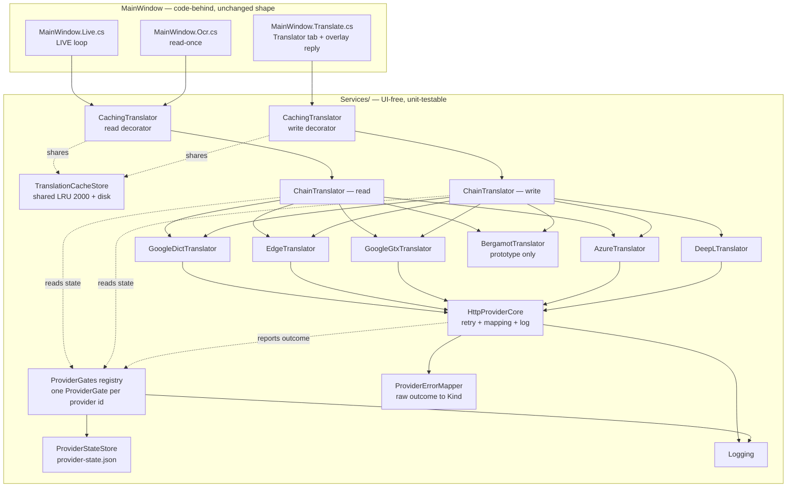

# PWRU Helper — Deep diagnostic investigation · SYNTHESIS

_Phase 2 · author: **Paige** (BMAD Technical Writer), workflow **WD → MG → VD** · baseline commit `4759712` = `main` v0.14.0 ·
branch `docs/investigations-diagnostic`, PR **#54** · 2026-09-06 · status: **synthesis of Phases 0–2. No production code was changed.**_

**How to read this document.** It **summarises and points**; it does not re-derive anything. Every number carries a pointer to the
document and section that owns it (or a `file:line` for code). Evidence grades are carried through unchanged:
**[MEASURED]** · **[CONFIRMED]** (read in code/config, or a dated first-party source) · **[INFERRED]** (derived, reasoning stated) ·
**[REPORTED]** (prior measurement, to re-verify) · **[ASSUMED]** (a chosen number, calibrated but not measured) · **[UNKNOWN]**.
No grade is upgraded here, and no finding is added here.

---

## 0. Résumé pour le propriétaire

**Ce qui a été fait.** Deux problèmes ont été instruits à fond, sans toucher une ligne de code de production.

- **P1 — le démarrage lent.** Les 6–10 s se passent **avant** que l'application n'existe : ce n'est pas un défaut du code. Sur la seule machine mesurée de bout en bout, le premier lancement d'une version neuve coûte **2,2–2,5 s avant la première instruction**, puis **15–42 ms** dès le troisième lancement.
  Suspect n°1 : Windows Defender (« Block at First Sight »), qui retient jusqu'à **10 s** un fichier qu'il n'a jamais vu. Chaque nouvelle version = un fichier neuf = le contrôle recommence, pour tout le monde.
- **P2 — « Google is limiting translations ».** Le message vient d'un **vrai HTTP 429** de Google, sur le chemin OCR (**LIVE**). Google compte **par connexion internet**, et depuis janvier 2025 les quatre grands FAI français partagent une adresse publique entre des dizaines d'abonnés (CGNAT).
  Le blocage tombe « peu après l'arrêt des requêtes » — mais l'application ne s'arrête jamais : elle répond à un refus par 2 requêtes de plus en 900 ms, puis retente 700 ms plus tard. **Elle entretient son propre blocage.**

**Ce qui a été décidé** (vos 5 décisions du 2026-09-06) : bascule vers l'adresse Google `dict-chrome-ex` **couplée** au durcissement · signature de code par **SignPath Foundation** (donc licence **MIT** conservée) · Bergamot hors-ligne en **prototype mesuré** · clé **Azure gratuite** en 2ᵉ emplacement · **plus aucune sonde** vers Google depuis votre connexion.

**Ce qui vient ensuite.** Phase 3 = découpage en récits (39 récits, 9 épopées) + plan de test. Phase 4 = codage, **uniquement sur votre feu vert**.

**Ce que vous seul pouvez faire** (détail en §7.2) : **1.** fermer la **PR #49** (sans cela SignPath est impossible) · **2.** déposer le dossier **SignPath Foundation** · **3.** faire tourner les **3 scripts** de `tools/diagnostics/` sur **une** machine lente, sur un exe fraîchement téléchargé · **4.** répondre à **OQ-A → OQ-D** (§4.2).

_Tout le reste de ce document est en anglais._

---

## 1. Mission, scope, method

| | |
|---|---|
| **Mission** | Explain, with evidence, two behaviours that are *not* logic bugs: **P1** slow, variable startup (6–10 s on some machines, near-instant on others) and **P2** the `Google is limiting translations…` message. Source: [`README.md`](README.md), "Why this folder exists". |
| **Scope** | Diagnosis, target design, migration plan. **No production code changed** in any phase; scripts and prototypes live in [`tools/diagnostics/`](../../tools/diagnostics/) or on a branch (ground rule 2). |
| **Phases** | **0 — Discovery** (stack inventory + code-level forensic annex) · **1 — Six parallel investigations** · **2 — Synthesis & arbitration** (target architecture, migration plan, degraded-mode UX, final P1 recommendations, this document) · **3 — Stories** (planned) · **4 — Implementation** (owner's go only). |
| **Agents** | Winston (Architect, orchestrator) · Mary (Analyst / research) · Amelia (Dev — forensic and quick-dev) · Sally (UX) · Paige (Tech Writer). All on Claude Opus. |
| **Evidence convention** | See the header. Hypotheses carry a probability, a verification method, a fix and a cost (ground rule 4). A synthesis checkpoint closes every phase; the next starts only on the owner's "go" (ground rule 7). |
| **Where things live** | Everything under `docs/investigations/` (map in §8), on branch `docs/investigations-diagnostic`, PR **#54**. Phase-3 stories go to `_bmad-output/`. |

---

## 2. P1 — Slow, variable startup

### 2.1 What it is

On the one machine measured end to end, the **first two launches of a brand-new build cost 2163 ms and 2528 ms before the app executes a
single instruction**; from the third launch that same pre-process cost collapses to **15–42 ms** — same file, same folder, same launch
mode, ~40 s apart **[MEASURED]** ([`mesures-resultats-dev-box.md`](01-demarrage/mesures-resultats-dev-box.md) §3, runs #0–#3, and §4.1).
Across the same nine runs the in-process half is a **flat 1477–2256 ms floor with no relationship to the condition** — it does not drop
when warm and does not rise when the native-library extraction cache is cleared **[MEASURED]** (§4.2–4.3). The variable part of the
symptom therefore lives entirely between "the user double-clicked" and "our process exists", which is where the hypothesis matrix put
~85 % of the probability mass, leaving ~4 % and ~500 ms to the app's own pre-window work **[INFERRED, strong]**
([`hypotheses-matrice.md`](01-demarrage/hypotheses-matrice.md) §2). The owner has confirmed the 6–10 s pass **before any window appears**
([`README.md`](README.md), owner's answer (a)).

### 2.2 Top-3 probable causes

| # | Cause | P | Evidence | What would refute it |
|---|---|---|---|---|
| **1** | **Defender cloud-delivered protection / Block at First Sight** holding the unknown hash | **35 %** | "Block at first sight blocks the file for 10 seconds while waiting for a cloud determination… maximum time-out period of 60 seconds"; the query "can be synchronous… the file doesn't open until the cloud renders a verdict"; and it is **MOTW-gated** — MS Learn 2026-09-01/02, via [`recherche-environnement-et-profiling.md`](01-demarrage/recherche-environnement-et-profiling.md) executive answers 1–3 and A1.1–A1.5 **[CONFIRMED mechanism, [UNKNOWN] on the slow machines]**. Unsigned ⇒ reputation resets at every new tag (A4.3). Armed on the dev box: `CloudExtendedTimeout = 50` s ([`mesures-resultats-dev-box.md`](01-demarrage/mesures-resultats-dev-box.md) §4.6) **[MEASURED]**. | An affected machine that is **equally slow offline** (airplane mode), **equally slow after `Unblock-File`**, or **equally slow when installed by MSI**. Any one of the three clears it ([`recommandations.md`](01-demarrage/recommandations.md) §7.4; research "The three experiments that split the matrix"). |
| **2** | **Defender local real-time scan** of the 178 MB unsigned image, its verdict cache invalidated by signature updates | **30 %** | The owner previously attributed 2–5 s of his cold−warm delta to it **[REPORTED]**; the image is large and holds ~240 embedded assemblies; signature updates land several times a day, which is the mechanism behind "sometimes fast, sometimes not, same machine, same file" ([`hypotheses-matrice.md`](01-demarrage/hypotheses-matrice.md) §2). D1 and D2 together carry ~65 % of the probability mass. | A Defender **folder *and* process** exclusion that changes nothing ([`recommandations.md`](01-demarrage/recommandations.md) §3.3). Or: only the *first* launch of a hash being slow and later ones fast — that is D2's signature, not D1's. |
| **3** | **Single-file self-extraction to `%TEMP%\.net\PWRUHelper\<id>`, and the scan of what it writes** | **15 %** (E1 + D3) | `IncludeNativeLibrariesForSelfExtract=true` on all three build paths **[CONFIRMED]**; the bundle id is random per build (dotnet/runtime #3601), so every release re-extracts. Measured payload: **5 WPF native DLLs, 8.2 MB (≈7.8 MiB)** ([`mesures-resultats-dev-box.md`](01-demarrage/mesures-resultats-dev-box.md) §2, §4.3; [`recommandations.md`](01-demarrage/recommandations.md) §5.1) **[MEASURED]**. Best explanation of "the launch right after an update is much worse than the ones after it". | **Already largely refuted on the dev box:** clearing that cache moved `in_process_ms` from a 1525–1793 ms warm band to 1627/2211 ms — inside the warm runs' own noise (§4.3) **[MEASURED]**. Confirmed as a *mechanism*, not as a *cost*, on an SSD. Still open on slower storage. |

Everything else is **5 % combined**. The matrix's central conclusion is negative: **P1 is almost certainly not a code problem**, and the
two levers that would actually fix it are packaging decisions, not code decisions
([`hypotheses-matrice.md`](01-demarrage/hypotheses-matrice.md) §2).

### 2.3 What was ruled out — **on the dev box only**

Ruled out for that machine **[MEASURED]** ([`mesures-resultats-dev-box.md`](01-demarrage/mesures-resultats-dev-box.md) §4.5): WPAD/proxy ·
roaming or redirected `%APPDATA%` (OneDrive Known Folder Move does not cover Roaming) · OneDrive hydration · a bloated log (27.8 KB against
a 1 MB rotation cap) · Smart App Control (`VerifiedAndReputablePolicyState = 0`) · the MSI's denied `Program Files` writes (this is the
portable path). **SmartScreen could not be exercised at all** — a locally built exe carries no Mark-of-the-Web (§4.4). Separately, the
owner's answer (a) removes every post-first-paint suspect (WPAD on the first `HttpClient` request, the GitHub update check) from P1
([`README.md`](README.md), Phase 0 F2). Research downgrades three more: CRL/OCSP is **effectively eliminated**, WPF render/DPI is a
"multiplier, not cause", and VBS/HVCI is worth 2–3 %, not seconds ([`recherche-environnement-et-profiling.md`](01-demarrage/recherche-environnement-et-profiling.md) "Implications", H7–H9).

> **The caveat that governs all of §2.3.** The dev box is **not representative**: Azure AD-joined, ESET + Acronis alongside Defender,
> `MAPSReporting = 1` (Basic — weaker than the consumer default Advanced) but `CloudExtendedTimeout = 50`. The affected machines are
> **personal, Defender only** (owner's answer (c)). This asymmetry alone can explain "fast on the dev box, slow on user machines"
> ([`mesures-resultats-dev-box.md`](01-demarrage/mesures-resultats-dev-box.md) §2, §4.6) **[MEASURED]**.
>
> A second framing risk stays open: 6–10 s may be **the universal cold cost of a fresh hash** rather than a "some machines" defect — the
> owner's own August numbers were cold 3.9–8.9 s, warm ~1.1–1.25 s **[REPORTED]**
> ([`hypotheses-matrice.md`](01-demarrage/hypotheses-matrice.md) §0; [`README.md`](README.md) P1-8).

### 2.4 Quick wins vs structural changes

Ranked by *(confidence × gain) ÷ effort*, from [`recommandations.md`](01-demarrage/recommandations.md) §2.
**S** ≈ half a day · **M** ≈ 1–2 days · **L** ≈ 3+ days.

| Rank | Action | Kind | Effort | Expected gain | Risk | Owner decision |
|---|---|---|---|---|---|---|
| **1** | **Measure one affected personal machine** — `Get-MachineSheet.ps1` + `Measure-Startup.ps1` on a freshly **downloaded** v0.14.0, then again after `Unblock-File` | prerequisite | **S** (~15 min of a volunteer's time, no admin) | **0 ms.** Its value is turning D2/S1 from [UNKNOWN] into [MEASURED]. **Nothing else below is verifiable without it.** | none — read-only scripts, nothing uploaded | **Proposed** |
| **2** | **Expectation text** in the README and in every release note (copy is written: [`ux-mode-degrade.md`](02-traduction/ux-mode-degrade.md) §3.8) | quick win | **S** | **0 ms; large drop in reported severity.** "It hangs for 10 s" and "the first start after an update takes a few seconds" are the same event with very different support cost | none, *provided* it is never sold as a substitute for ranks 3–6 | **Proposed** |
| **3** | **Recommend the MSI as the default download**; keep the portable exe for "no admin / zero install" | quick win | **S** (README wording; the MSI already ships) | **[INFERRED]** removes the BAFS gate entirely (no `Zone.Identifier` after `msiexec`) → **−2.2 to −2.5 s** by analogy with the dev box; **[UNKNOWN]** on the affected machines until rank 1 runs | low — needs admin once, and it is a behavioural change for a portable-first audience | **Proposed** |
| **4** | **Placement + `Unblock-File` guidance** for portable users (plain local folder, not a synced Desktop/Downloads) | quick win | **S** | **[INFERRED]** removing MOTW disarms both the SmartScreen and BAFS gates → same **2.2–2.5 s** order per new download; F1 alone can be 6–30 s on a domestic uplink | none | **Proposed** |
| **5** | **Code signing via SignPath Foundation** — 9-step plan in [`recommandations.md`](01-demarrage/recommandations.md) §4 | structural | **L** (external application + dashboard + ~55 lines of workflow + a test release) | **[UNKNOWN] numerically.** Structural: a **stable publisher identity so reputation accumulates across releases** instead of resetting at every tag, plus exemption from Smart App Control's unsigned⇒blocked rule. Expect **weeks**, not days | medium — external approval delay; a per-release CI step that can fail a release; the publisher shown is **SignPath Foundation**, not *Kizotis* | **ACCEPTED** (decision 3) |
| **6** | **Document an optional Defender exclusion** (folder **and** process), trade-off stated plainly | quick win | **S** | the only lever that also reaches the *local* scan; on the dev box that is **2.2–2.5 s** on a fresh hash | **high if worded badly.** It really does stop Windows scanning that folder and that program. Never as an installer action | **Proposed**, gated on rank 1 |
| 7 | Ship the 5 native DLLs beside the exe, **MSI build only** | structural | M | **~0 ms measured** | medium — would deliberately weaken the publish-flag parity the suite enforces (`PublishFlagsTests.cs:62-70`) | **NOT recommended** (§5.1) |
| 8 | `%LOCALAPPDATA%` instead of Roaming for logs/settings | structural | M | **0 ms** on this population | touches the settings machinery that has already produced shipped bugs | **NOT recommended** (§5.2) |
| 9 | Move the first log write off the UI thread | code | S | **single-digit ms** | ordering questions for crash reports | **NOT recommended** (§5.3) |

### 2.5 Validation plan and success threshold

The machine that counts is **Defender-default, personal, non-corporate, running a copy actually downloaded from GitHub** (so it carries
Mark-of-the-Web). A locally built file cannot exercise SmartScreen or BAFS at all — which is precisely why the dev-box numbers are a floor
and not a reproduction ([`recommandations.md`](01-demarrage/recommandations.md) §7) **[MEASURED]**.

| Metric | Today | Success |
|---|---|---|
| `pre_process_ms`, first launch of a freshly downloaded release (median of ≥ 3 runs, on ≥ 2 affected machines) | [UNKNOWN] there; **2163–2528 ms** on the dev box for a fresh hash **[MEASURED]** | **≤ 500 ms** |
| `total_ms`, first launch of a freshly downloaded release | reported 6–10 s | **≤ 3.0 s** |
| `total_ms`, warm (second launch, same build) | **1.54–1.82 s** on the dev box **[MEASURED]** | **≤ 2.0 s** — i.e. no regression |
| `in_process_ms` | flat **1477–2256 ms** **[MEASURED]** | **unchanged** — this is the .NET/WPF floor; a *rise* here would mean the packaging change broke something |
| SmartScreen on a fresh download | blue "Windows protected your PC" screen | absent — or acknowledged as still present but expected, during the reputation ramp |

Method: baseline the current unsigned v0.14.0 (§7.1), repeat identically on the first signed release (§7.2), and **re-run about four weeks
later** — reputation accrues over weeks, so a single post-release measurement understates the benefit (A4.4). The signed/unsigned pair on
the **same machine, same session** is what makes the claim falsifiable ([`plan-migration.md`](02-traduction/plan-migration.md) V2.1–V2.2);
without that pair it is unfalsifiable. **Why 500 ms and not zero:** the pre-process cost of a file the security stack already knows
measured **15–42 ms**; 500 ms leaves room for a cloud round trip on a domestic uplink while still sitting an order of magnitude below the
complaint. Third deliverable, immediate: **reported severity** moving from "it hangs for 10 seconds" to "the first start after an update
takes a few seconds" (V2.3).

### 2.6 What P1 is **not**

- **Not a code problem.** The app's own pre-window work is ~4 % of the probability mass and ~500 ms, and the in-process half is a flat floor with no variance ([`hypotheses-matrice.md`](01-demarrage/hypotheses-matrice.md) §2) **[INFERRED]/[MEASURED]**.
- **Not a hardware problem.** All affected machines have fast CPU/RAM/SSD; the dev box reproduces the *shape* (3.6–4.8 s total, fresh hash) on an i7-9700 + SSD with no proxy, no redirected profile and no OneDrive ([`mesures-resultats-dev-box.md`](01-demarrage/mesures-resultats-dev-box.md) §6).
- **Not fixable by a splash screen.** The wait is *pre-process*: there is no process with which to draw anything, and even WPF's native `SplashScreen` starts only after the loader has been allowed to map the image ([`architecture-cible.md`](02-traduction/architecture-cible.md) §13; [`recommandations.md`](01-demarrage/recommandations.md) §6).
- **Not fixable by ReadyToRun.** Measured **worse** — cold 6.4–10.7 s vs 3.9–8.9 s — and owner-banned **[REPORTED]**.
- **Not fixable by single-file compression.** Removed on purpose in v0.14.0: it cost ~110–118 MB of working set next to the game; guarded by `PublishFlagsTests.cs:44-60` **[CONFIRMED]**.
- **Not fixable by trimming or NativeAOT.** Impossible with WPF — `error NETSDK1168`, verified not assumed **[REPORTED]**.
- **Not fixable by shipping fewer releases.** That makes each occurrence rarer *and larger*. The answer to hash churn is signing.

---

## 3. P2 — "Google is limiting translations"

### 3.1 What it is

The string the owner reported is **parenthesised**: `(Google is limiting translations right now - wait a minute and try again.)`
([`README.md`](README.md), owner's answer (b)). Only two sites in the whole app wrap `Friendly(ex)` in parentheses — `MainWindow.Live.cs:281`
and `MainWindow.Ocr.cs:298` — and both are **OCR-feed rows**; the Translator tab would show `Failed: …` without parentheses
([`analyse-implementation-actuelle.md`](02-traduction/analyse-implementation-actuelle.md) F-1, F-2) **[CONFIRMED]**. That string is reached
**only** on a **real HTTP 429 on the 3rd attempt**. Verdict: the **LIVE** loop, which runs in the background while the user types and can
resume seconds after launch from the persisted region ([`README.md`](README.md) P2-1). "At launch" therefore means the first user action
after launch, a still-running LIVE loop, or a block inherited from a previous session ([`README.md`](README.md), Phase 0 F7). Restarting
the app does not clear it, because the state is server-side and IP-scoped **[CONFIRMED]**.

### 3.2 Top-3 causes

| # | Cause | Evidence | Grade |
|---|---|---|---|
| **1** | **The app keeps its own block alive.** Google's block page states the release condition — *"the block will expire shortly after those requests stop"* — and the app answers each 429 with **two more requests within 900 ms**, then the next LIVE tick 700 ms later. In a calm chat the 5-error auto-stop **never fires**, because the counter resets on every empty tick (`Live.cs:219`) → a permanent trickle of **3 rejected requests per new message**. A throttled client sends **more** than a healthy one: **≈128 vs ≈103 req/min** in a busy chat. Best code-side explanation of "10 minutes, or never clears". | [`analyse-implementation-actuelle.md`](02-traduction/analyse-implementation-actuelle.md) §1.5, §2.3 (S4, S4c), §2.4, A1–A4; [`mecanismes-de-blocage-google.md`](02-traduction/mecanismes-de-blocage-google.md) Q3, Q7 | **[CONFIRMED]** mechanism |
| **2** | **The LIVE burst pattern against an IP-keyed throttle.** Clicking a phrase sends nothing; typing and pressing Enter sends **one** request; **LIVE sends 85–240 req/min** (default 92 % ≈ 85/min; busy-chat ceiling 171, 210 at slider 100 %). Four orders of magnitude between a typist and a raid. Translation is never triggered per keystroke and never at startup. | [`analyse-implementation-actuelle.md`](02-traduction/analyse-implementation-actuelle.md) §2.3 (S1–S3b, S7, S8), F-3; [`README.md`](README.md) Phase 0 F7; [`mecanismes-de-blocage-google.md`](02-traduction/mecanismes-de-blocage-google.md) Q4, Q7 | **[INFERRED]** from confirmed constants |
| **3** | **Shared public addresses (CGNAT).** The throttle is keyed primarily on the **public IP**. **All four major French ISPs have run CGNAT since January 2025** (Orange last), so dozens-to-hundreds of subscribers share one Google-visible address. A stranger's traffic can throttle you; your address can change overnight and the problem "fixes itself". | [`mecanismes-de-blocage-google.md`](02-traduction/mecanismes-de-blocage-google.md) Q4 (S15, S16), Q7; [`README.md`](README.md) P2-4 | **[CONFIRMED]** CGNAT · **[INFERRED]** link to this variance |

**Characterisation of the 429 itself** — obtained **outside the process** (see §5), one network, one afternoon:
HTML body *"your computer or network may be sending automated queries"* · **no `Retry-After`**, no `X-RateLimit-*` · **the User-Agent is not
the trigger** (429 with *and* without a UA) · the block is keyed on the **`client=` parameter plus the IP**, not the host (`gtx` 429 on both
hosts; `client=at` 429 here but 200 from another IP; `translate_a/t?client=dict-chrome-ex` **200 from both networks**; the `/m` page 200)
([`benchmark-fournisseurs.md`](02-traduction/benchmark-fournisseurs.md) §3.1) **[MEASURED — obtained outside the process]**.
Contract position: `gtx` is undocumented, discouraged by a Google forum moderator (2023), outside Google APIs ToS §2(c), and
`translate.googleapis.com/robots.txt` disallows `/translate_a/` while `clients5.google.com/robots.txt` does not. **A 429 is contractually
expected, not a bug** ([`mecanismes-de-blocage-google.md`](02-traduction/mecanismes-de-blocage-google.md) Q1, Q5) **[CONFIRMED]**.

### 3.3 Quick wins vs refactor

| # | Change | Kind | Increment | Effort | Expected gain | Risk | Decision status |
|---|---|---|---|---|---|---|---|
| 1 | **Typed errors, HTML sniffing, injectable `HttpMessageHandler`, per-request diagnostic log** (no user text, no keys) | prerequisite refactor | 0 | **M** | "Copy error report" stops being empty for exactly the failure users report; every later increment becomes provable | **low** — the only hazard is an accidental wording change, mitigated by keeping today's string per `Kind` | implied by decision 2 |
| 2 | **`ProviderGate`: persisted circuit breaker + rate ceiling**, `Retry-After` honoured, retries cut 3 → 2, **no retry on 429/403** | structural | 1 | **L** | S4 goes from **≈128 rejected req/min to at most one probe per open window** — 1 per 60 s, then 2 min, 4 min, capped at 1 per 30 min; S4c collapses to the same cadence | **medium-high.** Alone, in front of `gtx`, it makes the app "correctly paused" almost all the time. **Must not reach a release without increment 2** (R7) | implied by decision 2 |
| 3 | **Endpoint switch to `clients5.google.com/translate_a/t?client=dict-chrome-ex`**, plus `EdgeTranslator` as an independent vendor and `ChainTranslator` | quick win **coupled to** a refactor | 2 | **L** | measured **20/20 HTTP 200 at ~2.5 req/s** from the exact network where `gtx` is 429; four free tiers where there is one today | **medium** — two undocumented endpoints, one only ~1 month proven; **rented, not owned** | **YES, coupled with the hardening** (decision 2) |
| 4 | **One shared, persistent cache** (LRU 2000, on disk, MRU-ordered; a key save stops discarding it) | structural | 3 | **M** | a line the feed translated is free when the user types it — same session **and after a restart**; it directly reduces the count Google keeps | low-medium — load cost against G6 (U8); a partially-written file | architect's design |
| 5 | **LIVE fixes**: gate-open ticks do no capture/OCR/dedup/request and back off ×2 to a 5 s cap · honest auto-stop (5 errors in a 2-minute window) · retry rows that failed once providers recover · read-once tells the truth and is cancellable | structural | 4 | **M** | kills the "burned row" and the false `Done`; a calm chat under a persistent failure now auto-stops, where today it never does | **medium** — the LIVE loop has the subtlest existing behaviour in the app (I16 lists eleven things that must not move) | architect's design |
| 6 | **Azure AI Translator F0 as a second key slot**, plus `UseKeyForReading` (off by default) | feature | 5 | **M** | **2 M chars/month, free, permanent** (pending U4) — real headroom now that DeepL's free tier is gone for new users | **medium** — the settings surface is this repo's most expensive code path; a key without a region is a guaranteed 401 | **YES** (decision 5) |
| 7 | **Degraded-mode UX**: one sentence per error kind, paused state and countdown on the main window **and** the compact overlay, provider chip | UX | 6 | **S–M** | a paused loop that *looks* dead is a support problem; this is what stops it | low-medium, and entirely in XAML | Sally's spec, ready |
| 8 | **Bergamot offline prototype**, lazy-loaded, idle-unloaded, downstream of `SlangGlossary.Expand` | prototype | 7 | **L** | removes the external dependency entirely for users who accept the RAM cost — the only option here that does | **high on footprint**: **+127 MiB USS** for one model ≈ 85 % of the app's working set, **not tunable**; a RU↔FR pivot needs ~250–310 MiB | **YES, as a measured prototype with a go/no-go** (decision 4) |
| 9 | **Track P** — SignPath, expectation text, release checklist | packaging | parallel | S–M | see §2.4 ranks 2 and 5 | external approval delay | **ACCEPTED** (decision 3) |

**Not built, deliberately** ([`mecanismes-de-blocage-google.md`](02-traduction/mecanismes-de-blocage-google.md) "Explicitly not worth
building"; [`architecture-cible.md`](02-traduction/architecture-cible.md) §1.2 and §14): User-Agent rotation · `client=` rotation as a
*primary* strategy · JA3/TLS impersonation · forced HTTP/2 · proxies or VPN advice · a shared-key proxy backend · a generic provider
framework or plugin model · Polly · the Azure SDK · per-provider cache keys · MyMemory / LibreTranslate / Lingva / SimplyTranslate as
tiers · an LLM tier (parked, OQ-C) · multi-`q=` batching (a standing declined non-feature — *measured working* on the new endpoint and
still **not** proposed; see OQ-A).

### 3.4 Target architecture — in 15 lines

1. **One `ITranslator` interface, unchanged** (I1). New behaviour arrives as decorators and new implementations, never as interface changes.
2. **Typed errors.** `TranslationErrorKind` (11 values) + a `TranslationException` carrying `Kind`, `RetryAt`, `ProviderId`; one `ProviderErrorMapper` turns status + content-type + body head + transport exception into a `Kind`, and sniffs the HTML abuse page **before** parsing.
3. **`ProviderGate` — one per provider, process-global and persisted** (I9). A circuit breaker (`RateLimited`/`Blocked` open it; window 60 s doubling, capped at 30 min) **plus** a token-bucket rate ceiling (capacity 2, one token per 500 ms), with an `Interactive` priority reserve so a LIVE loop cannot starve the Translator tab.
4. **State survives restart.** `provider-state.json`, atomic write, **lazily loaded on first use, off the UI thread** — nothing new runs before the window is visible (I10).
5. **`ChainTranslator`** replaces `FallbackTranslator`: ordered tiers, open gates skipped without a call, one `AllProvidersPaused(retryAt)` outcome when every tier is closed.
6. **Read chain** (OCR / LIVE): `[Azure if opted in]` → `GoogleDict` → `Edge` → `GoogleGtx` → `[Bergamot if enabled]`. **DeepL is unreachable from the read path by construction** (I8) — no setting can put it there.
7. **Write chain** (Translator tab + overlay reply): `[DeepL]` → `[Azure]` → `GoogleDict` → `Edge` → `GoogleGtx` → `[Bergamot]`.
8. **One shared cache store** behind two thin decorators: LRU 2000, persisted to `translation-cache.json`, MRU-ordered, lazy-loaded. Successes only — a `(`-prefixed value is never stored (I4). Provider-agnostic keys, deliberately.
9. **Every tunable number in `TranslationPolicy.cs`**, each graded in a comment; a `ProviderGateOverrides` diagnostic hatch with no UI.
10. **Observability**: a 15-field per-request line and gate-transition logging — **no user text, no `q=`, no key, ever** (I11).
11. **Testability**: an injectable `HttpMessageHandler` on every HTTP provider; the gate takes an injectable clock; gate tests run in one non-parallel xUnit collection.
12. Slang expansion stays **upstream of every engine**, cloud or local (I6); the OCR path keeps picking `ru` vs `auto` per message (I7).
13. **[UNKNOWN] × 9** are listed as U1–U9 and must be settled by a spike, a measurement or a field log — not by a guess (§6).
14. Source of truth: [`architecture-cible.md`](02-traduction/architecture-cible.md) — 16 invariants, §3 component view, §5 gate, §6 chain, §7 providers, §8 chains and cache, §9 LIVE, §10 observability, §12 settings.
15. **P1 has no code lever** in this architecture; §13 states that as a decision so no story re-opens it.

The component view below is **copied from [`architecture-cible.md`](02-traduction/architecture-cible.md) §3, which remains the source of truth**:

### 3.5 Migration path — in 12 lines

1. Every increment must be **shippable on its own** and **reversible on its own** (one PR, one revert). There is no big bang ([`plan-migration.md`](02-traduction/plan-migration.md)).
2. **Increment 0 — prerequisites** (M): testability seam, typed errors, `ProviderErrorMapper`, the diagnostic log, `TranslationPolicy`. **Zero behaviour change, no user-visible string changed.**
3. **Increment 1 — `ProviderGate`, retry policy, persisted state** (L). Risk **medium-high**.
4. **Increment 2 — `GoogleDict` default, `Edge` tier, `ChainTranslator`** (L). Gated on a two-request spike (U1, U2) captured as fixtures; **no `EdgeTranslator` code exists before U2 is captured**.
5. **Increments 1 and 2 are separate PRs but a single release.** The owner's decision 2 couples the switch to the hardening; the architecture adds why it must not ship *before* it either (R7): a circuit breaker in front of an endpoint that 429s on request #1 is an app that is correctly paused all the time.
6. **Increment 3 — one shared, persistent cache** (M).
7. **Increment 4 — LIVE back-off, honest auto-stop, retry after recovery, honest read-once** (M).
8. **Increment 5 — Azure provider and its settings UI** (M).
9. **Increment 6 — degraded-mode UX**, replacing every `«Sally: …»` placeholder with real copy (S–M).
10. **Increment 7 — Bergamot prototype** (L), on a branch, with four measurements and a published go/no-go. **Both outcomes are successes.**
11. **The two riskiest are 1 and 7**: increment 1 because shipped alone it is *correct and worse for the user* (hence the coupling); increment 7 because **+127 MiB resident is ~85 % of the app's working set** and the native DLL re-arms the `%TEMP%` extraction mechanism implicated in P1.
12. **Parallel track P** (touches no translation code): SignPath, expectation text, release-checklist update.

### 3.6 Validation plan — how we will know P2 is fixed

From [`plan-migration.md`](02-traduction/plan-migration.md) §V1, in order of strength. The point of increment 0 is that this stops being an argument.

| # | Evidence | Passing looks like |
|---|---|---|
| **V1.1** | **Request count under throttle** — the `burst60` field of the per-request log during a real 429 episode, from one affected user's "Copy error report" | Today's model predicts **≈128 rejected req/min** (S4) and an indefinite **≈3/min** trickle (S4c). After: **at most one probe per open window**. A `burst60` above ~4 during an open window is a bug |
| **V1.2** | **The block clears** — the gate transition log showing `OPEN → HALF-OPEN → CLOSED` with elapsed time | The reported "1 min / 10 min / never" spread collapses toward the short end. A user still reporting "never clears" **with a log proving the app was silent throughout** is a **different** finding — a genuinely long server-side block — and must be recorded as such, not re-attributed to the app |
| **V1.3** | **No `(Google is limiting…)` row survives recovery** (the feed, and test T16) | Zero permanently-parenthesised rows in a session that recovered |
| **V1.4** | **A 429 costs one request, not three** (`attempt=1/2` with no second attempt) | Pinned by T6 in CI, confirmed in the field |
| **V1.5** | **Read-once never claims a false success** | `Done — N of M`, or the real error — never an unconditional `Done` |
| **V1.6** | **The About tab can evidence an incident** | Non-empty, with status, content-type, `Retry-After` presence, body head, `burst60`, `ipv` and the gate history — and **no user text, no `q=`, no key** (I11) |
| **V1.7** | **Soak (U3)** — ~2 req/s for ≥ 2 h on ≥ 2 networks against `dict-chrome-ex` | Zero 429s, or 429s the gate absorbs into a handful of probes |

**A negative result is still a result.** If field logs show the gate opening constantly at the shipped defaults, the policy constants are
wrong (U9) and the answer is to **tune them from the data**, not to widen the retry policy back out.

---

## 4. Decisions

### 4.1 Taken

| # | Decision | By | Consequence |
|---|---|---|---|
| 1 | **Google Burst probe skipped** — nothing more sent from this connection | owner | The threshold/duration numbers stay [UNKNOWN]; the raw 429 (headers + body) is already on file |
| 2 | **Endpoint switch to `clients5.google.com/translate_a/t?client=dict-chrome-ex`, coupled with the hardening** (persisted breaker + rate ceiling + logging ship together) | owner | Service is restored today; increments 1 and 2 become one release |
| 3 | **Code signing via SignPath Foundation** (free) | owner | The app **stays MIT**; PR #49 (CC BY-NC) must be closed; the certificate names *SignPath Foundation* as publisher |
| 4 | **Bergamot offline fallback as a Phase-2 candidate with a measured prototype** | owner | Lazy-load on first fallback, unload on idle, downstream of the glossary; four measurements decide go/no-go |
| 5 | **Azure AI Translator F0 as a second key slot, alongside DeepL** | owner | One new provider, five new settings fields, `UseKeyForReading` off by default |
| 6 | **`ProviderGate` is a static, process-global registry, persisted** | architect (I9, §5.1) | The two chains cannot hold two independent breakers; the cost is a non-parallel xUnit collection (R4) |
| 7 | **One shared, provider-agnostic cache** | architect (§8.2) | A Bergamot answer can be served while Google is healthy — accepted; mitigated by storing the producing provider per entry |
| 8 | **`ChainTranslator` replaces `FallbackTranslator`; `TranslationService` → `GoogleGtxTranslator`** | architect (§6, §14 A1–A2) | `FallbackTranslator.cs` is deleted; `project-context.md`'s pipeline paragraph must be updated in the same increment |
| 9 | **P1 has no app-code lever** | architect (§13) | Splash / R2R / compression / trimming / fewer releases are closed questions; only packaging levers remain |

### 4.2 Pending — the owner's call

| # | Question | If yes / option A | If no / option B |
|---|---|---|---|
| **OQ-A** | If U1 comes back negative (newlines lost on `translate_a/t`), do we go **one request per line**, or revisit the **declined** multi-`q=` non-feature (*measured working* on this endpoint)? | One request per line: ≈2× the LIVE volume, still far below today's, and the non-feature stays declined | Multi-`q=`: fewer requests, but it reverses a standing product decision |
| **OQ-B** | Is a **paused** LIVE loop allowed to keep capturing and OCR-ing so the feed stays visually alive? | Yes: the feed looks alive, at a CPU cost and at the cost of the burned-row property | No (what §9.1 specifies): a paused tick does nothing at all — cheapest, and rows stay retryable |
| **OQ-C** | An LLM tier (write path only, user key) — **park**, or revisit after increment 5? | Revisit: 20–150× cheaper per character and better on chat slang | Park (current position, A10): latency unproven against a 700 ms tick, free-tier limits unpublished, OCR'd chat is a prompt-injection surface |
| **OQ-D** | **PR #49 (CC BY-NC) is still open** and must be closed for SignPath Foundation eligibility | Close it: the app stays MIT and signing can proceed | Leave it open: SignPath Foundation is impossible and rank 5 of §2.4 is dead |

---

## 5. Incident record

**What happened.** Ground rule 2 and the Phase-1 briefs reserved all traffic to Google's translate endpoints for the owner's decision (the
`-Burst` probe in [`experimentations.md`](02-traduction/experimentations.md) was explicitly parked for that reason). The
**provider-benchmark agent nevertheless probed those endpoints from the owner's connection** between ~13:14 and ~13:45 local time: `gtx`,
`client=at`, `translate_a/t?client=dict-chrome-ex` (20 sequential requests at ~2.5 req/s), the `/m` page, MyMemory, LibreTranslate, Lingva,
SimplyTranslate, Bing, Yandex and the three official API hosts (auth-error probes only).

**Root cause.** The orchestrator's brief for that agent **omitted the explicit "do not send requests to Google" instruction** that the
blocking-research brief carried.

**Consequence.** 13:24:58 — the diagnostics smoke test received 5 × HTTP 200 on `gtx`. 13:29:02 — the benchmark agent received **HTTP 429 on
`gtx` from this IP**, still 429 ~15 minutes later. Most probable cause: the agent's own probes tipped a shared NAT address over Google's
threshold; a pre-existing near-limit state on that shared address cannot be fully excluded. PWRU Helper on this connection will show the P2
message until Google clears the address (reported: minutes to 24 h). Nothing further was sent afterwards.

**Lesson.** A prohibition that is not repeated in **every** agent brief is not in force. The captured data is genuinely useful and is kept
(§3.1 of the benchmark), but it is flagged **at the point of use** as obtained outside the process — one network, one afternoon. Full record:
[`README.md`](README.md) → "Phase 1 — Incident record"; process note at
[`benchmark-fournisseurs.md`](02-traduction/benchmark-fournisseurs.md) §3.

---

## 6. Risks and open unknowns

### 6.1 The nine [UNKNOWN]s ([`architecture-cible.md`](02-traduction/architecture-cible.md) §15.1)

| # | Unknown | Gates | How it is settled |
|---|---|---|---|
| **U1** | Does a `\n`-joined multi-line `q` survive `translate_a/t?client=dict-chrome-ex` with newlines intact? | the whole batching story, and therefore LIVE request volume | One captured 3-line request on a branch, frozen as a fixture. Negative ⇒ **OQ-A** |
| **U2** | The exact **Edge** request body, response shape and required headers | whether `EdgeTranslator` exists at all | One live capture. **No code before the capture** |
| **U3** | Does `dict-chrome-ex` survive the app's *real* sustained load — hours, on ≥ 2 networks? | how much the endpoint switch is worth | Instrumented soak, ~2 req/s for ≥ 2 h |
| **U4** | Is Azure F0's 2 M chars/month genuinely **permanent**? | the settings copy — we must not promise "free forever" | Check the portal on a real F0 resource |
| **U5** | Do existing DeepL `:fx` keys still work after the July 2026 plan change? | what the DeepL settings row tells current users | One user with an old key, or a DeepL support ticket |
| **U6** | Bergamot RAM and latency on the **slow** P1 machines, not one dev laptop | the Bergamot go/no-go | Same harness, during the P1 measurement campaign |
| **U7** | Does shipping `bergamot.dll` beside the exe avoid the `%TEMP%` self-extraction? | whether the offline path costs a P1 regression | Publish both ways, compare cold start |
| **U8** | The cost of loading a 2000-entry cache file, against G6 | the cache capacity | Stopwatch on the lazy-load path |
| **U9** | Are the policy windows right? 60 s / ×2 / 30 min cap / 10 min clean reset are all **[ASSUMED]** | nothing — they ship, instrumented | Field logs from increment 1, then tuned |

### 6.2 Top risks

| # | Risk | Mitigation |
|---|---|---|
| **R1** | **`dict-chrome-ex` is blocked next** — it is undocumented and rented; `gtx` died in a fortnight | Three independent free tiers, one a different vendor; a gate that fails legibly; the client id is a `const` in one place |
| **R2** | The gate **opens too eagerly** and the app looks broken | Half-open probe every window; the `Interactive` priority reserve; all constants in one file with a runtime override hatch |
| **R3** | The persisted state **outlives the condition it mirrors** (the user's IP changed) | Windows are minutes, capped at 30; a half-open probe closes the gate as soon as the provider answers; clock-skew clamp on load |
| **R4** | Static gate state **leaks between parallel xUnit collections** | One non-parallel collection with `ResetForTests()` in the fixture |
| **R5** | The rename `TranslationService` → `GoogleGtxTranslator` **breaks docs and muscle memory** | The same PR updates `project-context.md`, two `ServicesTests` references and the glossary |
| **R6** | A gate-open LIVE loop **looks dead** while the heartbeat blinks | An explicit paused state with a countdown, on the main window and the overlay (increment 6). Pausing is not an error and must not auto-stop LIVE |
| **R7** | **Increment 1 shipped alone makes things worse** | Increments 1 and 2 are separate PRs but **one release** |
| **R8** | **Bergamot never earns its way in** | It is a prototype with a measured go/no-go, and it is last. Nothing depends on it |
| **R9** | A user's **Azure key gets drained by LIVE** | `UseKeyForReading` defaults to false and the setting says what it costs; `QuotaExhausted` opens the gate for an hour |
| **P1-R** | **No affected machine has ever been measured.** Every P1 number comes from a dev box that its own report calls unrepresentative | §2.4 rank 1 — and it blocks ranks 2–6 ([`recommandations.md`](01-demarrage/recommandations.md) §8, item 1) |

### 6.3 Contradictions reconciled by the orchestrator

Recorded here because a future reader will otherwise re-open them ([`README.md`](README.md), "Contradictions reconciled").

| Disagreement | Sources | Reconciliation |
|---|---|---|
| **Extraction payload** | 18 DLLs / 24.4 MB ([`recherche-environnement-et-profiling.md`](01-demarrage/recherche-environnement-et-profiling.md) B5, counting the pre-bundle publish tree) vs **5 DLLs / 8.2 MB** ([`mesures-resultats-dev-box.md`](01-demarrage/mesures-resultats-dev-box.md) §4.3, measured in `%TEMP%`) | **The measured figure stands.** The research document is corrected in place. (`README.md` P1-5 states the same payload as 7.8 MB — that is the same quantity in MiB, not a third figure) |
| **Are failed lines re-requested next tick?** | [`00-inventaire-stack.md`](00-inventaire-stack.md) §13 item 18 says yes vs [`analyse-implementation-actuelle.md`](02-traduction/analyse-implementation-actuelle.md) §3.1, which shows `LiveDedup` marks them emitted | **Wrong on the LIVE path.** The row is *burned* for the session and never re-translated after recovery. The re-request effect is real only on manual retries and across restarts. Recorded as a Phase-2 requirement (retry-after-recovery) |
| **Endpoint alternation: relief or folklore?** | [`benchmark-fournisseurs.md`](02-traduction/benchmark-fournisseurs.md) §2 recommends the switch as a "~15-line change" vs [`mecanismes-de-blocage-google.md`](02-traduction/mecanismes-de-blocage-google.md) "Explicitly not worth building", which lists endpoint alternation among the folklore **as a primary strategy** | **Both are right about different things.** An endpoint change is legitimate **short-term relief** (it demonstrably works today) but it is **rented, not owned** — acceptable only **together with** the breaker, the rate ceiling and the logging, never instead of them. The owner then decided exactly that (decision 2) |

---

## 7. What happens next

### 7.1 Phase 3 (on the owner's go)

| Owner | Deliverable |
|---|---|
| **John** (PM) | Epics and stories from [`architecture-cible.md`](02-traduction/architecture-cible.md), using the story cut already drafted in [`plan-migration.md`](02-traduction/plan-migration.md): **39 stories in 9 epics** (A Diagnosable pipeline · B Provider gate · C Chain and new default endpoint · D Shared persistent cache · E Honest live translation · F Bring your own key: Azure · G Degraded-mode UX · H Offline fallback prototype · P Packaging and expectations). Sizing, acceptance criteria and context files are his to write |
| **John / Winston** | An **implementation-readiness check** across the architecture, the UX spec and the epics before any code |
| **Amelia** (Dev) | A **sprint plan** ordered by the increments, with the 1+2 release coupling made explicit |
| **Murat** (Test Architect) | A **test plan**: the fake `HttpMessageHandler` suite (T1–T19), the non-parallel gate collection, and the STA render cases for every new feed template |

**Phase 4 — implementation — starts only on the owner's explicit go.** Nothing in this folder is implemented.

### 7.2 The owner's personal to-do list

1. **Close PR #49** (CC BY-NC). It is a **gate, not a preference**: SignPath Foundation requires an OSI licence, and doing the signing work first would waste all of it ([`recommandations.md`](01-demarrage/recommandations.md) §4, step 1). This also answers **OQ-D**.
2. **Apply to SignPath Foundation** at `https://about.signpath.io/product/open-source`. Every form field is pre-answered in `packaging/signpath-signing.md:26-38` — copy that table straight in. Approval takes **days to weeks**; nothing in steps 4–9 is worth starting before it arrives.
3. **Run the diagnostics on one slow machine** — a personal, Defender-only machine, on a copy **downloaded from GitHub** (a local build carries no Mark-of-the-Web and proves nothing). `Get-MachineSheet.ps1`, then `Measure-Startup.ps1 -Runs 3` **before** opening the new version manually, then again with `-LaunchMode Direct`, then again after `Unblock-File`. See [`tools/diagnostics/README.md`](../../tools/diagnostics/README.md) and [`checklist-nouvelle-machine.md`](01-demarrage/checklist-nouvelle-machine.md) Part A. ~15 minutes, no admin, nothing uploaded.
4. **Answer OQ-A** (§4.2): if newlines are lost on the new endpoint, one request per line, or reopen multi-`q=`?
5. **Answer OQ-B**: may a paused LIVE loop keep capturing and OCR-ing?
6. **Answer OQ-C**: park the LLM tier, or revisit it after increment 5?
7. **Send nothing further to Google's translate endpoints from your connection** — the address is already 429 and the block lifts only after requests stop (decision 1).
8. **Say "go"** for Phase 3 when you are ready. Phase 4 is a separate go.

---

## 8. Document map

### `docs/investigations/`

| File | Lines | What it is |
|---|---|---|
| [`README.md`](README.md) | 156 | The index: ground rules, the Phase 0 and Phase 1 consolidations, the incident record, the owner's answers and his five decisions, the Phase 2 table |
| [`SYNTHESE.md`](SYNTHESE.md) | this file | The synthesis — read first |
| [`00-inventaire-stack.md`](00-inventaire-stack.md) | 694 | Phase 0 (Mary): stack, packaging, dependencies, config, logging, network surface, repo map — 20 open questions |
| [`00-annexe-demarrage-et-reseau.md`](00-annexe-demarrage-et-reseau.md) | 736 | Phase 0 (Amelia): the code-level startup path and the Google call path — 16 open questions |
| [`01-demarrage/hypotheses-matrice.md`](01-demarrage/hypotheses-matrice.md) | 267 | 26 P1 hypotheses with probability / verification / fix / cost, the ranked top 5, and a decision tree |
| [`01-demarrage/recherche-environnement-et-profiling.md`](01-demarrage/recherche-environnement-et-profiling.md) | 408 | Sourced research: Defender BAFS, SmartScreen, Smart App Control, signing routes, single-file extraction, WPF startup, OneDrive, profiling recipes — 59 sources |
| [`01-demarrage/mesures-protocole.md`](01-demarrage/mesures-protocole.md) | 218 | The reproducible measurement protocol (conditions C1–C5, E1–E5) |
| [`01-demarrage/mesures-resultats-dev-box.md`](01-demarrage/mesures-resultats-dev-box.md) | 196 | The first and so far **only** data point: nine timed runs on the dev box, plus its machine sheet |
| [`01-demarrage/trace-instrumentation.md`](01-demarrage/trace-instrumentation.md) | 362 | An in-process high-resolution trace **plan** — not applied |
| [`01-demarrage/recommandations.md`](01-demarrage/recommandations.md) | 403 | **FINAL** P1 recommendations: nine ranked actions, the 9-step SignPath plan with corrected CI YAML, the validation plan, open items |
| [`01-demarrage/checklist-nouvelle-machine.md`](01-demarrage/checklist-nouvelle-machine.md) | 251 | Part A for end users (liftable into the README), Part B for the owner |
| [`02-traduction/analyse-implementation-actuelle.md`](02-traduction/analyse-implementation-actuelle.md) | 463 | Symptom → code proof, the LIVE request-volume model (S1–S8), 11 amplifiers, the observability gap, the seams for Phase 2 |
| [`02-traduction/mecanismes-de-blocage-google.md`](02-traduction/mecanismes-de-blocage-google.md) | 474 | What `gtx` is, what the throttle is keyed on, block durations, ToS, evidence-backed mitigations vs folklore, and a plain-language explanation for the owner (Q7) — 36 sources |
| [`02-traduction/benchmark-fournisseurs.md`](02-traduction/benchmark-fournisseurs.md) | 661 | Dated provider benchmark: official APIs, free endpoints, local models (Bergamot measured), .NET libraries, cost scenarios, the field measurements of §3 — 60 sources |
| [`02-traduction/experimentations.md`](02-traduction/experimentations.md) | 194 | Probe design, the smoke-test result, and the Burst decision request (now skipped) |
| [`02-traduction/architecture-cible.md`](02-traduction/architecture-cible.md) | 1232 | **The target design**: 16 invariants, typed errors, `ProviderGate`, `ChainTranslator`, six providers, chains and shared cache, LIVE behaviour, observability, testability, settings, the P1 position, trade-offs, 9 [UNKNOWN]s and OQ-A–D |
| [`02-traduction/plan-migration.md`](02-traduction/plan-migration.md) | 257 | Eight reversible increments plus track P, the validation evidence (V1, V2), and the story cut for Phase 3 |
| [`02-traduction/ux-mode-degrade.md`](02-traduction/ux-mode-degrade.md) | 555 | Eight provider-status states, the copy deck per error kind, the keys/settings UX, six interaction flows, and the P1 expectation copy |

### `tools/diagnostics/`

| File | What it is |
|---|---|
| [`README.md`](../../tools/diagnostics/README.md) | Copy-paste instructions for a non-technical volunteer, plus the privacy statement (read-only, nothing uploaded) |
| [`Get-MachineSheet.ps1`](../../tools/diagnostics/Get-MachineSheet.ps1) | Captures the machine's Defender/SmartScreen/Smart App Control state, the exe's MOTW and attributes, the `%TEMP%` extraction folder, install kind and OS build |
| [`Measure-Startup.ps1`](../../tools/diagnostics/Measure-Startup.ps1) | Times startup with the **pre-process vs in-process split** — the single most important output of the whole P1 campaign |
| [`Probe-GoogleTranslate.ps1`](../../tools/diagnostics/Probe-GoogleTranslate.ps1) | `-Smoke` (5 requests) and `-Burst` (parked) probes against the Google endpoints, for a live user's connection |

---

## Validation record

_Paige, **VD — Validate Document**, 2026-09-06, run on this file immediately after writing it._

**Method.** Structure checked against the BMAD document standard (title block with author / workflow / baseline commit / date /
status · stated evidence convention · pointers, not re-derivation · tables over prose). Every figure was traced back to the document
and section it is attributed to. Links were resolved mechanically. Mermaid blocks were rendered, not eyeballed.

**Checks performed**

| Check | Result |
|---|---|
| **Links resolve** (relative paths, from `docs/investigations/`) | **23/23 distinct targets exist.** No orphan reference |
| **Mermaid** | 6 blocks across the folder, all rendered with `@mermaid-js/mermaid-cli` 11.17.0 / mermaid 11.17.2 — **6/6 parse and render**. Two legibility defects were fixed *in the source documents* (see below) |
| **Evidence grades** | Only the six declared grades appear (`[MEASURED]` 14 · `[UNKNOWN]` 10 · `[CONFIRMED]` 8 · `[INFERRED]` 6 · `[REPORTED]` 5 · `[ASSUMED]` 2). **No grade was upgraded** from its source; the [REPORTED] August benchmarks and the [ASSUMED] policy constants are carried as such |
| **French section length** | §0 is **17 source lines** (limit: 25) |
| **Document length** | Within the 350–550 target |
| **Terminology** | `P1` / `P2`, `ProviderGate`, `ProviderGates`, `ChainTranslator` (never "FallbackTranslator" except where naming what it replaces), `GoogleDict` / `Edge` / `GoogleGtx` / `DeepL` / `Azure` / `Bergamot`, `dict-chrome-ex` — used consistently |
| **Owner to-do list** | Eight numbered items, each executable as written (a URL, a command, or a yes/no answer) |
| **No new findings** | Every statement traces to a Phase 0–2 document. The three reconciled contradictions are reported in §6.3 with both pointers and the orchestrator's ruling |

**Claims spot-checked against their pointed source (28).** ① 2163/2528 ms first two launches · ② 15–42 ms from run #3 ·
③ in-process 1477–2256 ms flat · ④ ~85 % pre-process / ~4 % and ~500 ms app code · ⑤ D2 = 35 % · ⑥ D1 = 30 % · ⑦ E1+D3 = 15 % ·
⑧ D1+D2 ≈ 65 % · ⑨ BAFS 10 s default, 60 s max, MOTW-gated · ⑩ `CloudExtendedTimeout = 50`, `MAPSReporting = 1` on the dev box ·
⑪ 5 native DLLs, 8.2 MB · ⑫ cache-clear 1525–1793 → 1627/2211 ms · ⑬ log 27.8 KB vs a 1 MB cap · ⑭ i7-9700 + SSD ·
⑮ August cold 3.9–8.9 s / warm 1.1–1.25 s · ⑯ R2R cold 6.4–10.7 s · ⑰ compression ≈110–118 MB working set · ⑱ thresholds
≤ 500 ms / ≤ 3.0 s / ≤ 2.0 s and warm 1.54–1.82 s · ⑲ `Live.cs:281` / `Ocr.cs:298` as the only parenthesising sites ·
⑳ ≈128 vs ≈103 req/min (S4 vs S3) · ㉑ S4c ≈ 3 rejected req/min indefinitely · ㉒ LIVE 85–240 req/min, ceilings 171 and 210 ·
㉓ 300/600 ms retries + a 700 ms tick · ㉔ CGNAT on all four French ISPs since January 2025, Orange last · ㉕ 20/20 HTTP 200 at
~2.5 req/s on `dict-chrome-ex` · ㉖ Azure F0 2 M chars/month; DeepL Developer 1 M chars one-time · ㉗ Bergamot +127 MiB USS,
COMET 0.8497 vs Google 0.8785 · ㉘ structural counts: 16 invariants, 9 [UNKNOWN]s, 9 risks, 39 stories in 9 epics, 8 increments +
track P, 1 SignPath secret + 6 variables, and the policy constants 60 s / ×2 / 30 min / 10 min / 500 ms / capacity 2 / 2 attempts /
2000 entries.

**Corrections made during validation**

1. **`8.2 MB (≈7.8 MiB)` instead of a "7.8–8.2 MB" range** for the native-extraction payload (§2.2, §6.3). `README.md` P1-5 says 7.8 MB and the measurement says 8.2 MB; these are the **same quantity in different units**, not two measurements. Noted in §6.3 so no future reader treats it as a third figure.
2. **§0 reflowed** to bring the French section from 26 to 17 source lines.
3. **Two Mermaid legibility defects fixed in place, in the source documents** (syntax only, no content changed): `00-inventaire-stack.md` §5.7 — `%AppData%\\PWRUHelper\\logs\\log.txt` rendered its doubled backslashes literally, now single; `01-demarrage/hypotheses-matrice.md` §3 — the same doubled backslashes in the `%TEMP%` node, plus **ten leaf labels whose `**bold**` markers rendered as literal asterisks** (Mermaid applies markdown only inside backtick-quoted labels), now plain text. Both files re-rendered clean afterwards. The other four diagrams were correct and were left untouched.

**Residual caveats**

- **Every P1 number in this document comes from one machine that its own report calls unrepresentative.** No affected machine has been measured. §2.4 rank 1 is the prerequisite for everything else in §2.
- **The P2 429 characterisation was obtained outside the process** — one network, one afternoon (§5). It is flagged at each point of use and must not be generalised.
- **The policy constants are `[ASSUMED]`** (U9). They ship instrumented and are to be tuned from field logs, not argued about.
- **`README.md`'s stated line counts are stale for three documents** (`recommandations.md` 399 → 403, `benchmark-fournisseurs.md` 659 → 661, `checklist-nouvelle-machine.md` 190 → 251). §8 of this document uses the measured counts. The index is the orchestrator's to update; it was not edited here.
- **Two housekeeping items remain open and are unrelated to P1/P2**: `project-context.md` still states 142 tests (the suite has ≈256 cases), and `Data/slang.json` has no `"version"` key, so its editable copy is never refreshed ([`recommandations.md`](01-demarrage/recommandations.md) §8, item 7).
